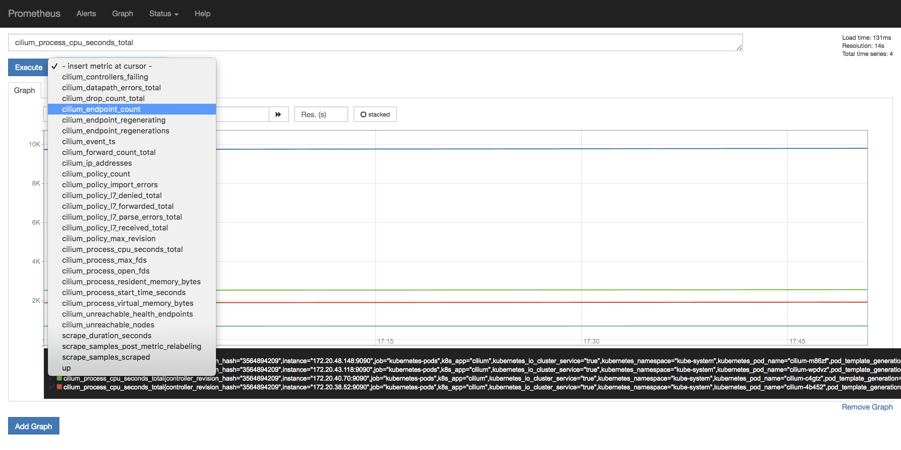
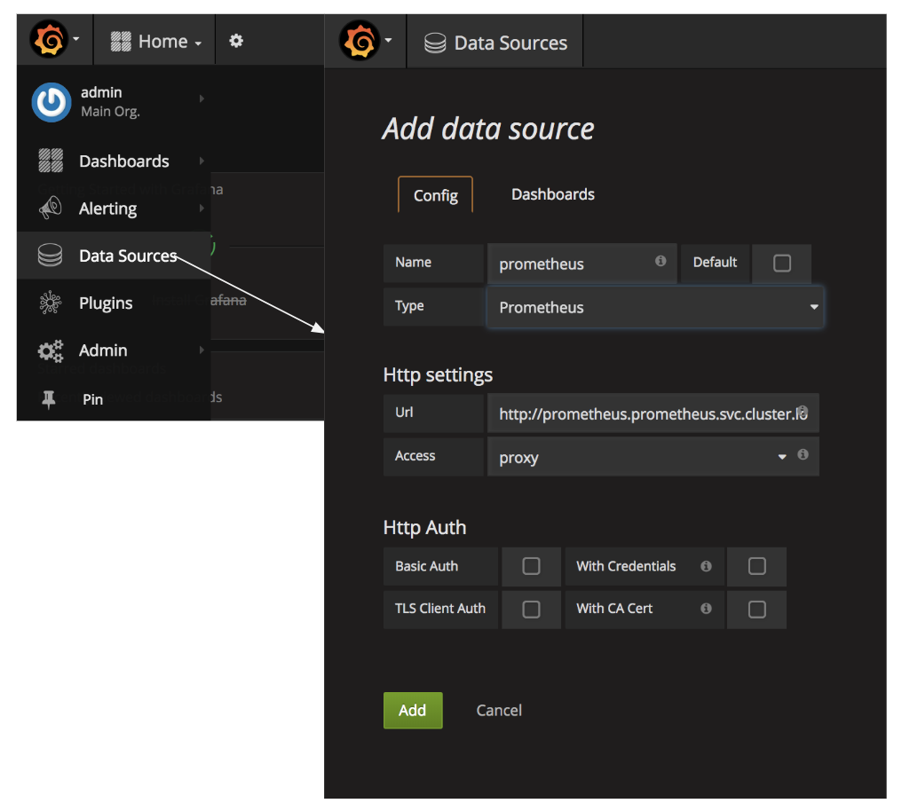
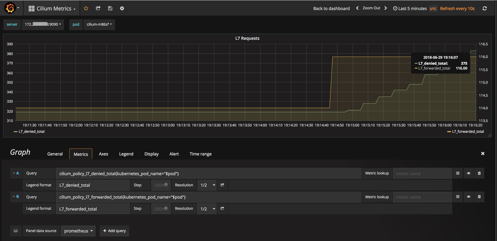

Cilium provides complete L3/L4 and L7 (API-aware) security for Kubernetes services. Cilium is deployed as a CNI and has deep visibility into the health and performance of both the networking and security enforcement. Cilium exposes several metrics in the popular Prometheus format along with
a simple Grafana dashboard template for analyzing the metrics. In this post, we will setup the Prometheus and Grafana services and look at the key Cilium metrics.

## Overview of Cilium Metrics

Before we go through the tutorial, below are some of the key metrics provided by Cilium.

- `cilium_endpoint_count`: The number of "endpoints", i.e pods, managed by Cilium. These are all the pods for which Cilium can enforce policies. This metric can be used to ensure that all the application pods are managed by Cilium by comparing the endpoint count with the pod count on a worker node.
- `cilium_endpoint_regenerating`: The number of endpoints in "regenerating" status. The regenerating status conveys that the endpoint’s networking configuration is being (re)generated. This includes (re)programming BPF for that endpoint. One common reason for regeneration is when new Cilium security policies are applied.
- `cilium_drop_count_total`: Captures the total number of packets dropped including the direction i.e. dropped at ingress or egress and reasons for drop such as due to L3/L4 security policies. In case of drops due to security policy, the spike in drop count can indicate an increase in either illegitimate access attempts or highlight a need to adjust the security policy to allow a legitimate access.
- `cilium_forward_count_total`: Total number of packets forwarded. Similar to the drop count, a sudden drop in forwarded count should be monitored for potential connectivity issues or side-effects of security policy changes.
- `cilium_policy_l7_received_total`: Total count of L7 received requests/responses. The count is only increased if there is an L7 policy which requires the traffic to be parsed and filtered by an L7 proxy.
- `cilium_policy_l7_denied_total`: Total count of access attempts that were denied by an L7 security policy. Similar to the L3/L4 drop count, the spike in L7 denied count indicates a need to either investigate illegitimate attempts or a need to adjust security policies.
- `cilium_policy_l7_forwarded_total`: Total count of L7 forwarded requests/responses (i.e allowed by the L7 policy).
- `cilium_policy_l7_parse_errors_total`: Total count of L7 parsing errors prior to any L7 policy enforcement.
- `cilium_unreachable_nodes`, `cilium_unreachable_health_endpoints`: These metrics identify any connectivity issues between nodes and Cilium health endpoints. They are generated by the periodic connectivity health checks performed by Cilium.

[Cilium Monitoring & Metrics](http://docs.cilium.io/en/v1.1/configuration/metrics/) has the complete description of all the Cilium metrics.

## Setting up Cilium + Prometheus + Grafana

If you don't have a Kubernetes cluster with Cilium, then you can easily create one using:

- [kops](http://docs.cilium.io/en/v1.1/install/guides/kops/) to create a multi-node cluster on AWS
- [minikube](http://docs.cilium.io/en/v1.1/gettingstarted/minikube/)

Once you have a Kubernetes cluster with Cilium, the following commands will install Prometheus in `prometheus` namespace and Grafana in the `monitoring` namespace.

```bash
kubectl create -f https://raw.githubusercontent.com/cilium/cilium/v1.1/examples/kubernetes/addons/prometheus/prometheus.yaml

kubectl create -f https://raw.githubusercontent.com/giantswarm/kubernetes-prometheus/master/manifests/grafana/deployment.yaml

kubectl create -f https://raw.githubusercontent.com/giantswarm/kubernetes-prometheus/master/manifests/grafana/service.yaml
```

**Restart the Cilium daemons** after finishing the installation of Prometheus and Grafana.

```bash

kubectl delete po -l k8s-app=cilium -n kube-system

```

## Cilium Metrics in Prometheus and Grafana

To test whether the Cilium metrics are getting collected by Prometheus, you can go to the Prometheus dashboard at `any_worker_node_ip:prometheus_nodeport`. If worker nodes are not accessible, such as in a private VPC, then use the kubernetes port-forwarding.

```bash
kubectl port-forward <prometheus-pod-name> -n prometheus 9090:9090
```

You should see the Cilium metrics in the drop down.


Similarly, access the Grafana dashboard using grafana service NodePort or using port-forwarding.

```bash
kubectl port-forward <grafana-pod-name> -n monitoring 3000:3000
```

For Grafana, the default user/password is `admin:admin`. Next, we will add the Prometheus datasource to Grafana.



- Give a name to the Prometheus datasource and select `type = Prometheus`
- `Url = http://prometheus.prometheus.svc.cluster.local:9090`
- `Access = proxy`
- Click on `Save & Test` and make sure you the datasource is working message.

We have published a Grafana dashboard for Cilium Metrics. You can simply import this to get started. In the Dashboards/Import, enter the URL`https://grafana.com/dashboards/6658` .


## Testing Cilium Metrics

We will monitor the L3/L4 denied and L7 denied requests. A spike in these requests suggests an increase in the traffic that is getting blocked due to the security policy. These could either be genuine traffic getting denied or illegitimate access attempts, both of which are good to monitor and investigate. We will use the example from the [Cilium Getting Started Guide](http://docs.cilium.io/en/v1.1/gettingstarted/minikube/#step-2-deploy-the-demo-application). In this app the `xwing` spaceships are denied access (L3/L4 policy) to `deathstar` service. And the `tiefighter` spaceships are allowed access only to `HTTP POST deathstar/v1/request-landing` and all other HTTP requests are denied (L7 policy).

```bash

# Create the app in default namespace
kubectl create -f https://raw.githubusercontent.com/cilium/cilium/v1.1/examples/minikube/http-sw-app.yaml

# Wait for all the pods and services of the app to get to the running state
kubectl get pods,svc

# Apply the L3/L4 and L7 Policy.
kubectl create -f https://raw.githubusercontent.com/cilium/cilium/v1.1/examples/minikube/sw_l3_l4_l7_policy.yaml

```

Now we will simulate two scenarios and monitor associated metrics in Grafana Cilium dashboard. First, run an attempt to access `deathstar` from `xwing`. This should be denied at the L3/L4-level and we should see an increase in the `Cilium Drop Count` chart. Since the policy is enforced at ingress on the `deathstar` pods, the drop count will increase for the `direction: INGRESS`.

```bash
while true; do kubectl exec xwing -- curl -sL -XPOST deathstar.default.svc.cluster.local/v1/request-landing; done
```

The `Cilium Drop Count (INGRESS)` metric will start showing an increase in `Policy denied (L3)`, capturing the security enforcement against the illegitimate access attempts.


Second, run an attempt to `GET` the list of API endpoints served by `deathstar` from `tiefighter`. This should be denied at the L7-level and we should see an increase in the `L7_denied_total` in `L7 Requests` chart.

```bash
while true; do kubectl exec tiefighter -- curl -sL -XGET deathstar.default.svc.cluster.local/v1; done
```



## Conclusion

Cilium's support for the standard Prometheus format makes it easy to monitor valuable metrics related to the effectiveness of security policies and health of service interactions. In upcoming releases, we will continue to add more metrics from Cilium. If you are already using Cilium and have suggestions for other useful metrics then let us know on [Cilium slack](https://cilium.slack.com/).
