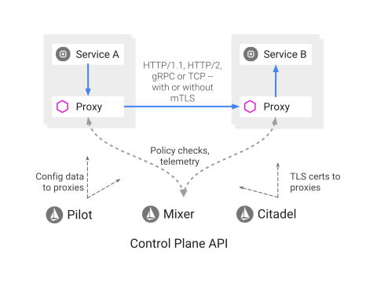
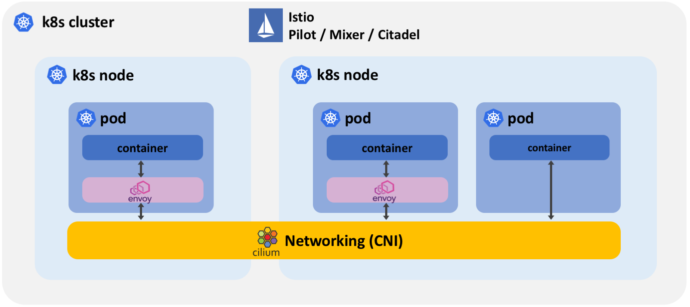
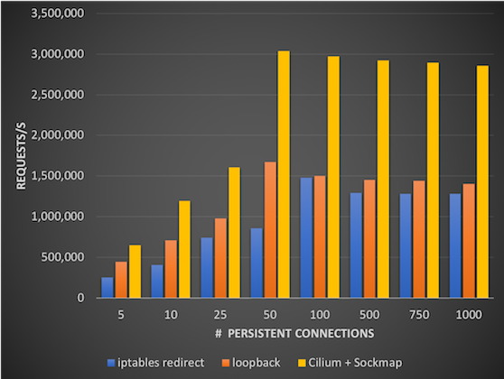
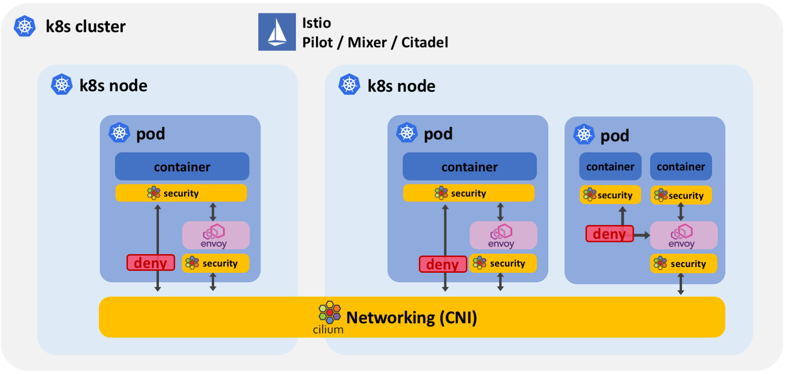
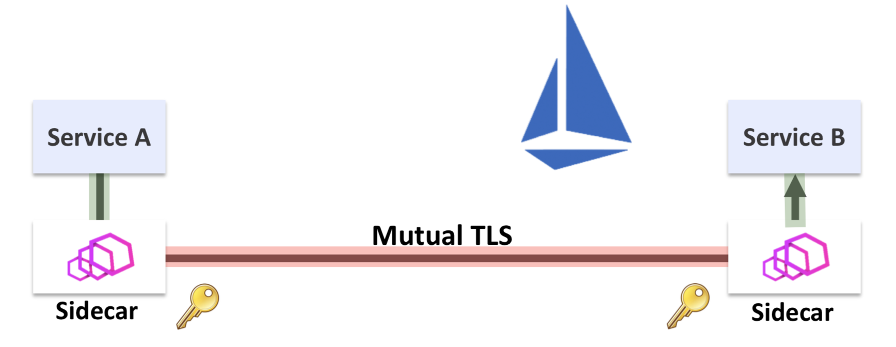
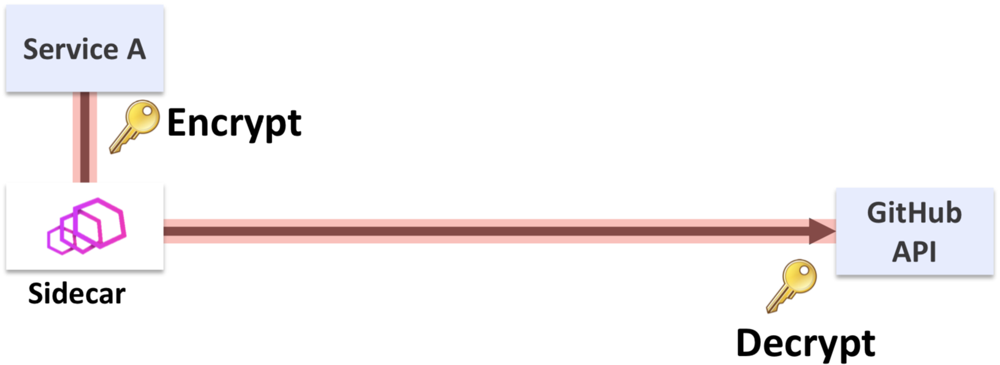
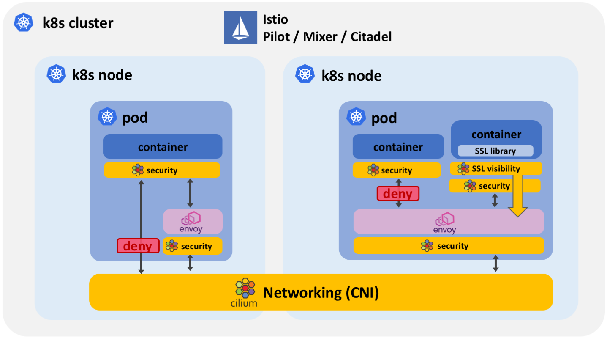

Istio 1.0 was [released](https://istio.io/blog/2018/announcing-1.0/) last week.
From the Cilium community, we would like to congratulate all Istio contributors
for this massive effort. We have been fortunate to participate in the community
by contributing to Istio and by helping several users moving towards production
with Istio and Cilium.

If you are interested in learning about an Istio + Cilium user story before
diving into the technical details, consider reading the following Istio blog
post by the HP FitStation team, one of the largest Cilium + Istio users:
**[Istio a Game Changer for HP's FitStation Platform](https://istio.io/blog/2018/hp/)**.

This blog will go into some of the details on how BPF and Cilium enhance Istio:

- **Increase Istio Security:**
  - Least privilege security for multi-container pods using socket-aware BPF
    programs
  - Protect from compromised sidecar proxies and protocols that bypass the
    sidecar
  - Use of BPF to force all application traffic through the sidecar proxy
- **Enable Istio for external services:**
  - Using socket-aware BPF programs and kTLS to provide visibility and control
    into TLS encrypted connections
- **Performance:**
  - Efficient networking and socket redirection to accelerate Istio

## What is Cilium?

Cilium is open source software for transparently providing and securing the
network and API connectivity between application services deployed using Linux
container management platforms like Kubernetes, Docker, and Mesos.

At the foundation of Cilium is a new Linux kernel technology called BPF, which
enables the dynamic insertion of powerful security, visibility, and networking
control logic within Linux itself. Besides providing traditional network level
security, the flexibility of BPF enables security on API and process
level to secure communication within a container or pod. Because BPF runs
inside the Linux kernel, Cilium security policies can be applied and updated
without any changes to the application code or container configuration.

See the section **[Introduction to Cilium](http://docs.cilium.io/en/v1.1/intro/)**
for a more detailed general introduction to Cilium.

## What is Istio?

Istio provides an easy way to create a network of deployed services with load
balancing, service-to-service authentication, monitoring, and more, without
requiring any changes in service code. You can add Istio support to services by
deploying a special sidecar proxy throughout your environment that intercepts
all network communication between microservices, configured and managed using
Istio’s control plane functionality.

You can read more about Istio's concept and architecture in the [Istio
documentation](https://istio.io/docs/).

## Efficient networking for Istio

The most basic form of collaboration is the Cilium CNI plugin providing
networking to Istio by connecting all sidecar proxies together and by providing
connectivity between proxies and the Istio control plane. Cilium also ensures
that Istio managed services can communicate with pods that are not managed by
Istio.

The following diagram illustrates how the Istio control plane, sidecar proxies,
and the CNI plugin are layered on top of each other:

In this mode, all the Istio system components benefit from Cilium's efficient
networking capabilities based on BPF in the Linux kernel. BPF is the
replacement technology for networking and packet filtering such as iptables
among other things. You can find more information on why BPF is driving this
shift in the following blog post from April: **[Why is the kernel community
replacing iptables with
BPF?](/blog/2018/04/17/why-is-the-kernel-community-replacing-iptables/)**

<a name="socket-level-redirection-to-accelerate-istio-and-envoy">
### Socket level redirection to accelerate Istio and Envoy

The service mesh architecture of Istio requires all network traffic
for both incoming and outgoing requests of all pods participating in the
service mesh to be redirected to the sidecar proxy. The sidecar proxy will
terminate all TCP connections and perform services such as telemetry, retries,
routing, mutual TLS, and authorization on behalf of the services and use a
secondary so-called upstream TCP connection to reach the destination service.
This is what allows a service mesh to perform mutual TLS on behalf of the
application and is what achieves the transparency to not require changing any
application code when running a service mesh.

However, this redirection can be costly when standard IP-based tooling such as
iptables is used to implement the redirection as the entire TCP/IP stack has to
be traversed multiple times.

Cilium makes use of an exciting BPF feature called sockmap. It allows filtering
and redirection and socket level and is thus making Cilium socket-aware. The
socket is the interface that applications use to send and receive network
traffic. Applied to Istio redirection requirements, this allows to essentially
short-circuit TCP sockets on the same node and thus massively accelerate the
TCP connection between the application and the sidecar proxy of the service
mesh in a completely transparent manner. Neither the application nor the
sidecar proxy require modification in any way.

If you are interested to learn more about this use case, refer to the presentation
**Accelerating Envoy and Istio with CIlium and the Linux kernel
([recording](https://t.co/cx6CQhn1xl),
[slides](https://www.slideshare.net/ThomasGraf5/accelerating-envoy-and-istio-with-cilium-and-the-linux-kernel))**
as presented at KubeCon 2018 in Austin.

## Enhancing Istio Security with Cilium

Cilium also integrates with Istio to enhance the security of Istio. Let's look
at what security properties Istio provides:

- **Mutual TLS:** Ability to verify the identity of the sender if the sender is
  controlled by Istio. This protects a service from receiving requests from
  attacks spoofing an IP address from a legitimate source service. It also
  enables TLS/SSL-based encryption between all services managed by Istio.

- **Authorization:** Ability to authorize requests including the ability to
  filter on metadata such as HTTP protocol fields, IP addressing and identity
  information as well as invoking further authorization plugins, for example,
  perform token validation.

### Level 1: Protect unsupported protocols and compromised sidecars (Cilium 1.0)

A first essential level of protection required is to apply security policies to
all network protocols unsupported by Istio. This includes UDP, ICMP, and all
IPv6 traffic. Any such traffic bypasses the sidecar proxy and thus any eventual
security policy enforced via Istio. Cilium applies L3/L4 security policies
outside of the pod to all network traffic, regardless of the protocol. If a
protocol is unsupported, the packet will be dropped.

- **Secure non-IPv4/TCP protocols:** Cilium provides security policies outside
  of the pod and either completely blocks or applies fine-grained security
  rules to any traffic that has bypassed the proxy because the protocol is
  unsupported or the redirection has failed for some other reason.

- **Protect from compromised sidecars:** The sidecar proxy itself is not
  subject to the Istio security rules. A compromised sidecar has unrestricted
  access to the network. It can also manipulate its own security rules to
  become more permissive. Cilium allows to define service level security
  policies in addition to Istio and ensures that a compromised sidecar proxy
  can only operate with least privelege.

### Level 2: Secure multi-container pods (Work in Progress)

The security protection at level 1 protects a service mesh at the granularity
of pods and services. It does not provide any security inside of a pod, for
example for communication between the application container and the sidecar
container.

Security protection at level 2 introduces segmentation between containers and
processes in the same pod by providing segmentation at the socket level by
using socket-aware BPF programs.

- **Force application traffic through sidecar:** By using socket-aware BPF
  policies, Cilium can ensure that all communication of an application must
  occur via the sidecar for both incoming and outgoing connections. The
  application container itself is guaranteed to not be able to receive a
  connection from outside the pod or make a request to outside of the pod
  without passing through the sidecar proxy.

- **Least privilege security inside of pod:** By locking down communication
  on container and process level inside of the pod using socket-aware BPF
  programs, a security breach in one of the containers no longer leads to the
  entire pod being compromised. This is in particular important as sidecar
  containers have direct network access to any other container in the pod and
  may access potentially sensitive information.

**Fun fact:** Socket-aware BPF programs are not limited to IP-based sockets.
The security policies can be extended to cover UNIX domain sockets as well.

## TLS visibility for external services (Work in Progress)

Istio relies on visibility into the application protocol layer such as HTTP to
provide functionality such as URI-based routing, HTTP headers-based
authorization and API request level telemetry and tracing. This visibility is
achieved by keeping the application traffic between services unencrypted and
performing the TLS encryption between the sidecar proxies of the source and
destination service by applying mutual TLS with certificates managed by Istio
Citadel.

This works well for connectivity between services inside the mesh.
Communication to services outside of the mesh is almost guaranteed to be TLS
encrypted by the application itself in order to secure communication on the
untrusted internet.

The kTLS (Kernel TLS) work for Linux has originally been **[proposed by Dave
Watson](https://netdevconf.org/1.2/papers/ktls.pdf)** at Facebook. It includes
the capability to defer the symmetric encryption of data from the SSL library
in the application to the socket in the Linux kernel. The initial motivation
for this work was a pure performance optimization as the use of kTLS turned out to
be 3-4% faster than SSL libraries. This was interesting enough for providers of
static data over SSL to continue the effort. The work has since been merged and
is available in the latest Linux kernels. Combined with the capabilities of BPF
programs injected at the Linux socket layer, kTLS enables transparent
visibility of data that would otherwise already be encrypted at this point.

We are still working on this feature but have an initial functional prototype
that proves the concept of gaining visibility and control over data that is
typically TLS encrypted in the application itself. The next step is to make
this data available to the sidecar to unleash Istio on connections to external
services.

### How can kTLS be transparent without requiring application changes?

To be fair, the SSL library used by the application must be aware of kTLS and
the user must opt into the behavior on a system level. The application itself
must not be changed though and enabling the visibility can be as simple as
upgrading the version of the SSL library that the app is using.

Because the visibility is gained at the socket level, this also means that the
application can no longer change this data after it has been enqueued. This is
in particular important if the data is being used to authorize a request.

## Summary

- **Increased Istio Security:**

  - **Least privilege security inside of pod:** By locking down communication
    on container and process level inside of the pod using socket-aware BPF
    programs, a security breach in one of the containers no longer leads to the
    entire pod being compromised.
  - **Secure non-IPv4/TCP protocols:** Istio is TCP and IPv4 only at this
    point. Any other protocol such as UDP or IPv6 will bypass the sidecar proxy
    and any Istio security rules. Cilium will step in either by
    completely blocking these protocols or by applying fine-grained security
    rules.
  - **Protect from compromised sidecars:** The sidecar proxy itself is not
    subject to the Istio security rules. A compromised sidecar has unrestricted
    access to the network. It can also manipulate its own security rules to
    become more permissive. Cilium allows to define service level security
    policies in addition to Istio and ensures that a compromised sidecar proxy
    can only operate with least privelege.
  - **Force application traffic through sidecar:** By using socket-aware BPF
    policies, Cilium can ensure that all communication of an application must
    occur via the sidecar for both incoming and outgoing connections. The
    application container itself is guaranteed to not be able to receive a
    connection from outside the pod or make a request to outside of the pod
    without passing through the sidecar proxy.

- **External services:**
  - **Istio for TLS encrypted connections:** TCP connections to services outside of
    the cluster are typically TLS encrypted and Istio cannot inspect the HTTP
    headers of such connections. Cilium will be capable of providing visibility
    and control over TLS encrypted data by leveraging the kTLS integration into
    BPF in the kernel.
- **Performance:**
  - **Efficient networking:** Istio requires a CNI plugin to provide network
    connectivity between pods. Cilium implements the CNI plugin interface and
    utilizes BPF to provide a highly efficient datapath between the sidecar
    proxies and the Istio control plane.
  - **Socket redirection to accelerate Istio:** Cilium can accelerate the
    traffic redirection to the sidecar proxy by performing the redirection of
    the traffic at Linux socket level using socket-aware BPF programs. This
    allows bypassing the expensive TCP/IP stack traversal without changing any
    code in the application or in the sidecar.

If you are interested to learn more:

- **[Try a Getting Started Guide](http://docs.cilium.io/en/stable/gettingstarted/)**
- **[Learn more about Cilium concepts](http://docs.cilium.io/en/stable/concepts/)**
- **[Join our Slack channel](https://cilium.io/slack)**
