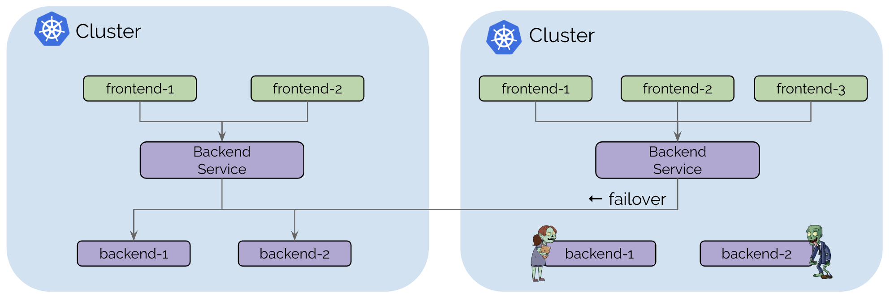
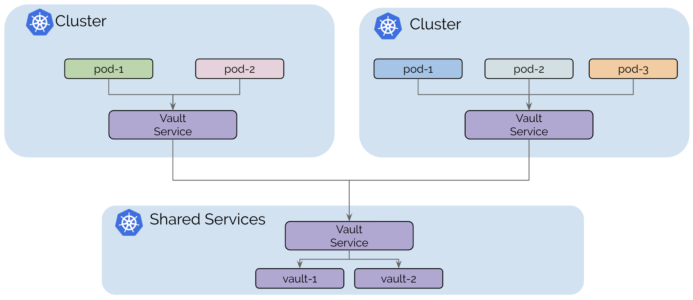
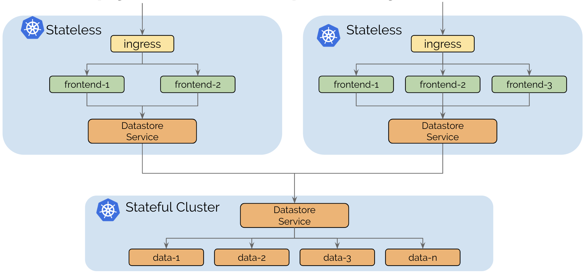
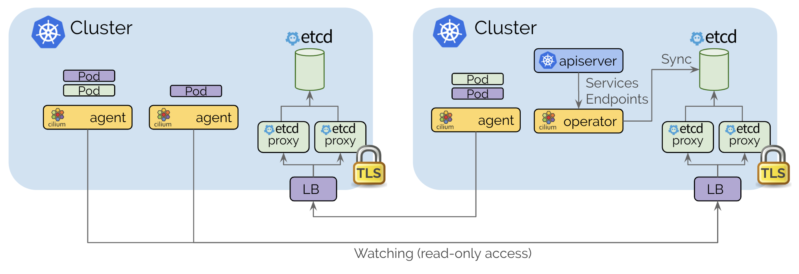
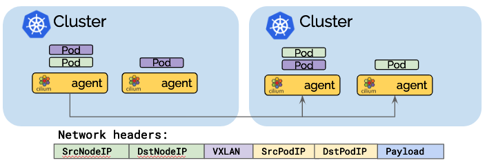
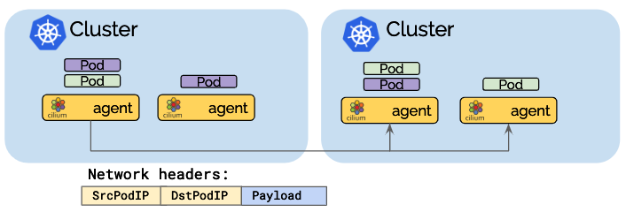
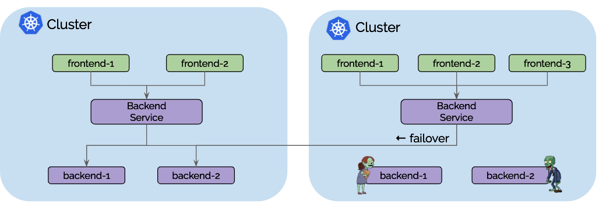

{{preview}}

This is a deep dive into ClusterMesh, Cilium's multi-cluster implementation. In
a nutshell, ClusterMesh provides:

- Pod IP routing across multiple Kubernetes clusters at native
  performance via tunneling or direct-routing without requiring any gateways
  or proxies.

- Transparent service discovery with standard Kubernetes services and
  coredns/kube-dns.

- Network policy enforcement spanning multiple clusters. Policies can be
  specified as Kubernetes NetworkPolicy resource or the extended
  CiliumNetworkPolicy CRD.

- Transparent encryption for all communication between nodes in the
  local cluster as well as across cluster boundaries.


{{/preview}}

This is a deep dive into ClusterMesh, Cilium's multi-cluster implementation. In
a nutshell, ClusterMesh provides:

- Pod IP routing across multiple Kubernetes clusters at native
  performance via tunneling or direct-routing without requiring any gateways
  or proxies.

- Transparent service discovery with standard Kubernetes services and
  coredns/kube-dns.

- Network policy enforcement spanning multiple clusters. Policies can be
  specified as Kubernetes NetworkPolicy resource or the extended
  CiliumNetworkPolicy CRD.

- Transparent encryption for all communication between nodes in the
  local cluster as well as across cluster boundaries.


The multi-cluster capability is built in layers and you can choose to use all
layers or select and use only the layers you need.

# Use Cases

Let's review some of the use cases of connecting multiple Kubernetes clusters
before we dive into the implementation details.

## Use Case: High Availability



High availability is the most obvious use case for most. This use case includes
operating Kubernetes clusters in multiple regions or availability zones and runs
the replicas of the same services in each cluster. Upon failure, requests can
fail over to other clusters. The failure scenario covered in this use case is
not primarily the complete unavailability of the entire region or failure
domain. A more likely scenario is temporary unavailability of resources or
misconfiguration in one cluster leading to inability to run or scale particular
services in one cluster.

## Use Case: Shared Services

The initial trend of Kubernetes based platforms was to build large,
multi-tenant Kubernetes clusters. It is getting more and more common to build
individual clusters per tenant or to build clusters for different categories of
services, e.g. different levels of security sensitivity.



However, some services such as secrets management, logging, monitoring, or DNS
are often still shared between all clusters. This avoids operational overhead
in maintaining these services in each tenant cluster.

The primary motivation of this model is isolation between the tenant clusters,
in order to maintain that goal, tenant clusters are connected to the shared
services clusters but not connected to other tenant clusters.

## Use Case: Splitting Stateful and Stateless services

The operational complexity of running stateful or stateless services is very
different. Stateless services are simple to scale, migrate and upgrade. Running
a cluster entirely with stateless services keeps the cluster nimble and agile.
Migration from one cloud provider to another is possible easily.

Stateful services can introduce a potentially complex dependency chain.
Migrating services typically involves the migration of storage.



Running individual clusters for stateless and stateful allows isolating the
dependency complexity to a smaller number of clusters and keeps the stateless
clusters dependency free.

# Control Plane

## Requirements

- All Kubernetes worker nodes must be assigned a unique IP address and all
  worker nodes must have IP connectivity between each other.

- All clusters must be assigned unique PodCIDR ranges.

- Cilium must be configured to use [etcd] as the kvstore.

- The network between clusters must allow the inter-cluster communication. The
  exact firewalling requirements will depend on whether Cilium is configured to
  run in direct-routing or tunneling mode.

## Architecture

The control plane is based on [etcd] and kept as minimalistic as possible:

- Each Kubernetes cluster maintains its own etcd cluster which contains the
  state of that cluster. State from multiple clusters is never mixed in etcd
  itself.

- Each cluster exposes its own etcd via a set of etcd proxies. Cilium agents
  running in other clusters connect to the etcd proxies to watch for changes
  and replicate the multi-cluster relevant state into their own cluster. Use
  of etcd proxies ensures scalability of etcd watchers. Access is protected
  with TLS certificates.

- Access from one cluster into another is _always_ read-only. This ensures
  that the failure domain remains unchanged, i.e. failures in one cluster
  never propagate into other clusters.

- Configuration occurs via a simple Kubernetes secrets resource that contains
  the addressing information of the remote etcd proxies along with the
  cluster name and the certificates required to access the etcd proxies.



# Pod IP Routing

The pod IP routing is the foundation of the multi-cluster ability. It allows
pods across clusters to reach each other via their pod IPs. Cilium can operate
in several modes to perform pod IP routing. All of them are capable to perform
multi-cluster pod IP routing.

## Tunneling mode



Tunneling mode encapsulates all network packets emitted by pods in a so-called
encapsulation header. The encapsulation header can consist of a VXLAN or
Geneve frame. This encapsulation frame is then transmitted via a standard UDP
packet header. The concept is similar to a VPN tunnel.

- **Advantage:** The pod IPs are never visible on the underlying network. The
  network only sees the IP addresses of the worker nodes. This can simplify
  installation and firewall rules.

- **Disadvantage:** The additional network headers required will reduce the
  theoretical maximum throughput of the network. The exact cost will depend on
  the configured MTU and will be more noticeable when using a traditional MTU
  of 1500 compared to the use of jumbo frames at MTU 9000.

- **Disadvantage:** In order to not cause excessive CPU, the entire networking
  stack including the underlying hardware has to support checksum and
  segmentation offload to calculate the checksum and perform the segmentation
  in hardware just as it is done for "regular" network packets. Availbility of
  this offload functionality is very common these days.

## Direct-routing mode



In the direct routing mode, all network packets are routed directly to the network.
This requires the network to be capable of routing pod IPs. Propagation of pod IP
routing information across nodes can be achieved using multiple options:

- Use of the `--auto-direct-node-routes` option which is super lightweight
  route propagation method via the kvstore that will work if all worker nodes
  share a single layer 2 network. This requirement is typically met for all
  forms of cloud provider based virtual networks.

- Using the [kube-router
  integration](http://docs.cilium.io/en/stable/gettingstarted/kube-router/) to
  run a BGP routing daemon.

- Use of any other routing daemon that injects routes into the standard Linux
  routing tables (bird, quagga, ...)

When a point is reached where the network no longer understands pod IPs,
network packet addresses need to be masqueraded.

- **Advantage:** The reduced network packet headers can optimize network
  throughput and latency.

- **Disadvantage:** The entire network must be capable of routing pod IPs
  which can increase the operational complexity.

## Hybrid-routing mode

The hybrid-routing mode enables the use of direct-routing when available which
will typically be in the local cluster or other clusters in the same VPC with a
fall-back to tunneling mode when spanning VPCs or cloud-providers. This can
limit the operational complexity and allows to pay the cost of optimization
only when needed.

# Service Discovery

The service discovery of Cilium's multi-cluster model is built using standard
Kubernetes [services] and designed to be completely transparent to existing
Kubernetes application deployments:

```yaml
apiVersion: v1
kind: Service
metadata:
  name: rebel-base
  annotations:
    io.cilium/global-service: 'true'
spec:
  type: ClusterIP
  ports:
    - port: 80
  selector:
    name: rebel-base
```

- Cilium monitors Kubernetes [services] and endpoints and watches for
  services with an annotation `io.cilium/global-service: "true"`. For such
  services, all services with identical name and namespace information are
  automatically merged together and form a global service that is available
  across clusters.

- Any traffic to a ClusterIP of a global service will automatically be
  load-balanced to endpoints in all clusters based on the standard Kubernetes
  health-checking logic.

- Each cluster continues to maintain its own ClusterIP for each service which
  means that Kubernetes and kube-dns/coredns are not aware of others
  clusters. The DNS server continues to return a ClusterIP valid only in the
  local cluster and Cilium will perform the load-balancing transparently.

- Several additional annotations exist for fine-grained control such as
  unidirectional exposure or affinity policies.


All traffic from `frontend-1` to ClusterIP `30.1.1.1` will automatically be
load-balanced to pod IPs of backends of cluster 1 `[10.0.0.1, 10.0.0.2]` as
well as the pod IPs backends in cluster 2 `[20.0.0.1, 20.0.0.2]`. Each cluster
will perform health-checking of the local backend instances and notify other
clusters as pods appear, disappear or become unhealthy.

# Transparent Encryption

The transparent encryption introduced in [Cilium
1.4](https://cilium.io/blog/2019/02/12/cilium-14/) is compatible with
multi-cluster. Make sure to configure all nodes across all clusters with a
common key and all communication between nodes is automatically encrypted.


# Multi-cluster network policy

The short version is that policy enforcement that you are familiar with from a
single cluster will simply expand and work across clusters. Due to the fact
that policies are specified using pod labels, a policy that allows `frontend`
to talk to `backend` will apply to traffic with the cluster just as it will
to traffic crossing clusters.

Cilium does _not_ automatically propagate NetworkPolicy or CiliumNetworkPolicy
across clusters. It is the responsibility of the user to import the policy into
all clusters. This is intentional as it means that each cluster gets to decide
whether the cluster is permitted to receive communication from remote clusters
or emit communication to remote clusters.

## Allowing specific cluster cross-over paths

It is possible to establish policies that apply to pod in particular clusters
only. The cluster name is represented as a label on each pod by Cilium which
allows to match on the cluster name in both the `endpointSelector` as well as
the `matchLabels` for `toEndpoints` and `fromEndpoints` constructs:

```yaml
apiVersion: 'cilium.io/v2'
kind: CiliumNetworkPolicy
metadata:
  name: 'allow-cross-cluster'
  description: 'Allow x-wing in cluster1 to contact rebel-base in cluster2'
spec:
  endpointSelector:
    matchLabels:
      name: x-wing
      io.cilium.k8s.policy.cluster: cluster1
  egress:
    - toEndpoints:
        - matchLabels:
            name: rebel-base
            io.cilium.k8s.policy.cluster: cluster2
```

The above example policy will allow `x-wing` in cluster1 to talk to
`rebel-base` in cluster2. X-wings won't be able to talk to rebel bases in the
local cluster unless additional policies exist that whitelist the
communication.

# Relation to Istio multicluster

Both projects are independent but can complement each other nicely. A common
way to combine Cilium and Istio multi-cluster is to use Cilium's multi-cluster
Pod IP routing layer to fulfill the following requirement of the [Istio
Multicluster
guide](https://istio.io/docs/setup/kubernetes/multicluster-install/):

> All pod CIDRs in every cluster must be routable to each other.

Further, the Cilium policy enforcement capability can be used to secure
communication to and from the Istio control plane as well as protect sidecar
bypass attempts via unsupported protocols such as UDP or IPV6 as well as
protect from compromised sidecar proxies.

It is also possible to run a mix of global Istio services and Cilium global
services side by side. Cilium's global services are reachable from all Istio
managed services as they can be discovered via DNS just like regular services.

# Getting Started

To get started, follow the step-by-step [ClusterMesh
tutorial](http://docs.cilium.io/en/stable/gettingstarted/clustermesh/) which
guides you through the process of connecting clusters together. Make sure to
join our [Slack] channel to ask questions and brag about your setup.



# Further Material & References

- [Adrien Trouillaud](https://github.com/adrienjt) has notified us on Slack
  that the
  [multicluster-scheduler](https://github.com/admiraltyio/multicluster-scheduler)
  has integrated Cilium multi-cluster support. Make sure to have a look.

- KubeCon US 2019 session: [Connecting Kubernetes Clusters Across Cloud
  Providers](https://docs.google.com/presentation/d/1siR8tPoIEbE0itbdoKdLKbkTS9nYV-2Wj0QIxJqRI7M/edit?usp=sharing)

<iframe width="1202" height="676" src="https://www.youtube.com/embed/U34lQ8KbQow" frameborder="0" allow="accelerometer; autoplay; encrypted-media; gyroscope; picture-in-picture" allowfullscreen></iframe>

- [ClusterMesh tutorial](https://istio.io/docs/setup/kubernetes/multicluster-install/)

- [Cilium 1.4 release blog](https://cilium.io/blog/2019/02/12/cilium-14/)
  which was the release that introduced multi-cluster service discovery.

[slack]: https://cilium.herokuapp.com/
[etcd]: https://github.com/etcd-io/etcd
[services]: https://kubernetes.io/docs/concepts/services-networking/service/
