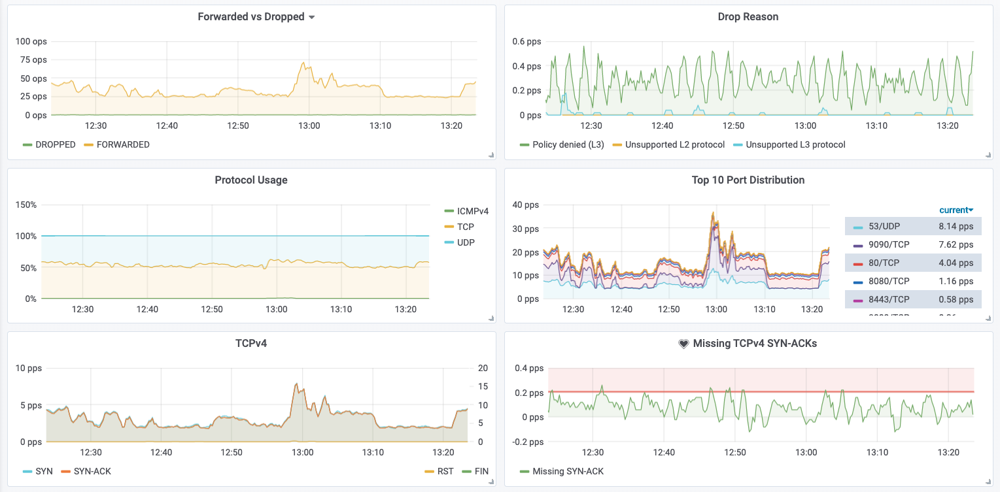
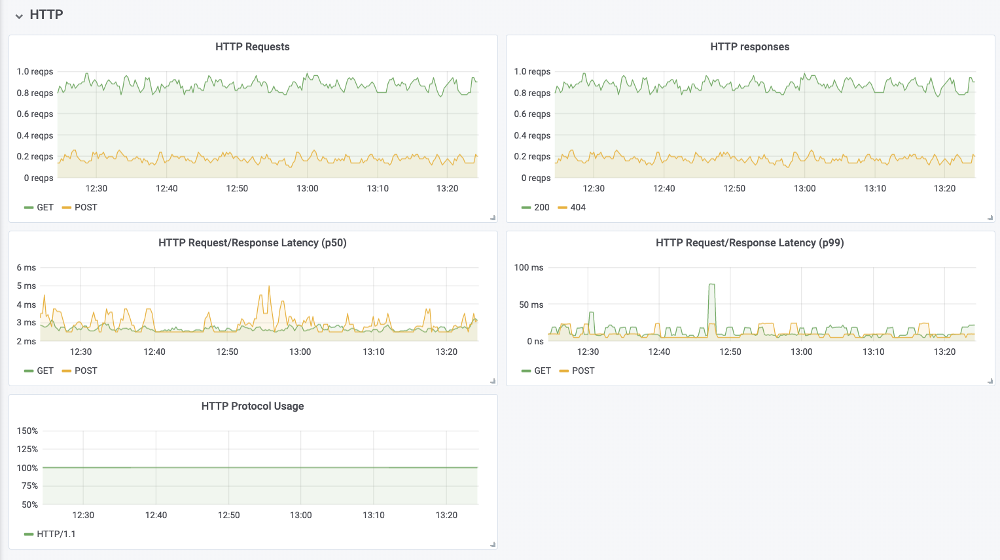

Hubble is a fully distributed networking and security observability platform
for cloud native workloads. Hubble is open source software and built on top of
[Cilium] and [eBPF] to enable deep visibility into the communication and
behavior of services as well as the networking infrastructure in a completely
transparent manner.

Hubble can answer questions such as:

**Service dependencies & communication map:**

- What services are communicating with each other? How frequently? What does
  the service dependency graph look like?
- What HTTP calls are being made? What Kafka topics does a service consume
  from or produce to?

**Operational monitoring & alerting:**

- Is any network communication failing? Why is communication failing? Is it
  DNS? Is it an application or network problem? Is the communication broken on
  layer 4 (TCP) or layer 7 (HTTP)?
- Which services have experienced a DNS resolution problems in the last 5
  minutes? Which services have experienced an interrupted TCP connection
  recently or have seen connections timing out? What is the rate of unanswered
  TCP SYN requests?

**Application monitoring:**

- What is the rate of 5xx or 4xx HTTP response codes for a particular service
  or across all clusters?
- What is the 95th and 99th percentile latency between HTTP requests and
  responses in my cluster? Which services are performing the worst? What is
  the latency between two services?

**Security observability:**

- Which services had connections blocked due to network policy? What services
  have been accessed from outside the cluster? Which services have resolved a
  particular DNS name?

## Why Hubble?

The Linux kernel technology [eBPF] is enabling visibility into systems and
applications at a granularity and efficiency that was not possible before. It
does so in a completely transparent way, without requiring the application to
change or for the application to hide information. By building on top of
[Cilium], Hubble can leverage [eBPF] for visibility. By relying on [eBPF], all
visibility is programmable and allows for a dynamic approach that minimizes
overhead while providing deep and detailed visibility where required. Hubble
has been created and specifically designed to make best use of these new [eBPF]
powers.

# Features

## Service Dependency Graph

Troubleshooting microservices application connectivity is a challenging task.
Simply looking at "kubectl get pods" does not indicate dependencies between
each service or external APIs or databases.

Hubble enables zero-effort automatic discovery of the service dependency graph
for Kubernetes Clusters at L3/L4 and even L7, allowing user-friendly
visualization and filtering of those dataflows as a Service Map.

See [Hubble Service Map Tutorial](https://github.com/cilium/hubble/tree/v0.5/tutorials/deploy-hubble-servicemap)
for more examples.

## Metrics & Monitoring

The metrics and monitoring functionality provides an overview of the state of
systems and allow to recognize patterns indicating failure and other scenarios
that require action. The following is a short list of example metrics, for a
more detailed list of examples, see the [Metrics
Documentation](https://github.com/cilium/hubble/blob/v0.5/Documentation/metrics.md)

### Networking Behavior

### Network Policy Observation

### HTTP Request/Response Rate & Latency

### DNS Request/Response Monitoring

## Flow Visibility

Flow visibility provides visibility into flow information on the network and
application protocol level. This enables visibility into individual TCP
connections, DNS queries, HTTP requests, Kafka communication, and much more.

### DNS Resolution

Identifying pods which have received DNS response indicating failure:

    hubble observe --since=1m -t l7 -j \
       | jq 'select(.l7.dns.rcode==3) | .destination.namespace + "/" + .destination.pod_name' \
       | sort | uniq -c | sort -r
      42 "starwars/jar-jar-binks-6f5847c97c-qmggv"

_Successful query & response:_

    starwars/x-wing-bd86d75c5-njv8k            kube-system/coredns-5c98db65d4-twwdg      DNS Query deathstar.starwars.svc.cluster.local. A
    kube-system/coredns-5c98db65d4-twwdg       starwars/x-wing-bd86d75c5-njv8k           DNS Answer "10.110.126.213" TTL: 3 (Query deathstar.starwars.svc.cluster.local. A)

_Non-existent domain:_

    starwars/jar-jar-binks-789c4b695d-ltrzm    kube-system/coredns-5c98db65d4-f4m8n      DNS Query unknown-galaxy.svc.cluster.local. A
    starwars/jar-jar-binks-789c4b695d-ltrzm    kube-system/coredns-5c98db65d4-f4m8n      DNS Query unknown-galaxy.svc.cluster.local. AAAA
    kube-system/coredns-5c98db65d4-twwdg       starwars/jar-jar-binks-789c4b695d-ltrzm   DNS Answer RCode: Non-Existent Domain TTL: 4294967295 (Query unknown-galaxy.starwars.svc.cluster.local. A)
    kube-system/coredns-5c98db65d4-twwdg       starwars/jar-jar-binks-789c4b695d-ltrzm   DNS Answer RCode: Non-Existent Domain TTL: 4294967295 (Query unknown-galaxy.starwars.svc.cluster.local. AAAA)

### HTTP Protocol

_Successful request & response with latency information:_

    starwars/x-wing-bd86d75c5-njv8k:53410      starwars/deathstar-695d8f7ddc-lvj84:80    HTTP/1.1 GET http://deathstar/
    starwars/deathstar-695d8f7ddc-lvj84:80     starwars/x-wing-bd86d75c5-njv8k:53410     HTTP/1.1 200 1ms (GET http://deathstar/)

### TCP/UDP Packets

_Successful TCP connection:_

    starwars/x-wing-bd86d75c5-njv8k:53410      starwars/deathstar-695d8f7ddc-lvj84:80    TCP Flags: SYN
    deathstar.starwars.svc.cluster.local:80    starwars/x-wing-bd86d75c5-njv8k:53410     TCP Flags: SYN, ACK
    starwars/x-wing-bd86d75c5-njv8k:53410      starwars/deathstar-695d8f7ddc-lvj84:80    TCP Flags: ACK, FIN
    deathstar.starwars.svc.cluster.local:80    starwars/x-wing-bd86d75c5-njv8k:53410     TCP Flags: ACK, FIN

_Connection timeout:_

    starwars/r2d2-6694d57947-xwhtz:60948   deathstar.starwars.svc.cluster.local:8080     TCP Flags: SYN
    starwars/r2d2-6694d57947-xwhtz:60948   deathstar.starwars.svc.cluster.local:8080     TCP Flags: SYN
    starwars/r2d2-6694d57947-xwhtz:60948   deathstar.starwars.svc.cluster.local:8080     TCP Flags: SYN

### Network Policy Behavior

_Denied connection attempt:_

    starwars/enterprise-5775b56c4b-thtwl:37800   starwars/deathstar-695d8f7ddc-lvj84:80(http)   Policy denied (L3)   TCP Flags: SYN
    starwars/enterprise-5775b56c4b-thtwl:37800   starwars/deathstar-695d8f7ddc-lvj84:80(http)   Policy denied (L3)   TCP Flags: SYN
    starwars/enterprise-5775b56c4b-thtwl:37800   starwars/deathstar-695d8f7ddc-lvj84:80(http)   Policy denied (L3)   TCP Flags: SYN

# Getting Started

See the links below to get started. While doing so, make sure to join the
`#hubble` channel on the [Cilium Slack] to share your experiences with others
exploring Hubble and to provide feedback to the Hubble development team.

- [Installation](https://github.com/cilium/hubble/blob/v0.5/Documentation/installation.md)
- [Documentation](https://github.com/cilium/hubble/tree/v0.5/Documentation)
- [Tutorials](https://github.com/cilium/hubble/tree/v0.5/tutorials)

[cilium]: http://github.com/cilium/cilium
[ebpf]: http://docs.cilium.io/en/stable/bpf/
[cilium slack]: https://slack.cilium.io/
