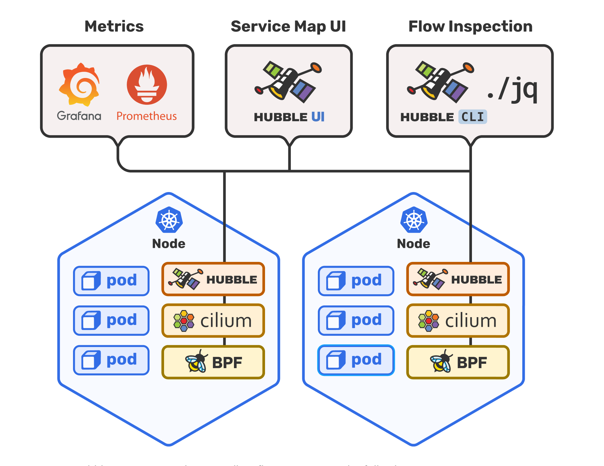
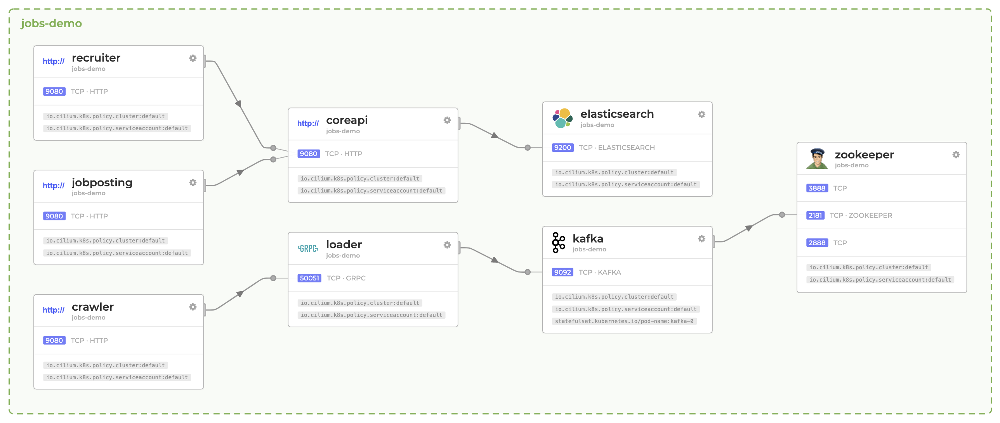
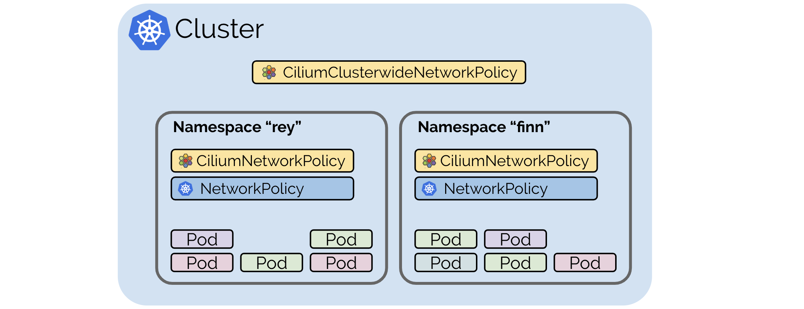
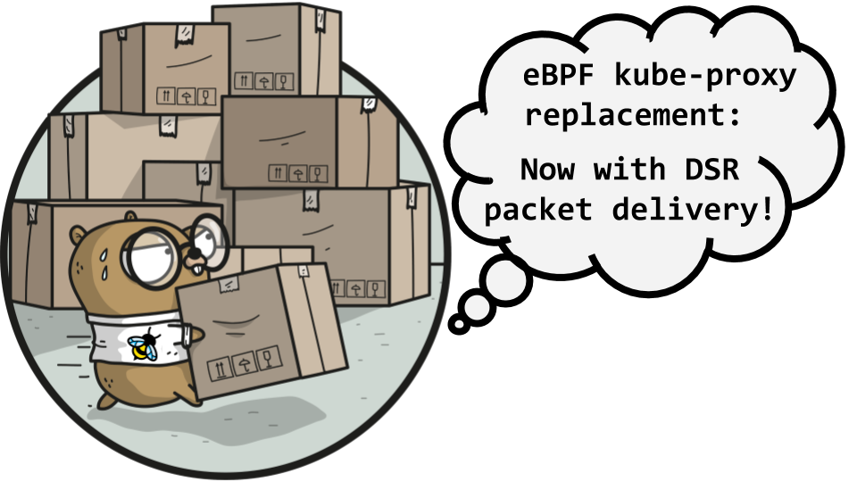
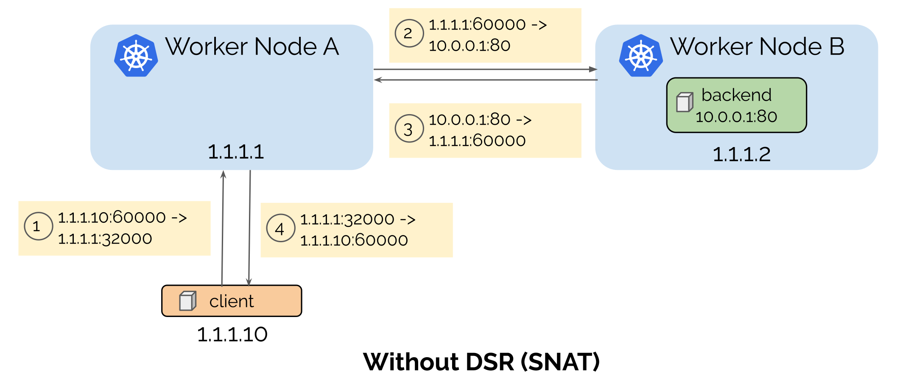
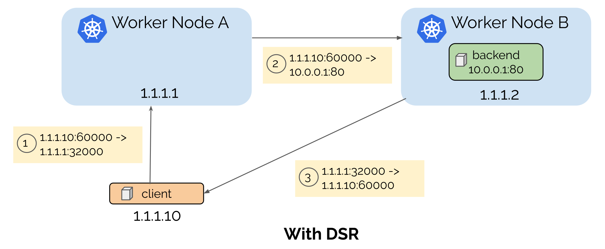
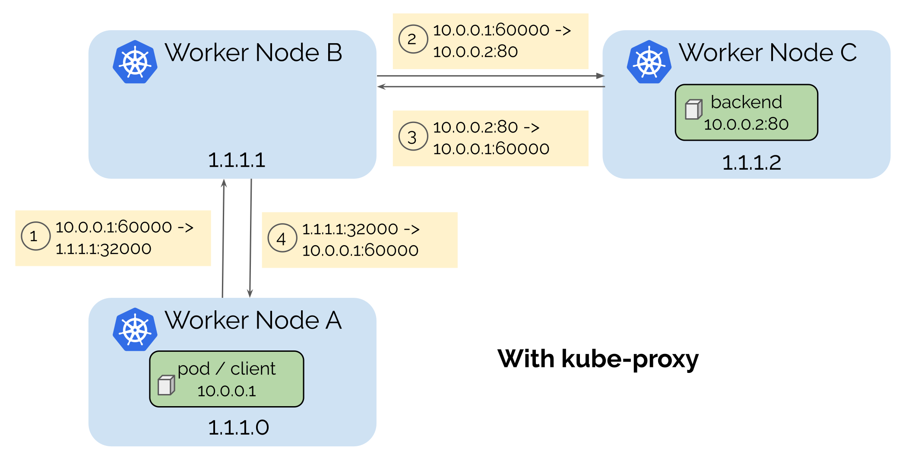
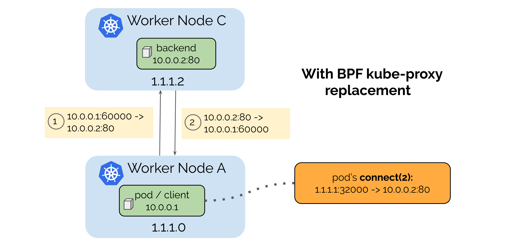
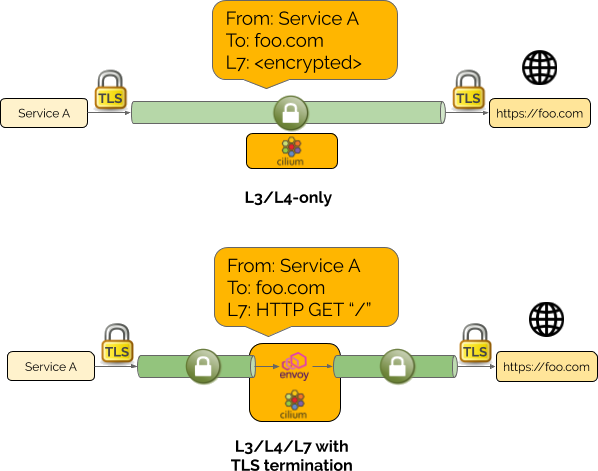
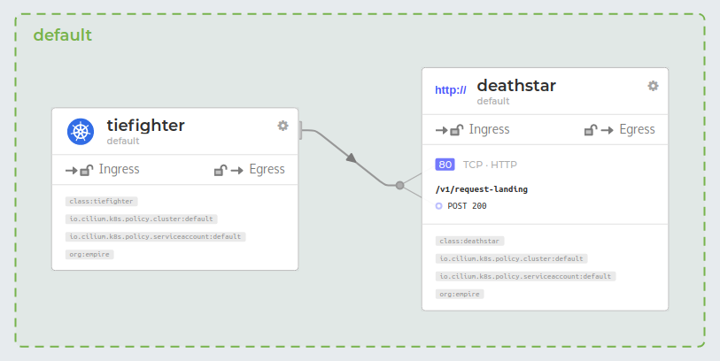

{{preview}}


We are excited to announce the Cilium 1.7 release. A total of 1551 commits have
been contributed by a community of 141 developers, many of whom made their
first contributions this cycle. Cilium 1.7 brings with it a trove of exciting
new features:

- **Hubble:** We've heard lots of positive feedback on Hubble since the
  [announcement](blog/2019/11/19/announcing-hubble). To make
  cluster connectivity easier to visualize and debug, we've released a new
  Hubble UI as open source so you can tweak and extend it too! We've also been
  working on various improvements to the core Hubble implementation, including
  better correlation between network flow data and Kubernetes resources.
  ([More details](blog/2020/02/18/cilium-17#hubble))
- **Cilium Cluster-wide Network Policies:** The 1.7 release brings the
  much-anticipated Cluster-wide CNP feature. This allows users to apply
  baseline network policies which apply to pods across the cluster, regardless
  of the namespace that the pod resides in.
  ([More details](blog/2020/02/18/cilium-17#ccnp))
- **Kube-proxy replacement with Direct Server Return:** As presented at
  [Kubecon US 2019] and [FOSDEM 2020], this release rounds out the full service
  feature set for replacing kube-proxy and additionally adds support for Direct Server
  Return (DSR). This further improves the latency and performance of the kube-proxy
  replacement in Cilium. Moreover, our kube-proxy replacement comes out of
  beta and is automatically enabled in environments with newer kernels.
  ([More details](blog/2020/02/18/cilium-17#kubeproxy-removal))
- **Extending L7 policies with TLS introspection:** We've added support to
  Cilium to configure Envoy TLS certificates via Kubernetes resources or local
  files. This allows Cilium to transparently observe HTTP calls and enforce
  API-aware policies on TLS-encrypted sessions.
  ([More details](blog/2020/02/18/cilium-17#tls-visibility))
- **L7 visibility annotations for pods:** Previously, to gain L7 visibility
  into traffic in the cluster, users would need to write network policies that
  put pods into a default deny posture. Visibility annotations now allow users
  to gain L7 visibility into network traffic first, then subsequently craft
  full network policies using these insights.
  ([More details](blog/2020/02/18/cilium-17#visibility-annotations))
- **Pure Go eBPF library:** This is the first Cilium release to begin using the
  pure Go eBPF library co-written between the Cilium community and CloudFlare.
  This streamlined library already allowed Cilium to jettison CGo, improving
  performance and reducing binary sizes.
  ([More details](blog/2020/02/18/cilium-17#pure-go-ebpf-library))
- **Improvements to scalability** through [Kubernetes EndpointSlice support](blog/2020/02/18/cilium-17#endpoint-slice) and
  [Cilium agent improvements](blog/2020/02/18/cilium-17#scalability), development on [upstream Linux](blog/2020/02/18/cilium-17#upstream-linux),
  running our [testing environment on managed Kubernetes](blog/2020/02/18/cilium-17#managed-ci),
  [distributing Cilium via Helm repositories](blog/2020/02/18/cilium-17#helm)... **and much more!**
  For more highlights, see the [1.7 Release Highlights](blog/2020/02/18/cilium-17#17Highlights).

{{/preview}}


We are excited to announce the Cilium 1.7 release. A total of 1551 commits have
been contributed by a community of 141 developers, many of whom made their
first contributions this cycle. Cilium 1.7 brings with it a trove of exciting
new features:

- **Hubble:** We've heard lots of positive feedback on Hubble since the
  [announcement](/blog/2019/11/19/announcing-hubble). To make
  cluster connectivity easier to visualize and debug, we've released a new
  Hubble UI as open source so you can tweak and extend it too! We've also been
  working on various improvements to the core Hubble implementation, including
  better correlation between network flow data and Kubernetes resources.
  ([More details](#hubble))
- **Cilium Cluster-wide Network Policies:** The 1.7 release brings the
  much-anticipated Cluster-wide CNP feature. This allows users to apply
  baseline network policies which apply to pods across the cluster, regardless
  of the namespace that the pod resides in.
  ([More details](#ccnp))
- **Kube-proxy replacement with Direct Server Return:** As presented at
  [Kubecon US 2019] and [FOSDEM 2020], this release rounds out the full service
  feature set for replacing kube-proxy and additionally adds support for Direct Server
  Return (DSR). This further improves the latency and performance of the kube-proxy
  replacement in Cilium. Moreover, our kube-proxy replacement comes out of
  beta and is automatically enabled in environments with newer kernels.
  ([More details](#kubeproxy-removal))
- **Extending L7 policies with TLS introspection:** We've added support to
  Cilium to configure Envoy TLS certificates via Kubernetes resources or local
  files. This allows Cilium to transparently observe HTTP calls and enforce
  API-aware policies on TLS-encrypted sessions.
  ([More details](#tls-visibility))
- **L7 visibility annotations for pods:** Previously, to gain L7 visibility
  into traffic in the cluster, users would need to write network policies that
  put pods into a default deny posture. Visibility annotations now allow users
  to gain L7 visibility into network traffic first, then subsequently craft
  full network policies using these insights.
  ([More details](#visibility-annotations))
- **Pure Go eBPF library:** This is the first Cilium release to begin using the
  pure Go eBPF library co-written between the Cilium community and CloudFlare.
  This streamlined library already allowed Cilium to jettison CGo, improving
  performance and reducing binary sizes.
  ([More details](#pure-go-ebpf-library))
- **Improvements to scalability** through [Kubernetes EndpointSlice support](#endpoint-slice) and
  [Cilium agent improvements](#scalability), development on [upstream Linux](#upstream-linux),
  running our [testing environment on managed Kubernetes](#managed-ci),
  [distributing Cilium via Helm repositories](#helm)... **and much more!**
  For more highlights, see the [1.7 Release Highlights](#17Highlights).

# What is Cilium?

Cilium is open source software for transparently providing and securing the
network and API connectivity between application services deployed using Linux
container management platforms such as Kubernetes.

At the foundation of Cilium is a new Linux kernel technology called eBPF, which
enables the dynamic insertion of powerful security, visibility, and networking
control logic within Linux itself. eBPF is utilized to provide functionality
such as multi-cluster routing, load balancing to replace kube-proxy,
transparent encryption as well as network and service security. Besides
providing traditional network level security, the flexibility of eBPF enables
security with the context of application protocols and DNS requests/responses.
Cilium is tightly integrated with Envoy and provides an extension framework
based on Go. Because eBPF runs inside the Linux kernel, all Cilium
functionality can be applied without any changes to the application code or
container configuration.

See the section **[Introduction to
Cilium](https://cilium.readthedocs.io/en/stable/intro/)** for a more detailed general
introduction to Cilium.

# New [USERS.md](https://github.com/cilium/cilium/blob/master/USERS.md) file: Who is using Cilium?

```
* N: Adobe, Inc.
  D: Adobe's Project Ethos uses Cilium for multi-tenant, multi-cloud clusters
  U: L3/L4/L7 policies
  L: https://youtu.be/39FLsSc2P-Y

* N: CENGN - Centre of Excellence in Next Generation Networks
  D: CENGN is using Cilium in multiple clusters including production and development clusters (self-hosted k8s, On-premises)
  U: L3/L4/L7 network policies, Monitoring via Prometheus metrics & Hubble
  L: https://www.youtube.com/watch?v=yXm7yZE2rk4
  Q: @rmaika @mohahmed13

* N: Datadog
  D: Datadog is using Cilium in AWS (self-hosted k8s)
  U: ENI Networking, Service load-balancing, Encryption
  Q: @lbernail, @roboll
[...]
```

([Full USERS.md file](https://github.com/cilium/cilium/blob/master/USERS.md))

Sharing experiences and learning from other users is essential. We are
frequently asked who is using a particular feature of Cilium to get in contact
with other users to share experiences and best-practices. While the Cilium
Slack community allows users to get in touch, it can be challenging to find
users of a particular feature quickly.

If you are using Cilium, please consider [adding yourself as a user](https://github.com/cilium/cilium/edit/master/USERS.md) with a quick
description of your use case by opening a pull request to this file and adding
a section describing your usage of Cilium. If you are open to others contacting
you about your use of Cilium on Slack, add your Slack nick as well.

<a name="hubble"></a>

# Hubble

_Contributed by Sebastian Wicki and Sergey Generalov_



The development cycle of Cilium 1.7 coincided with the
[a first preview release of Hubble](/blog/2019/11/19/announcing-hubble)
-- an observability tool specifically designed for Cilium. Hubble is able to
obtain deep visibility into the network traffic of Kubernetes application and
services by tapping into Cilium's eBPF data path. This information can then be
queried via Hubble CLI and UI, for example for
[interactive troubleshooting of DNS issues](/blog/2019/12/18/how-to-debug-dns-issues-in-k8s).
For monitoring, Hubble provides an extensible metrics framework which
integrates nicely into Prometheus and Grafana. For more information please refer
to the [tutorial on setting up Hubble Metrics with Grafana](https://github.com/cilium/hubble/tree/master/tutorials/deploy-hubble-and-grafana).

Several features in Cilium 1.7 have been added with Hubble in mind: The
[L7 visibility annotations for pods](#visibility-annotations) for example allows
Hubble to extract application-layer information from DNS and HTTP traffic.
The [Cilium API](https://docs.cilium.io/en/v1.7/api/) has also been extended in
this release to allow Hubble to annotate the observed network flows with
additional meta-data, such as mapping Kubernetes ClusterIPs to their respective
service names.

<a name="hubble-ui"></a>

### Hubble UI



Hubble UI enables zero-effort automatic discovery of the service dependency graph for Kubernetes Clusters at L3/L4 and even L7, allowing user-friendly visualization and filtering of
those dataflows as a Service Map. First presented during [the Hubble announcement](/blog/2019/11/19/announcing-hubble), we provided users with a preview release docker image, allowing everyone to try [Hubble Service Map in a Minikube](https://github.com/cilium/hubble/blob/master/tutorials/deploy-hubble-servicemap/README.md) while working on open sourcing the code itself.

We are happy to announce, Hubble UI code is now open sourced and available under Cilium's GitHub organization: [https://github.com/cilium/hubble-ui](https://github.com/cilium/hubble-ui)

During Cilium 1.7 development cycle several performance improvements were made to Hubble UI to work better in small multi-node clusters; however we still consider Hubble UI in preview release stage and encourage the community to provide feedback on [Hubble Github page](https://github.com/cilium/hubble/issues) or [Cilium Slack #hubble channel](https://cilium.herokuapp.com/).

<a name="ccnp"></a>

# Cilium Cluster-wide Network Policies

_Contributed by Deepesh Pathak and André Martins_



This release introduces Cilium Cluster-wide Network Policies (CCNP). Prior to
Cilium 1.7, all Cilium network policies were namespaced, so there was no easy
way to configure a baseline policy that applies across the entire cluster.
Cluster-wide policies streamline the application of a standard default posture
by allowing the cluster maintainer to apply a single policy which applies to
pods in all namespaces, regardless of the policies that exist in individual
namespaces. Cluster-wide policies are essential in various cases, such as:

- Automatically applying a default-deny policy to all namespaces as they're
  created;
- Allowing requests to a baseline set of allowed destinations like kube-dns,
  DNS destinations used by all apps, or known IP ranges;
- Reducing management overhead of network policies in high-scale environments.

The `CiliumClusterwideNetworkPolicy` resource specification is the same as that
of existing `CiliumNetworkPolicy` CRD with the only difference in the scope of
the policy, denoted by the "kind" field in the YAML. Resource-based Access
Control (RBAC) can be defined separately for CCNP so users modifying policies
in one namespace won't roll back the baseline policies. The policy example
below grants any pod with the label `group: my-app` in the entire cluster the
privilege to perform DNS requests via kube-dns:

### Policy Example

```yaml
apiVersion: 'cilium.io/v2'
kind: CiliumClusterwideNetworkPolicy
description: 'Default deny and allow egress to kube-dns pod.'
metadata:
  name: 'clusterwide-policy-example'
spec:
  endpointSelector:
    matchLabels:
      group: my-app
  egress:
    - toEndpoints:
        - matchLabels:
            'k8s:io.kubernetes.pod.namespace': kube-system
            k8s-app: kube-dns
      toPorts:
        - ports:
            - port: '53'
```

With the new Kubernetes CRD introduced in this release for cluster-wide policy,
it's now simpler to create network policies which apply to the entire cluster.

<a name="kubeproxy-removal"></a>

# Kube-proxy replacement with Direct Server Return

_Contributed by Martynas Pumputis, Daniel Borkmann, Sebastian Wicki and André Martins_



This release brings many improvements and adds additional features to Cilium's
kube-proxy replacement in eBPF, first introduced in Cilium
[v1.6](/blog/2019/08/20/cilium-16). The eBPF-based kube-proxy
replacement implements handling of Kubernetes services of type `ClusterIP`,
`NodePort`, `ExternalIPs` and `LoadBalancer`.

Kube-proxy replacement in eBPF has many benefits when compared to the vanilla
kube-proxy of Kubernetes, such as better performance, reliability and
debuggability. See **[Kubernetes without
kube-proxy](https://docs.cilium.io/en/stable/gettingstarted/kubeproxy-free/)**
for a quick-start guide and advanced configuration options. In addition, see
[Kubecon US 2019] and [FOSDEM 2020] for implementation details and performance
benchmarks.

In this release, Cilium's eBPF-based kube-proxy replacement has been stabilized
and as a result moved from beta status to general availability. New Cilium
deployments via Helm transparently enable the kube-proxy replacement components
by default if supported by the underlying Linux kernel, meaning, even if run
alongside a kube-proxy environment, users still benefit from the eBPF-based
data path optimizations.

Check out our **[2 minute Cilium demo](http://www.youtube.com/watch?v=bIRwSIwNHC0&t=110)**
on running Kubernetes without kube-proxy and netfilter/iptables being compiled
out of the kernel:

<center>
<div
  style=" max-width: 640px; height: 304.54px; cursor: pointer; background: url('/2020-02-10-cilium-17-demo-preview.png') #fff no-repeat; background-size: contain;" onclick="this.innerHTML=`<iframe width='640px' height='304.54px' src='https://www.youtube.com/embed/bIRwSIwNHC0?start=113&modestbranding=1&autoplay=1' frameborder='0' allow='accelerometer; autohide; autoplay; encrypted-media; gyroscope; picture-in-picture' allowfullscreen></iframe>`"></div></center>

## Direct Server Return

When accessing a Kubernetes service from outside via NodePort, ExternalIPs or
LoadBalancer, a Kubernetes worker node might redirect the request to
another node. This happens when a service endpoint runs on a different node
than the request was sent to. Before the redirect, the request is SNAT'd, which
means that the backend won't see the source IP address of a client. Also, the
reply will be sent through the initial node back to the client, which introduces
additional latency.

To avoid that, Kubernetes offers `externalTrafficPolicy=Local` which helps to
preserve the client source IP address by dropping a request to a service if a
receiving node does not run any service endpoint. However, this complicates
load-balancer implementations, and can lead to uneven load balancing.

To address the problem, we have implemented Direct Server Return for Kubernetes
services with the help of eBPF. This not only preserves the client source IP
address, but also allows us to avoid an extra hop when sending a reply back to
the client as shown in the figures below:



<br />



### Support for Kubernetes Services with External IPs

We have added support for services which are exposed with [External IPs].
For each incoming packet with the destination IP set to one of those `externalIPs`
the traffic will be redirected to one of the pods being backed by that service.

```yaml
apiVersion: v1
kind: Service
metadata:
  name: external-service
  namespace: kube-system
spec:
  ports:
    - name: service-port
      protocol: TCP
      port: 8080
  externalIPs:
    - 10.0.0.1
    - 10.0.0.2
    - 10.0.0.3
```

### Optimizations for Service Endpoint Selection

Accessing a Kubernetes service from a Cilium-managed node via ClusterIP,
NodePort, ExternalIPs or LoadBalancer is handled through socket-based
load balancing in eBPF. This means that instead of performing slower DNAT on
the packet itself in lower layers of the stack, the backend is selected once,
for example, during the TCP `connect(2)` syscall where the kernel proceeds with
directly connecting to the service' backend address.

For any NodePort and ExternalIPs service, we implemented an optimization where the
backend can directly be selected on the local node for traffic from the host namespace
or from Cilium-managed Kubernetes pods. This is different compared to the regular
kube-proxy implementation that would need an additional hop in the network in
order to first reach the related node address of the service which in turn would
then forward the request to a remote backend in the worst case.



<br />



This latency improvement of saving an additional hop for packets is transparent
to applications and made possible in Cilium given every Cilium-managed node
has a global view of Kubernetes services and their backends, and internal knowledge
of security identities of remote Cilium-managed nodes.

### Miscellaneous Improvements

- Support for services of the `LoadBalancer` type was added, and we have
  successfully tested the kube-proxy replacement with [MetalLB](https://metallb.universe.tf/).
- The kube-proxy replacement in Cilium now fully supports the aforementioned
  `externalTrafficPolicy` setting for both `NodePort` and `LoadBalancer`
  services. For services with the `Local` traffic policy, requests to nodes
  without any local service endpoints will be dropped rather than forwarded,
  therefore avoiding any unwanted additional hops.
- To accommodate external load balancers which have to learn about the
  availability of service endpoints on individual nodes, this release of Cilium
  now also supports Kubernetes' `healthCheckNodePort` field. The Cilium
  user-space agent now serves a service health check for each Kubernetes service
  of type `LoadBalancer` with `externalTrafficPolicy=Local`.
- For each NodePort service kube-proxy opens a socket in the host namespace,
  and binds the NodePort port to it in order to prevent other applications
  from reuse. For a large number of services, this adds a lot of resource
  overhead in the kernel, potentially allocating and binding thousands of sockets.
  Cilium's kube-proxy replacement avoids this issue entirely, does not allocate
  a single socket, and instead uses the eBPF `bind(2)` hook through its socket-based
  load balancing mechanism to consult its eBPF service map and reject an
  application's `bind(2)` request on these ports with an error code.
- Cilium's socket-based load balancing in eBPF now also supports IPv4-in-IPv6
  service address translation. This allows IPv4 service backend selection out
  of the `connect(2)`/`sendmsg(2)` hook of IPv6-only applications. This is
  often enabled by default in language runtimes such as in case of Java.
- We have developed an extensive kube-proxy compatibility test suite with over 350
  test cases which now runs as part of our Cilium CI infrastructure to ensure
  same semantics for our eBPF kube-proxy replacement.

<a name="tls-visibility"></a>

# TLS visibility for L7 policies (beta)

_Contributed by Jarno Rajahalme_

Cilium Network Policy (CNP) specification has two new experimental extensions
(subject to change in coming releases) for policy enforcement on TLS protected
HTTP connections. Firstly, the port-level policy rule definition is extended
with TLS contexts, one for terminating the client-initiated TLS connection in
the Cilium host proxy, and the other for originating TLS for the upstream proxy
connection. In order for this proxy TLS interception to work, the client pod
must be configured with your local CA certs that are also used to create the TLS
secrets for the port rule. A new [Getting Started
Guide](https://docs.cilium.io/en/v1.7/gettingstarted/tls-visibility 'Inspecting TLS Encrypted Connections with Cilium') has step-by-step
instructions for this.



Secondly, the HTTP rule level is extended with new header matches that can
perform header manipulations on mismatching headers. The header value being
matched can be sourced from a Kubernetes Secret, so no secret information needs to be
specified directly in the CNP. The supported mismatch actions include `LOG`, `ADD`,
`DELETE` and `REPLACE`. These allow a policy to either just inspect and log
incorrect header values, or replace incorrect values with the correct
ones. Applying the `REPLACE` mismatch action on an client authorization header
makes it possible to never expose secret tokens to application pods.

Using these new facilities with `toFQDNs` rules allows not only limiting TLS
traffic to external services on specific domain names, but also enforcing and
access logging the HTTP metadata (path, method, headers, etc.), preventing
potentially malicious exfiltration of data, for example.

<a name="visibility-annotations"></a>

# L7 protocol visibility via pod annotations

_Contributed by Ian Vernon and Joe Stringer_

When users run Cilium as the CNI, by default the only visibility that is
available via tools like [Hubble] or `cilium monitor` is information at layers
2, 3 and 4 as individual packets pass through the Cilium eBPF data path. Users
can apply [Layer 7 Policy] to add API-aware visibility and enforcement on the
network streams in the cluster, but for any visibility to be effective without
dropping any other traffic, users would need to craft full policies for the
selected endpoints to allow all expected traffic to/from those endpoints.

To allow users to gain introspection into the API calls being made without
having to craft full policies for their endpoints, we've added support for
proxy visibility annotations. Users can annotate the pod indicating the
direction, port and protocols active on the port, then Cilium gathers and
distributes information about API calls being made to other tools like Hubble.
In the image below, the `tiefighter` is posting API requests to
`v1/request-landing` on the `deathstar`... I wonder what that's about!



The policy documentation describes how to use these pod annotations in [more
detail](http://docs.cilium.io/en/stable/policy/visibility/).

<a name="ebpf-library"></a>

# Pure Go eBPF library

_Contributed by Joe Stringer_

During the [Linux Plumbers 2019 eBPF track](https://linuxplumbersconf.org/event/4/sessions/62/#20190911),
Cilium core developers and Cloudflare engineers co-presented a [proposal](https://linuxplumbersconf.org/event/4/contributions/449/)
for a pure Go eBPF library which would aim to solve eBPF kernel interactions for long-lived
Go-based daemons like Cilium or Cloudflare's L4 load balancer, without the need to pull in [CGo](https://dave.cheney.net/2016/01/18/cgo-is-not-go).

This effort is now well under way, and in Cilium 1.7 the ring-buffer used for sending messages
from the eBPF data path to the user space `cilium-agent` process has been converted over from the
previous CGo implementation to a faster, more efficient implementation with the help of the new
library.

There are various other eBPF libraries in the wild, for example, [libbpf](https://git.kernel.org/pub/scm/linux/kernel/git/torvalds/linux.git/tree/tools/lib/bpf)
or [libbcc](https://github.com/iovisor/bcc/blob/master/src/cc/libbcc.pc.in). While the former
represents the canonical implementation, lives in the Linux kernel tree and is suited for
C/C++-based applications, it cannot be used in pure Go context. Similarly, that is the case
for the latter which has a focus on tracing, wraps libbpf and even LLVM's eBPF backend. Other
Go-based libraries in this area depend on CGo, complicating builds and having expensive
context switches between C and Go environment as a result to just name a few.

With the start of a generic, pure Go eBPF library, we aim to solve both Cilium and Cloudflare's
production needs for orchestrating eBPF, and hope to also enable a much larger Go community to
interact with the kernel's eBPF subsystem more easily. The main goals are to cover networking
use-cases, to minimise external dependencies, to solve common problems and to have a well-tested
and highly testable eBPF library in pure Go that can be used in production.

Aside from the initial eBPF map, program and ring-buffer interactions, the development on the
library continues with recent extensions to support the BPF Type Format (BTF) and initial proposals
for static data substitution to support templated eBPF programs which only need to be compiled once.

To learn more about the eBPF library, visit the project under Cilium's GitHub organization: [https://github.com/cilium/ebpf](https://github.com/cilium/ebpf)

<a name="endpoint-slice"></a>

# Kubernetes EndpointSlice support

_Contributed by André Martins_

In order to have better scalability for a large number of endpoints backed by
a service, Kubernetes 1.16 has introduced [EndpointSlice](https://kubernetes.io/docs/concepts/services-networking/endpoint-slices/).
Since Kubernetes 1.17 this API has been marked as beta and enabled by default.
Although the API endpoint is enabled by default, the controller that manages
Endpoint Slices is not and one needs to follow the guide [here](https://kubernetes.io/docs/tasks/administer-cluster/enabling-endpointslices/#enabling-endpointslices)
to enable that controller and make use of this new type.

Cilium 1.7 introduces a new flag, `enable-k8s-endpoint-slice`, which is enabled
by default and will automatically detect if Endpoint Slices are available in the
cluster and use those to perform all the service translations in eBPF. Setting
this flag to false will fallback to using the v1/Endpoints types available in
the cluster.

<a name="scalability"></a>

# Scalability

_Contributed by Ian Vernon and André Martins_

### CNP node status

As part of the CiliumNetworkPolicy (CNP) scalability improvements, Cilium
introduces a new flag: `enable-k8s-event-handover`.

When a new CNP is created in the cluster, all Cilium agents will receive an
event from Kubernetes and, as soon as they enforce the policy in the data path,
each one of them will update its status in the status field of the CNP. For a
large number of nodes this can cause high CPU usage in kube-apiserver as for
each update received from each Cilium agent a new Kubernetes event needs to be
sent to all remaining nodes. In previous releases, we have supported entirely
disabling this feature using the `--disable-cnp-status-updates` flag; however
this prevents users from understanding the enforcement status of the CNPs.

With `enable-k8s-event-handover` enabled, the implementation will behave
slightly differently: Instead of updating its status field in the CNP, each Cilium
agent will update its status into the KVstore. Cilium Operator will then watch
for all of those updates for each CNP from the KVstore and perform incremental
updates with all Cilium agent status to each CNP into Kubernetes. In the end,
the CNP status will always be present in Kubernetes, but the way it will be
more efficiently populated.

### Cilium agent

As Cilium does no longer depend on container runtimes, all of the container
runtimes' dependencies were removed from Cilium causing the cilium-agent binary
size to drop from 97M to 74M.

### Golang 1.13

Cilium 1.7 is compiled with Golang 1.13 which allows a lot of memory optimizations
in the [runtime](https://golang.org/doc/go1.13#runtime) and also decreases
the memory footprint of Cilium.

<a name="upstream-linux"></a>

# Linux kernel changes

_Contributed by Daniel Borkmann_

During the Cilium 1.7 development window, we've also worked on a number of
improvements to the Linux kernel's eBPF subsystem which we co-maintain. The selected
changes highlighted below are generic for all eBPF users, but have been implemented
in the context of Cilium's and Hubble's eBPF needs. They are part of the just
released 5.5 kernel.

### Live-Patching of eBPF programs

Given that Cilium's data path needs to support a wide range of Linux kernels, that
is, from 4.9 up to the very latest kernel release. A lot of the eBPF data path
functionality has been split into eBPF tail calls in particular for the case of
having Cilium's eBPF kube-proxy replacement enabled. Aside from reducing verifier
complexity on older kernels, the use of eBPF tail calls also allows for atomically
replacing pod-specific eBPF features without service disruption on a live system.

The x86-64 eBPF JIT compiler in the kernel originally mapped eBPF tail calls into
an indirect jump, meaning, the target eBPF program address is loaded from the
BPF tail call map from a given index into register `%rax` followed by a `jmpq *%rax`.
Due to the various speculative execution flaws on modern CPUs, we later changed
the eBPF JIT to [emit retpolines](https://lore.kernel.org/netdev/20180222141253.3639-1-daniel@iogearbox.net/)
instead at the cost of performance. Given also that all major compilers have
adapted this technique, the Linux kernel community in general has since been
obsessed with avoiding indirect calls in fast-path code whenever possible. For
example, a small [improvement](https://lore.kernel.org/netdev/20180602210641.6163-6-daniel@iogearbox.net/)
to turn eBPF map-related helpers into direct calls showed a [14% performance gain](http://vger.kernel.org/lpc-networking2018.html#session-10).

Now, for the 5.5 kernel, we [implemented](https://lore.kernel.org/bpf/cover.1574452833.git.daniel@iogearbox.net/)
tracking of eBPF tail call map indices in the verifier and if the latter determines
that a given index is constant from all program paths, as in the vast majority of
cases in Cilium's eBPF programs, we can emit a direct jump. Once the tail called
programs are updated, the eBPF JIT image is patched to directly jump to the new location.

To demonstrate this technique, the below example eBPF program implements an eBPF tail
call jump to the constant map index `0`:

<pre>
    0: (b7) r3 = 0
    1: (18) r2 = map[id:526]
    3: (85) call bpf_tail_call#12
    4: (b7) r0 = 1
    5: (95) exit
</pre>

The x86-64 eBPF JITed program would emit a retpoline on older kernels (marked in bold):

<pre>
    0xffffffffc076e55c:
    [...]                                  _
    19:   xor    %edx,%edx                |_ index (r3 = 0)
    1b:   movabs $0xffff88d95cc82600,%rsi |_map (r2 = map[id:526])
    25:   mov    %edx,%edx                |  index >= array->map.max_entries check
    27:   cmp    %edx,0x24(%rsi)          |
    2a:   jbe    0x0000000000000066       |_
    2c:   mov    -0x224(%rbp),%eax        |  tail call limit check
    32:   cmp    $0x20,%eax               |
    35:   ja     0x0000000000000066       |
    37:   add    $0x1,%eax                |
    3a:   mov    %eax,-0x224(%rbp)        |_
    40:   mov    0xd0(%rsi,%rdx,8),%rax   |_prog = array->ptrs[index]
    48:   test   %rax,%rax                |  prog == NULL check
    4b:   je     0x0000000000000066       |_
    <b>4d:   mov    0x30(%rax),%rax</b>          |  goto *(prog->bpf_func + prologue_size)
    <b>51:   add    $0x19,%rax</b>               |
    <b>55:   callq  0x0000000000000061</b>       |  retpoline for indirect jump
    <b>5a:   pause</b>                           |
    <b>5c:   lfence</b>                          |
    <b>5f:   jmp    0x000000000000005a</b>       |
    <b>61:   mov    %rax,(%rsp)</b>              |
    <b>65:   retq</b>                            |_
    66:   mov    $0x1,%eax                (next instruction, r0 = 1)
    [...]
</pre>

For 5.5 or later kernels, the same program would get optimized into a direct jump
(marked in bold) without the need for a retpoline:

<pre>
    0xffffffffc08e8930:
    [...]                                  _
    19:   xor    %edx,%edx                |_ index (r3 = 0)
    1b:   movabs $0xffff9d8afd74c000,%rsi |_map (r2 = map[id:526])
    25:   mov    -0x224(%rbp),%eax        |  tail call limit check
    2b:   cmp    $0x20,%eax               |
    2e:   ja     0x000000000000003e       |
    30:   add    $0x1,%eax                |
    33:   mov    %eax,-0x224(%rbp)        |_
    <b>39:   jmpq   0xfffffffffffd1785</b>       |_[direct] goto *(prog->bpf_func + prologue_size)
    3e:   mov    $0x1,%eax                (next instruction, r0 = 1)
    [...]
</pre>

Upon program update, the instruction on address `39`, that is `jmpq 0xfffffffffffd1785`,
would be live-updated with the address of the new target eBPF program. Similarly,
if the target eBPF program would get deleted from the tail call map, then the `jmp`
is patched into a same-sized `nop` instruction in order to allow a fall-through:

<pre>
    0xffffffffc08e8930:
    [...]                                  _
    19:   xor    %edx,%edx                |_ index (r3 = 0)
    1b:   movabs $0xffff9d8afd74c000,%rsi |_map (r2 = map[id:526])
    25:   mov    -0x224(%rbp),%eax        |
    2b:   cmp    $0x20,%eax               .
    2e:   ja     0x000000000000003e       .
    30:   add    $0x1,%eax                .
    33:   mov    %eax,-0x224(%rbp)        |_
    <b>39:   nopl   0x0(%rax,%rax,1)</b>         |_ fall-through nop
    3e:   mov    $0x1,%eax                (next instruction, r0 = 1)
    [...]
</pre>

Thus, instead of redirecting speculation into the `pause/lfence` loop, the kernel
eliminates the need to potentially perform any speculation for the jump given the
direct address and can therefore execute the generated eBPF code more efficiently.

See the [merged patch set](https://lore.kernel.org/bpf/cover.1574452833.git.daniel@iogearbox.net/) for further information.

### Safe and multi-architecture supported eBPF probe helpers for tracing

Cilium's eBPF data path is able to export tracing information at various aggregation
levels through a high-performance, customizable ring-buffer to its user space agent.
[Hubble](https://github.com/cilium/hubble), which builds on top of Cilium and implements
a fully distributed networking and security observability platform, is then able to
provide deep visibility into the communication and behavior of services as well as
the networking infrastructure. Additionally, Hubble also enriches the gathered information
through eBPF-based kernel tracing.

Since multi-architecture support is in development for the next Cilium 1.8 release,
we have [implemented](https://lore.kernel.org/bpf/cover.1572649915.git.daniel@iogearbox.net/)
a new set of eBPF helpers in the kernel which allow for safe and multi-architecture
eBPF-based memory probing.

The current set of `probe_kernel_read()` and `bpf_probe_read_str()` eBPF helpers have
several downsides: while generally safe due to disabling page-faulting, on x86-64,
these helpers can still trigger a kernel [warning](https://git.kernel.org/pub/scm/linux/kernel/git/torvalds/linux.git/commit/?id=00c42373d3970b354948ba3b24a34501b1a2505f) when attempting to probe user memory on a non-canonical user access address. This can
be problematic since the non-canonical address range is often used in user space
applications for [tagged](https://en.wikipedia.org/wiki/Tagged_pointer) pointers.

Another severe downside is that the two mentioned eBPF helpers are incompatible for non-x86
based architectures as they assume usage for probing memory access for kernel space
addresses as well as user space addresses. However, use for both cases will attempt
to always access kernel space address space given access is performed under `KERNEL_DS`
and, while x86 has a non-overlapping address space, other architectures do not,
meaning, kernel pointer and user pointer can have the same address value.

Therefore, we have added the set of `bpf_probe_read_user()`, `bpf_probe_read_kernel()`
and `bpf_probe_read_user_str()` and `bpf_probe_read_kernel_str()` eBPF helpers to
the kernel for strict access under either `USER_DS` or `KERNEL_DS` in their allowed
range and without the possibility to trigger a non-canonical access warning in the
kernel.

See the [merged patch set](https://lore.kernel.org/bpf/cover.1572649915.git.daniel@iogearbox.net/) for further information.

<a name="managed-ci"></a>

# Supporting Cilium testing on managed Kubernetes offerings

_Contributed by Maciej Kwiek and Ray Bejjani_

Running Cilium end-to-end tests has always been a bit painful because of tight
coupling between our testing framework and assumptions about the cluster that
tests are being run on. This release, we've done a lot of work to make
developers' lives easier.

Cilium 1.7 gives Cilium developers means to run most of our test suite on
Kubernetes clusters managed by providers such as GKE. Developers are also able
to run only selected tests on our CI GKE clusters, which eases the burden of
managing local clusters and allows for more test-driven development thanks to
faster cluster provisioning.

<a name="helm"></a>

# Helm 3 and Helm repository

_Contributed by Arthur Evstifeev and Joe Stringer_

[Helm3] was recently released, simplifying the use of helm charts repositories
and allowing installation without requiring Tiller to be installed in your
cluster. Extending upon the helm template support introduced initially in
Cilium 1.6, from this release onwards Cilium will be available via a helm
repository residing at [https://helm.cilium.io](https://helm.cilium.io). All
Cilium guides have been updated to use Helm3 syntax. To use this repository for
installation:

**Example: Configuring Cilium for GKE**

```bash
helm repo add cilium https://helm.cilium.io/
helm install cilium cilium/cilium \
  --namespace cilium \
  --set global.cni.binPath=/home/kubernetes/bin \
  --set global.nodeinit.enabled=true \
  --set nodeinit.reconfigureKubelet=true \
  --set nodeinit.removeCbrBridge=true
```

<a name="17Highlights"></a>

# 1.7 Release Highlights

- **Enhancements to kube-proxy replacement in eBPF**
  - New Direct Server Return (DSR) mode for better latency and client source IP preservation
  - Kubernetes ExternalIPs and LoadBalancer service support
  - NodePort services health check support added
  - Handling of `externalTrafficPolicy=Local` added
  - IPv4-in-IPv6 support for socket-based load balancing
  - Optimized endpoint selection for socket-based load balancing
  - Various SNAT optimizations and better port collision handling
  - Efficient detection of NodePort and ExternalIPs port reuse via bind hook
  - New feature probe mode by default for new deployments
  - Extensive kube-proxy compatibility test suite for Cilium CI
- **Policy**
  - TLS visibility policies (beta)
  - L7 visibility via pod annotations
  - Support handling remote nodes as separate identity
  - Improve handling of DNS timeouts with FQDN policy
- **Kubernetes**
  - Validated with Kubernetes 1.17
  - Support dual-stack mode
  - Support for EndpointSlices
  - Better CRD validation for Cilium resources
- **Datapath**
  - More efficient ring-buffer communication between eBPF and cilium-agent
  - Support more flexible aggregation of connection events
  - Better bounding on dumping large maps
  - Improved handling of large CIDR policies
  - Detect feature support using bpftool
  - Support for forwarding ICMP fragmentation needed messages via agent option
  - Support binding to NodePorts
- **Scalability and Resource consumption**
  - Offload `CiliumNetworkPolicy` status reporting to KVstore and cilium-operator
  - Optimize footprint using Go 1.13
  - Remove dependency on container runtime (CRI).
- **CLI**
  - Improved information in the `cilium status` command
  - Command completion for zsh
- **Documentation**
  - Use Helm 3 for deployment instructions
  - Add a dedicated repository for Cilium helm charts.
  - Various fixes for chaining and managed Kubernetes guides
- **Istio**
  - Support for 1.4.3
- **Kernel changes**
  - Live-patching eBPF programs
  - Multi-architecture support improvements
- **Hubble**
  - Hubble graphical user interface
  - Correlate additional metadata with network flows
- **Continuous Integration / Testing**
  - Support for running the Cilium CI in GKE and EKS managed clusters

See the [Changelog](https://github.com/cilium/cilium/blob/v1.7/CHANGELOG.md)
for full notes on changes during the Cilium 1.7 development cycle.

# Getting Started

New to Cilium? Follow one of the [Getting Started
Guides](https://docs.cilium.io/en/v1.7/gettingstarted/).

# Upgrade Instructions

As usual, follow the [upgrade
guide](https://cilium.readthedocs.io/en/v1.7/install/upgrade/#upgrading-minor-versions)
to upgrade your Cilium deployment. Feel free to ping us on
[Slack].

# Release

- Release Notes & Binaries: [1.7.0](https://github.com/cilium/cilium/releases/tag/v1.7.0)
- Container image: `docker.io/cilium/cilium:v1.7.0`

[slack]: https://cilium.herokuapp.com/
[hubble]: https://github.com/cilium/hubble/
[helm3]: https://helm.sh/blog/helm-3-released/
[kubecon us 2019]: https://www.youtube.com/watch?v=bIRwSIwNHC0
[fosdem 2020]: https://fosdem.org/2020/schedule/event/containers_bpf/
[layer 7 policy]: http://docs.cilium.io/en/stable/policy/language/#l7-policy
[external ips]: https://kubernetes.io/docs/concepts/services-networking/service/#external-ips
