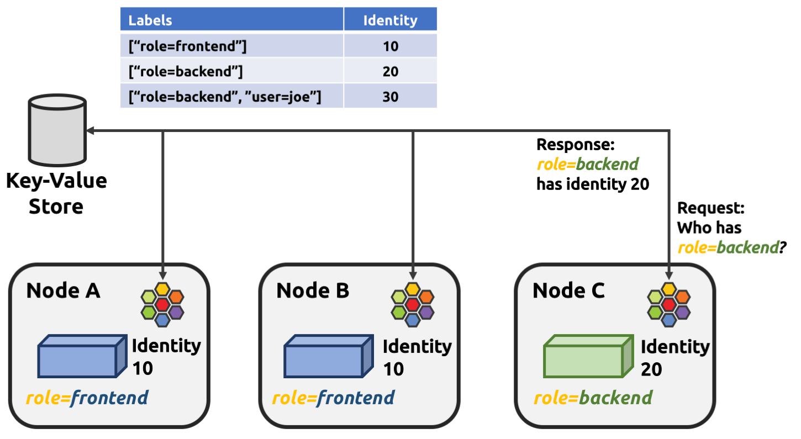

{{preview}}

Multitenancy is a common pattern in Kubernetes. Many organizations deploy Kubernetes-as-a-Service, where one cluster houses many tenants and workloads. This pattern might sound familiar, as cloud computing services like AWS, Azure, and GCP have enabled multiple customers (tenants) to run their business-critical workloads in a single cluster for years.

The benefits of this pattern are well-understood: Infrastructure efficiency is increased as CPU cores and memory have become a commodity. SRE/ops teams aren’t burdened with linear management of _N_ clusters for _N_ tenants, and generalized hardware can be utilized for virtually any workload.

However, with these benefits comes trade-offs: A model of shared compute implies shared infrastructure. In an environment with untrusted workloads, isolation has become a [serious security challenge](https://blog.jessfraz.com/post/hard-multi-tenancy-in-kubernetes/). In Kubernetes there are many shared resources that deserve security attention, but we’re going to focus on networking and discuss the unique network security challenges Kubernetes faces as a multitenancy provider.

{{/preview}}

_Contributed by Jed Salazar and Joe Stringer, Isovalent_

Multitenancy is a common pattern in Kubernetes. Many organizations deploy Kubernetes-as-a-Service, where one cluster houses many tenants and workloads. This pattern might sound familiar, as cloud computing services like AWS, Azure, and GCP have enabled multiple customers (tenants) to run their business-critical workloads in a single cluster for years.

The benefits of this pattern are well-understood: Infrastructure efficiency is increased as CPU cores and memory have become a commodity. SRE/ops teams aren’t burdened with linear management of _N_ clusters for _N_ tenants, and generalized hardware can be utilized for virtually any workload.

However, with these benefits comes trade-offs: A model of shared compute implies shared infrastructure. In an environment with untrusted workloads, isolation has become a [serious security challenge](https://blog.jessfraz.com/post/hard-multi-tenancy-in-kubernetes/). In Kubernetes there are many shared resources that deserve security attention, but we’re going to focus on networking and discuss the unique network security challenges Kubernetes faces as a multitenancy provider.

## Network Perimeters

To gain an understanding of the challenges of network security in Kubernetes, it’s worthwhile understanding the history of network security. The defining principle of network security in the pre-cloud-computing age was the _network perimeter security_ model. In short, this model assumed threats were _external_ to the network, meaning that attacks came from the Internet or an untrusted external network. Workloads internal to the network were trusted and the majority of an organization's security focus was deploying hardened perimeter firewalls that blocked access to internal (trusted) resources from external (untrusted) sources.

This model breaks down in a Kubernetes environment. Multiple tenants run in a single cluster, all using the same network infrastructure. Kubernetes [scheduling](https://kubernetes.io/docs/concepts/scheduling-eviction/kube-scheduler/) means virtually any type of workload can be deployed to a worker Node based on available system resources, which means multiple tenants can run on the same worker Node. In short, threats can come from inside the network perimeter or even the same Node where protections are scant and visibility is limited. Because the network perimeter model is no longer suitable in the age of cloud, an emerging pattern of network security called [Zero-Trust Networking](https://www.cloudflare.com/learning/security/glossary/what-is-zero-trust/) is gaining ground. Zero-Trust means internal and external resources aren’t implicitly trusted based on IP address for access to resources, even in the same network or worker Node.

## Multitenancy and Network Security in Kubernetes

Cilium is one of the least complex ways to achieve secure multitenancy. Cilium utilizes cloud-native-aware network identity and benefits from eBPF which incurs virtually no performance impacts to secure network connectivity. Why does this matter?

Consider our [previous blog post](https://cilium.io/blog/2020/06/29/cilium-kubernetes-cni-vulnerability), which shows the trusted network model having a history of impacting the security of Kubernetes. Another [vulnerability, (CVE-2020-8558)](https://groups.google.com/g/kubernetes-security-announce/c/B1VegbBDMTE?pli=1) was discovered in `kube-proxy` where processes bound to localhost (`127.0.0.1`) can be reachable by Nodes or Pods in the same local network. This is dangerous because certain deployments, such as the `kube-apiserver` don't require authentication if accessed via `127.0.0.1:8080` because it's assumed localhost is only reachable by other processes in the same Node.

Note: It's strongly suggested to disable this behavior by adding the `--insecure-port=0` flag to your kubernetes API server command line arguments.

The linked vulnerability works because of the way `iptables` routes to a [NodePort](https://v1-14.docs.kubernetes.io/docs/concepts/services-networking/service/#nodeport) address and the fact Kubernetes Pods run with `CAP_NET_RAW` privileges by default, allowing Pods to specify any source IP address.

A simplified explanation is a Pod with `CAP_NET_RAW` sends a packet with a localhost source IP, destined to a localhost NodePort address (`127.0.0.1:xxxxx -> 127.0.0.1:8888`) which performs _Destination NAT_ (DNAT) to a NodePort destination IP (`127.0.0.1:xxxxx -> 10.0.0.10:9999`). Because `route_localnet` is enabled, the packet is routed and `POSTROUTING` [masquerades](https://tldp.org/HOWTO/IP-Masquerade-HOWTO/ipmasq-background2.1.html) the source IP to the IP of the Node (`10.0.0.5:xxxxx -> 10.0.0.10:9999`). With the source and destination IP configured as the respective Node IPs, this packet is now fully valid and routable. Thanks to [squeed](https://github.com/squeed) for the details in the `iptables` [routing implementation](https://github.com/kubernetes/kubernetes/issues/90259).

Binding a process to localhost has traditionally been assumed safe under the trusted network model [“because it assumed that only other localhost processes could reach it”](https://groups.google.com/g/kubernetes-security-announce/c/B1VegbBDMTE?pli=1). Because untrusted workloads can run in the same network or on the same Node, the case for Zero-Trust becomes more clear.

## eBPF and Secure Multitenant Networks

We'll discuss a couple of concrete examples of how Cilium and eBPF implement aspects of Zero-Trust network principles to enable multitenancy in Kubernetes.

IP addresses aren't suitable for identities in Kubernetes because Pod Replicas can have _N_ number of IP addresses for a single workload. Additionally, correlating a Pod to an IP address is difficult in a highly dynamic environment like Kubernetes, as Pods can be quickly destroyed and re-scheduled, each time with a different IP address. So if you have a Pod with labels `frontend`, and you delete the Pod and quickly spin up a new Pod, Kubernetes is free to reassign the `frontend` IP to a new Pod that has the label `agent_of_chaos`.

To update the security policy in a traditional IP-based model, Nodes have to learn about the Pod shut down and then update the policy rules to remove the IP address from IP allow lists. In the meantime, the `agent_of_chaos` Pod can initialize using the same IP and send traffic to other Pods with the `frontend` IP address, and IP-based policy may allow it.

Cilium identifies a network entity with an [identity](https://docs.cilium.io/en/v1.8/concepts/terminology/#identity) instead of an IP address. Identities are derived from Kubernetes [labels](https://kubernetes.io/docs/concepts/overview/working-with-objects/labels/) and other metadata which allows security logic such as, "Only allow `frontend` Pods access to `backend` Pods". This allows for identity-aware security decisions such as Network Policy filtering.

When Cilium initializes the network for a new Pod, it allocates the identity and ties the identity directly to the Pod by applying security policy at the Pod's network device via eBPF. For traffic exiting the Pod, the identity is attached directly to all traffic, so it doesn't matter that it reuses the same IP address, we have a stronger notion of identity to back the security policy.

Another example of Zero-Trust in Cilium is based on the _Default Deny_ principle. We discussed how Cilium disables IPv6 traffic unless explicitly enabled in our [previous post](https://cilium.io/blog/2020/06/29/cilium-kubernetes-cni-vulnerability) but it's worth discussing the motivations that led to that decision.

Given what we know about cloud-native architecture, advances in the latest network protocols, and with decades of networking experience, we wanted to design a performant and secure network. This naturally led us towards eBPF, which provides the level of flexibility and power needed to implement the right approach. Conceptually this means that every network interaction was designed to provide guarantees about how we're handling packets. Because we build Cilium to be high-performance we could compile in a minimum amount of code. If we're not using a function, we should compile it out. By implementing only the set of the features that you need, we minimize the code footprint in Cilium which increases performance and also reduces the attack surface.

## Cilium and the Kube-Proxy Vulnerability

Cilium running in kube-proxy replacement mode is protected against the recent `kube-proxy` [vulnerability, (CVE-2020-8558)](https://groups.google.com/g/kubernetes-security-announce/c/B1VegbBDMTE?pli=1). This is because Cilium uses socket-based load-balancing also known as ["host-reachable services"](https://docs.cilium.io/en/v1.8/gettingstarted/host-services/#host-services) which does not require `route_localnet=1` in order to make NodePort services reachable via the loopback interface. These layer 3 protections are consistent with what we discussed in the section above. The NodePort service can be accessed by default from a host or Pod within a cluster via its public IP address, any local address, or loopback address, e.g. `127.0.0.1:NODE_PORT`. This means processes bound to `127.0.0.1` aren’t reachable by anything other than other localhost processes.

## Wrapping Up

Multitenancy brings many advantages but also risks to a Kubernetes environment. Cilium has created a network model where workloads are protected from attacks originating inside or outside of the network perimeter, which therefore moves Kubernetes closer to the future of the Zero-Trust Network. We developed Cilium from the ground up with secure multitenancy built into the design. eBPF gives us the power to realize this in ways that existing implementations simply couldn't.

If you're using (or are looking to use) Cilium for secure multitenancy, head over to our [Slack channel](https://cilium.herokuapp.com/) and let us know or ask a question. We have a growing and knowledgable community and we're always interested in helping steer you in the right direction.

## Image Attribution

- <https://unsplash.com/photos/0Yiy0XajJHQ>
- <https://unsplash.com/photos/M5tzZtFCOfs>
