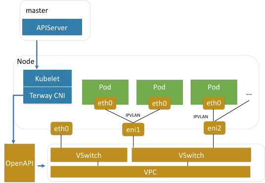
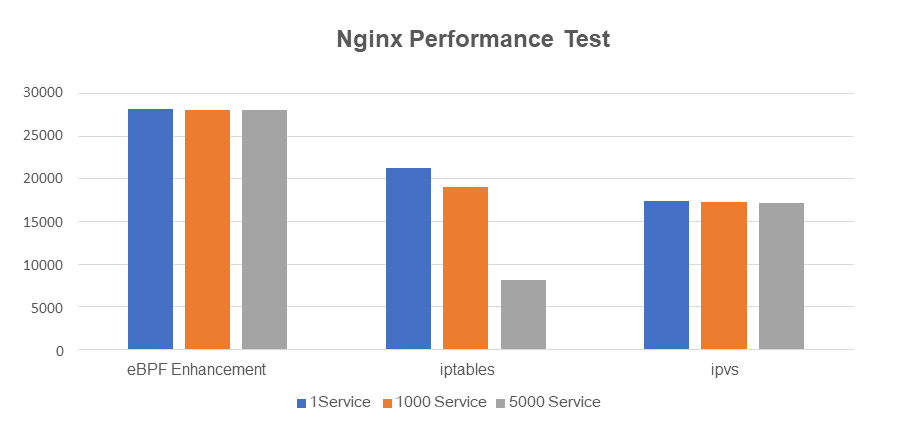

{{preview}}

A couple of weeks ago, the Alibaba team presented details on the new datapath
for the Alibaba Cloud during the SIG Cloud-Provider-Alibaba meeting and also
published a [blog post](https://www.alibabacloud.com/blog/how-does-alibaba-cloud-build-high-performance-cloud-native-pod-networks-in-production-environments_596590)
with the technical architecture. Guess what, it is all Cilium & eBPF based.
Alibaba Cloud is not the first cloud provider to directly embed Cilium.
Recently, Google [announced](/blog/2020/08/19/google-chooses-cilium-for-gke-networking/)
the availability of Dataplane V2 based on Cilium & eBPF for GKE and Anthos.
What is unique to Alibaba's setup is the use of IPVLAN as we will learn
below. In this blog post, we will dive into the details of the Terway CNI, the
CNI plugin of Alibaba Cloud, and review some of the statements made in the blog
post.

{{/preview}}

A couple of weeks ago, the Alibaba team presented details on the new datapath
for the Alibaba Cloud during the SIG Cloud-Provider-Alibaba meeting and also
published a [blog post](https://www.alibabacloud.com/blog/how-does-alibaba-cloud-build-high-performance-cloud-native-pod-networks-in-production-environments_596590)
with the technical architecture. Guess what, it is all Cilium & eBPF based.
Alibaba Cloud is not the first cloud provider to directly embed Cilium.
Recently, Google [announced](/blog/2020/08/19/google-chooses-cilium-for-gke-networking/)
the availability of Dataplane V2 based on Cilium & eBPF for GKE and Anthos.
What is unique to Alibaba's setup is the use of IPVLAN as we will learn
below. In this blog post, we will dive into the details of the Terway CNI, the
CNI plugin of Alibaba Cloud, and review some of the statements made in the blog
post.

Like almost all cloud providers, Alibaba supports a concept of ENI (elastic
network interface) with the purpose of exposing the SDN (software defined
networking), which already supports virtualization, to pods. This avoids
building virtualized networking on top of already virtualized networking and
can avoid overhead and unnecessary complexity.

> The cloud IaaS layer network is already virtualized. If network
> virtualization is further performed in pods, the performance loss is
> significant.

For Alibaba, it looks something like this:

(Source: https://www.alibabacloud.com/blog/how-does-alibaba-cloud-build-high-performance-cloud-native-pod-networks-in-production-environments_596590)

In order to implement this model, the CNI layer has to interact with the Cloud
APIs to set up ENIs as needed for pods. For this purpose, Alibaba has built the
[Terway CNI plugin](https://github.com/AliyunContainerService/terway) plugin. Check
out [Alibaba's original blog
post](https://www.alibabacloud.com/blog/how-does-alibaba-cloud-build-high-performance-cloud-native-pod-networks-in-production-environments_596590)
to learn about the internals of Terway CNI plugin and some of the challenges
they faced. This post specifically focuses on IPVLAN and how eBPF is used improve
the scalability of Kubernetes services and Network Policy.

## IPVLAN for better Network Scalability and Performance

An ENI can either be dedicated to a pod or shared between multiple pods. When
an ENI is shared, an additional routing decision in software has to be made to
route packets to and from the individual pods attached to the ENI.
Sharing an ENI has a massive scalability advantage as each ENI supports between
10-20 addresses and thus far fewer ENIs are needed in the entire cluster. The
downside of sharing an ENI is that the additional virtual bridge introduces
some overhead. Performance numbers below illustrate the difference.

In order to implement sharing of an ENI, IPVLAN is a great option to put a
high-performance virtual bridge in place and connect multiple pods to a single
ENI. For this purpose, the Terway CNI plugin is integrating with Cilium to
provide a flexible ENI datapath with an efficient Network Policy and Services
implementation. This work is currently being upstreamed by the Alibaba team in
this [pull request](https://github.com/cilium/cilium/pull/10251).

(Source: https://www.alibabacloud.com/blog/how-does-alibaba-cloud-build-high-performance-cloud-native-pod-networks-in-production-environments_596590)

The following performance measurements show the difference between both modes.
They also illustrate how both ENI modes are superior to a Flannel-based overlay
network.

(Source: https://www.alibabacloud.com/blog/how-does-alibaba-cloud-build-high-performance-cloud-native-pod-networks-in-production-environments_596590)

You don't necessarily have to pick one model over the other though, as it's
perfectly reasonable to schedule pods with high-performance needs with a
dedicated ENI and schedule all other pods with shared ENIs.

## Tackling the Kubernetes Services and Network Policy Scalability problem with eBPF

So far, the standard way of implementing Kubernetes services has been to use
kube-proxy in iptables mode. Due to the sequential nature of iptables, the
scalability of this solution is severely limited.

(Source: https://www.alibabacloud.com/blog/how-does-alibaba-cloud-build-high-performance-cloud-native-pod-networks-in-production-environments_596590)

You can see that, as the number of services increases and crosses a certain
threshold, the latency starts to spike. Even worse, the initial latency to a
particular service will be heavily influenced by a random factor, i.e.,
whether the service entry is close to the beginning or end of the chain of
rules.

Given this, it's not surprising to see Alibaba use the eBPF-based Kubernetes
service implementation of Cilium.

What difference does it make? This is the performance difference as measured by
the Alibaba team. The eBPF implementation gives better scalability and
performance compared to kube-proxy in both iptables and IPVS mode:

(Source: https://www.alibabacloud.com/blog/how-does-alibaba-cloud-build-high-performance-cloud-native-pod-networks-in-production-environments_596590)

> After eBPF simplifies the link, the performance is improved significantly by
> 32% compared to when iptables is used and 62% compared to IPVS mode.

Similar to the implementation of Kubernetes services, the implementation of
NetworkPolicy can benefit from using eBPF as well.

(Source: https://www.alibabacloud.com/blog/how-does-alibaba-cloud-build-high-performance-cloud-native-pod-networks-in-production-environments_596590)

The box labelled "BPF-agent" represents Cilium running alongside Terway CNI to
provide the eBPF-based Kubernetes Services and Network Policy implementation.

> Note: We use Cilium as the BPF agent on nodes to configure the BPF rules for
> pod ENIs. For more information about Terway-related adaptation, please visit
> [this website](https://github.com/cilium/cilium/pull/10251).

(Source: https://www.alibabacloud.com/blog/how-does-alibaba-cloud-build-high-performance-cloud-native-pod-networks-in-production-environments_596590)

Unfortunately, Alibaba does not provide specific numbers on the impact of this
optimization. As a rough guideline, the Cilium team has measured the
performance difference between Cilium running in IPVLAN and veth mode in an
earlier post. You can find the numbers [here](/blog/2019/02/12/cilium-14/#ipvlan-support-beta).

## Conclusion

We are excited to see Alibaba Cloud contribute to Cilium and welcome them to
the community. If you want to learn more:

- [Cilium Overview](https://cilium.io/)
- [Cilium GitHub](https://github.com/cilium/cilium)
- [How Does Alibaba Cloud Build High-Performance Cloud-Native Pod Networks in Production Environments?](https://www.alibabacloud.com/blog/how-does-alibaba-cloud-build-high-performance-cloud-native-pod-networks-in-production-environments_596590)
- [What is eBPF?](https://ebpf.io/what-is-ebpf)

  

    
      Author: Thomas Graf
    
    
    Thomas Graf is a Co-Founder of Cilium and the CTO & Co-Founder of
    Isovalent, the company behind Cilium. Previously, Thomas worked at Red Hat
    and Cisco as Linux kernel developer on the Linux kernel and various other
    open-source projects.
    
  

