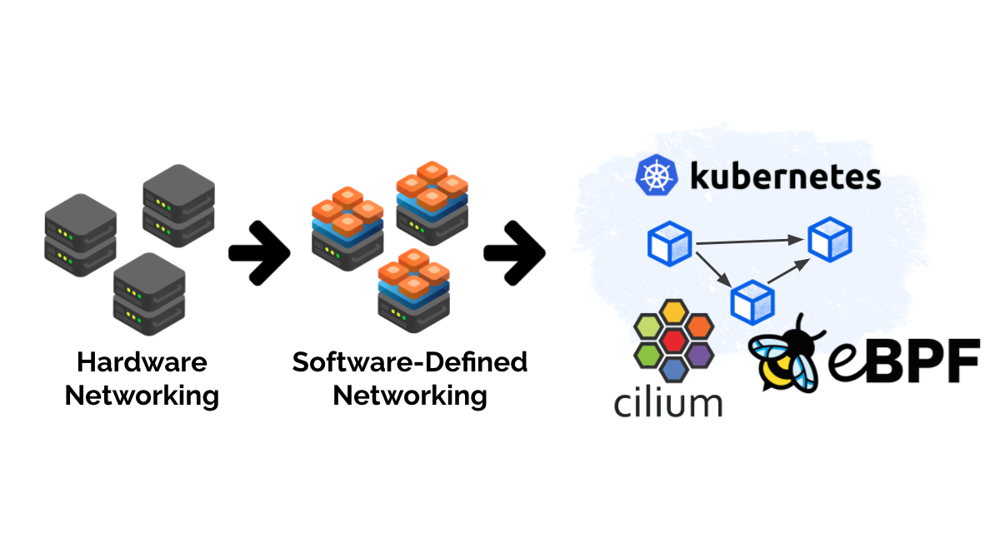
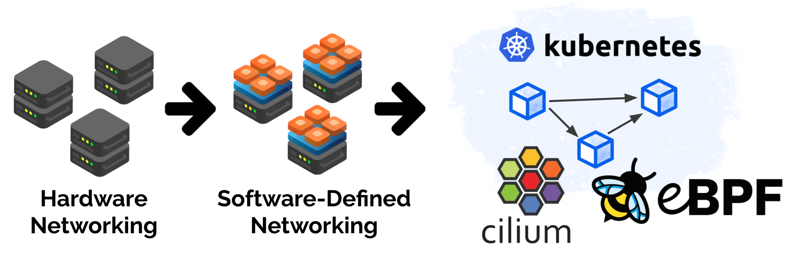
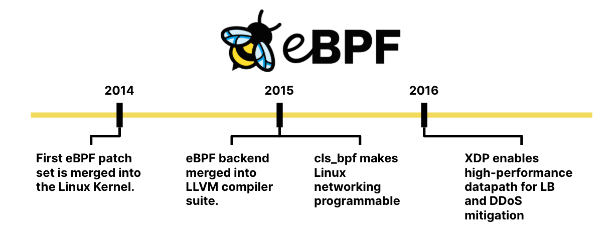
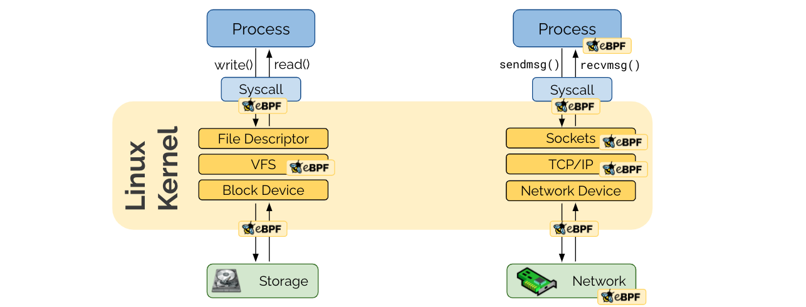
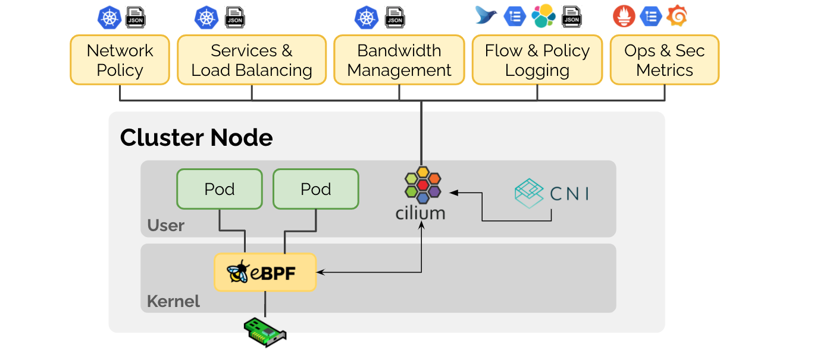

{{preview}}

Today is an exciting day for the Cilium community:
[Isovalent](https://www.isovalent.com), the company behind Cilium, is
announcing its [$29M Series A financing round](https://techcrunch.com/2020/11/10/with-29m-in-funding-isovalent-launches-its-cloud-native-networking-and-security-platform-based-on-ebpf-and-cilium/) backed by [Andreessen
Horowitz](https://a16z.com/2020/11/10/investing-in-isovalent/), Google, and Cisco. This is a perfect occasion to take a deeper look
into where eBPF-based networking is coming from and to understand what the
excitement is all about.

Two weeks ago, we hosted the first ever [eBPF Summit
2020](https://ebpf.io/summit-2020/). Besides exciting keynotes, several users
of Cilium spoke about their use cases including
[Adobe](https://www.youtube.com/watch?v=7UQ2CU6UEGY&t=5s), [Capital
One](https://www.youtube.com/watch?v=hwOpCKBaJ-w&t=28s&ab_channel=eBPFSummit),
[Datadog](https://www.youtube.com/watch?v=6mTVuZUHLBg&t=5s),
[GitLab](https://youtu.be/kwQ0ooO3UM8?t=5),
[Google](https://www.youtube.com/watch?v=oLS25ztnlMk), and [Wildlife
Studios](https://youtu.be/_1t3bXzptP0?t=10). Earlier last month, [Alibaba
Cloud](/blog/2020/10/09/cilium-in-alibaba-cloud) covered how they are using
Cilium for eBPF-based high-performance cloud-native networking. This was just a
couple of weeks after Google had
[announced](https://cloud.google.com/blog/products/containers-kubernetes/bringing-ebpf-and-cilium-to-google-kubernetes-engine)
the availability of a Cilium-based networking dataplane for GKE and Anthos.

{{/preview}}

Today is an exciting day for the Cilium community:
[Isovalent](https://www.isovalent.com), the company behind Cilium, is
announcing its [$29M Series A financing round](https://techcrunch.com/2020/11/10/with-29m-in-funding-isovalent-launches-its-cloud-native-networking-and-security-platform-based-on-ebpf-and-cilium/) backed by [Andreessen
Horowitz](https://a16z.com/2020/11/10/investing-in-isovalent/), Google, and Cisco. This is a perfect occasion to take a deeper look
into where eBPF-based networking is coming from and to understand what the
excitement is all about.

Two weeks ago, we hosted the first ever [eBPF Summit
2020](https://ebpf.io/summit-2020/). Besides exciting keynotes, several users
of Cilium spoke about their use cases including
[Adobe](https://www.youtube.com/watch?v=7UQ2CU6UEGY&t=5s), [Capital
One](https://www.youtube.com/watch?v=hwOpCKBaJ-w&t=28s&ab_channel=eBPFSummit),
[Datadog](https://www.youtube.com/watch?v=6mTVuZUHLBg&t=5s),
[GitLab](https://youtu.be/kwQ0ooO3UM8?t=5),
[Google](https://www.youtube.com/watch?v=oLS25ztnlMk), and [Wildlife
Studios](https://youtu.be/_1t3bXzptP0?t=10). Earlier last month, [Alibaba
Cloud](/blog/2020/10/09/cilium-in-alibaba-cloud) covered how they are using
Cilium for eBPF-based high-performance cloud-native networking. This was just a
couple of weeks after Google had
[announced](https://cloud.google.com/blog/products/containers-kubernetes/bringing-ebpf-and-cilium-to-google-kubernetes-engine)
the availability of a Cilium-based networking dataplane for GKE and Anthos.

The last few months have already been incredibly exciting for the entire team.
It's not every day that one of the co-founders of Kubernetes praises the
technology and work your team has created.

Today's launch out of stealth is another great moment for the team and an
achievement of all team members who have worked incredibly hard for this day.
We are looking forward to talk more publicly about what we do as a company
while we continue to innovate around our open-source projects.

This moment is a great opportunity to provide a deeper dive into the motivation
to use eBPF for networking. What are all these users seeing in Cilium? What is
so special about eBPF?

# The Roots of Programmability: Software Defined Networking

To really understand the shift, let's briefly look back at the history of
networking. In the 90s, networking was almost entirely physical. Cables,
perimeters, dial-up modems and a lot of Layer 2. Around the same time, in 1999,
iptables was created for Linux and just shortly after, PF was released for BSD.
Both projects focused on software-based firewalling. Early signs of a much
larger movement later on: software-defined networking. This was the time I
personally got involved in Linux networking.

In the years 2003-2008, VLANs were first described, the first release of the Xen
hypervisor happened, EMC acquired VMware, and KVM was merged into the Linux
kernel. This was the start of the virtualization era but from a networking
perspective, not much had changed. Networking of virtual machines was
delegated to the underlying physical network by bridging VMs directly to the
network. Almost no networking logic existed in software. During this early
virtualization era, most of the Linux kernel networking focus was on the TCP/IP
stack and optimizing the kernel as a system to run applications.

It was the year 2009 when things got exciting from a software networking
perspective. The first version of [Open vSwitch](https://www.openvswitch.org/)
was released which brought us software-defined networking (SDN). It brought
massive network programmability to the Linux kernel.

This programmability aspect can still be found in eBPF-based networking today
and is one of the corner stones. eBPF-based networking has its roots in SDN and
evolves it by removing the device-centric model from the equation.

# The Rise of Containers and Kubernetes

The year 2013 brought Docker. Docker primarily inherited the networking from
the virtualization layers and containers were treated like miniature VMs from a
networking perspective. The fundamental shift that Docker brought focused on
application packaging with container images and not on the infrastructure side.
Therefore, almost all of the early networking solutions for containers were
inherited from OpenStack days.

In 2014, the first commit to Kubernetes happened. Kubernetes was obviously not
the first project to attempt translating high-level user intent into
infrastructure automation, but Kubernetes made a deliberate decision to make a
lot fewer assumptions in networking and security. For example, there is no
concept of a network or subnet in Kubernetes. This led to an impressive cycle
of innovations.

But the quick evolution of Kubernetes also has a dark side: The desire to get
to a complete enough state as quickly as possible made it rely on iptables. A
packet filter in the Linux kernel I personally worked on while still using a
dial-up modem. Clearly not perfectly suited for the task, but widely available
and good enough to get started.

# The eBPF Revolution Begins

The same year that Kubernetes started, eBPF was first merged into the Linux
kernel as a successor to the long-standing packet filter BPF. Hence the
name extended BPF or short: eBPF. One year later, the eBPF backend was merged into the LLVM compiler
suite, allowing for LLVM to emit eBPF bytecode. In parallel, integration
into the kernel's traffic control layer made Linux networking programmable with eBPF.

2016, XDP was merged into the Linux kernel enabling a high-performance datapath
by allowing eBPF programs to run directly in the driver of a network device.
This is what later unlocked the development of eBPF-based high-performance load
balancers driving some of the largest data centers today.

Ever since, eBPF is in an incredibly steep trajectory to evolve further and
becomes more and more powerful every year. The general-purpose nature of eBPF
allowed for a diverse community to form around it, spanning networking,
tracing, security, profiling, and observability.

# Cilium & eBPF - An ideal match for the Cloud-Native World

To recap history, with hardware networking, the functionality and scale were
mostly defined by the hardware. With software-defined networking a lot of it
moved from hardware to software by taking functionality previously provided
with hardware, rewrite it in software, and then put the word virtual in front.
All of this made sense as long as machines are involved.

Containers and the cloud-native era are not about machines. We care about
applications, APIs, and services. Some machines will still exist for a long
time but you don't want to build your architecture around them.

> However, in modern systems we rarely think about connecting machines, or
> virtual machines, or even containers really. Instead we’re concerned with
> connecting microservices. So rather than machines and wires, we think in
> terms of cloud services, APIs and the higher level protocols and the
> systems used to connect them. The past was IP addresses, ports, vNICs and
> VLANS. Now it is service identity, gRPC, Kafka, distributed data stores,
> remote APIs, etc.
>
> -- Martin Casado, Creator of SDN, Partner, a16z

What makes eBPF and thus Cilium such a great fit to address the new cloud
native challenges?

## Programmability

The programmability of eBPF makes it possible to adjust to the quickly evolving
cloud-native requirements and tackle the increase in scale with ease. Here is
an example on how the programmability of eBPF lead Google to adopt Cilium as
its new networking dataplane for GKE:

> As more and more enterprises adopt Kubernetes, the gamut of use cases is
> widening with new requirements around multi-cloud, security, visibility and
> scalability. In addition, new technologies such as service mesh and
> serverless demand more customization from the underlying Kubernetes layer.
> These new requirements all have something in common: they need a more
> programmable dataplane that can perform Kubernetes-aware packet manipulations
> without sacrificing performance.
>
> Enter Extended Berkeley Packet Filter (eBPF), a new Linux networking
> paradigm that exposes programmable hooks to the network stack inside the
> Linux kernel.
>
> -- Gobind Johar, Product Manager, Google Kubernetes Engine

Even more important, eBPF is not networking specific or tied to a particular
domain. The generic nature of eBPF not only attracts a much bigger community to
innovate, it also avoids making premature assumptions about what building
blocks are required to solve future problems. This is a massive advantage over
any networking specific programmability solution such as iptables, Open
vSwitch, or nftables.

## Embedded in the Linux kernel

Some of you may correctly state that programmability already existed in the
form of user-space networking. The unique new aspect of eBPF's programmability
is being embedded in the Linux kernel. Applications use system calls to
interact via the network and the Linux kernel is responsible to handle these
system calls. In order for a user-space networking framework to remain
transparent to the application, it still has to traverse the socket layer of
the Linux kernel. eBPF avoids this by remaining in the kernel altogether.

The reason why this was not more important before is because with virtual
machines, the hypervisor created a natural boundary between the network
device of the metal machine and the sockets of the operator system inside the
VM. With containers, this all happens in the same kernel.

## Safety and Efficiency

Why not just load a Linux kernel module then? It obviously provides arbitrary
programmability at a very high efficiency. We could dive into the cost of
maintaining kernel modules across kernel versions, but the major downside is
more trivial: Safety while remaining efficient.

> Buggy kernel code will crash your machine. The kernel is not protected from
> a buggy kernel module. I think people assumed that this is just how things
> are; that's the price to do kernel programming. eBPF changed this dogma. It
> brought safety to kernel programming.
>
> -- Alexei Starovoitov, eBPF Co-Maintainer, Facebook

By requiring eBPF programs to pass through a verification process, eBPF
programs are significantly more secure than loading a kernel module.

The efficiency is guaranteed by a Just in Time (JIT) compiler that ensures
native execution speed of eBPF bytecode.

All of this makes eBPF incredibly powerful, but it is also a low-level
technology intended to be used primarily by Linux kernel developers. This is
where Cilium comes into play.

# Cilium - eBPF-based Networking, Observability, and Security

Cilium is an open source project that has been designed on top of eBPF to
address the networking, security, and visibility requirements of container
workloads. It provides a high-level abstraction on top of eBPF. Cilium is to
eBPF what Kubernetes and container runtimes are to Linux kernel namespaces,
cgroups, and seccomp. The right abstraction layer on top.

Let's dive into particular use cases that Cilium is solving:

## Networking

- **Network connectivity:** In its most basic form, Cilium is a CNI to provide
  network connectivity to Kubernetes workloads. The eBPF-based datapath
  features both IPv4 and IPv6 with the ability to support direct-routing,
  encapsulation/overlay topologies, as well as integration with cloud provider
  specific networking layers.

- **Service Load-Balancing:** Cilium can act as 100% kube-proxy replacement to
  provide all service load-balancing in a Kubernetes cluster. The
  implementation is highly scalable and supports direct server return (DSR)
  with session affinity. If possible, Cilium will perform the load balancing on
  the system call level and translate the address directly in the `connect()`
  system call instead of relying on network address translation throughout the
  entire duration of a network connection.

- **Edge Load-Balancing:** The XDP-based edge load-balancing capability can
  steer traffic into Kubernetes clusters or run entirely independent of
  Kubernetes. It supports consistent hashing with Maglev and provides an
  implementation for Kubernetes service types NodePort, LoadBalancer and
  services with externalIPs.

- **Multi-cluster connectivity + security:** With the multi-cluster ability, Kubernetes clusters can be
  connected without the introduction of additional gateways or proxies. The
  notion of global services allows to route service traffic across clusters.

- **Integration of VM/metal:** Virtual and metal machines can be seamlessly
  connected with Kubernetes workloads without proxies or gateways by
  representing such external workloads in the Kubernetes cluster as if the
  workload would run as a pod.

## Security

- **Network Policy:** Full support for Kubernetes Network Policy based on a
  modern identity-based implementation built entirely in eBPF. Extensive
  visibility functionality eases problem troubleshooting and compliance
  monitoring.

- **FQDN/DNS-based:** Transparent integration with DNS-based service discovery
  allows for network policies based on DNS names instead of IP address
  blocks to cope with the highly dynamic nature of modern services backed by
  constantly changing set of IP addresses. The built-in DNS authorization
  further improves the security model.

- **API Awareness:** Transparent injection of Envoy and other proxies on an
  on-demand basis enables policy enforcement on API level, e.g. HTTP, Kafka,
  gRPC, Cassandra, ...

- **Policy-driven SSL termination & injection:** SSL termination and injection
  of SSL certificates is policy driven, allowing to terminate SSL connections on
  behalf of an application or to transparently inject use of a certificate or
  token for service traffic without requiring to share the secret with the
  workload directly.

- **Simulation & Audit:** With policy simulation and policy audit, the effect
  of network policy changes can be inspected before dropping live traffic.

## Observability

- **Flow logging:** Flow logs at L3-L7 provide deep visibility of forwarding
  and policy decisions on the network level. A cluster-wide flow query API
  enables the quick inspection of networking behavior and network drops during
  incidents.

- **Programmable Metrics:** Configurable and programmable metrics allow users
  to understand network, application, and security behavior and monitor the
  correctness consistently.

- **Service Map:** A graphical service topology map simplifies understanding of
  deployed application topologies and dependencies.

- **Troubleshooting:** The troubleshooting tooling has been built into Cilium
  from the beginning. An internal tracing system makes it possible to track every
  forwarding decision and can be enabled on the fly. Metrics capture packet
  drops with detailed reasoning.

For more details, check out the [Functionality
Overview](https://docs.cilium.io/en/stable/intro/#functionality-overview) in
the Cilium documentation.

# Conclusion

Our team has had its fair share of exciting moments. The public launch of
Isovalent as a company is yet another major milestone.
Technically it's only a "Hello world" for something that our customers have
already been using for a while, but for our team, today is emotional. This year
has been challenging in many ways and not everything has always been within our
control. Being able to achieve and build something as a team that everbody can
be truly proud of will always be the most rewarding aspect of team and company
building to me.

I'm looking forward to work with many of you, as users, contributors, or
customers.

# Further Reading

- [Learn more about Cilium](https://cilium.io/)
- [Learn more about eBPF](https://ebpf.io/)
- [Learn more about Isovalent](https://www.isovalent.com/)

  

    
      Author: Thomas Graf
    
    
    Thomas Graf is a Co-Founder of Cilium and the CTO & Co-Founder of
    Isovalent, the company behind Cilium. Previously, Thomas worked at Red Hat
    and Cisco as Linux kernel developer on the Linux kernel and various other
    open-source projects.
    
  

