import authors from 'utils/author-data';

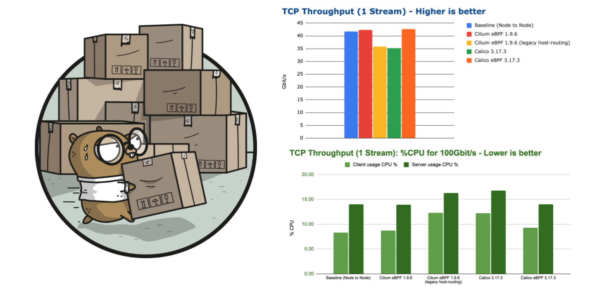

# Understanding Cilium Network Performance

(Updated as of 28th August 2023 with Performance Impact of Sidecars on CNI's)

Hello 👋

As more crucial workloads are being migrated to Kubernetes, network performance
benchmarks are becoming an important selection criteria when deciding what
network layer to leverage in a Kubernetes cluster. In this blog post, we'll
explore the performance characteristics of Cilium based on extensive benchmarks
that we have run in the past few weeks. Upon popular request, we are also
including measurements for Calico to allow for a direct comparison.

However, instead of just presenting the numbers, we are going to dive into
the topic of container networking benchmarking a bit deeper and look at:

- [The Throughput Benchmark](#throughput)
- [Does Container Networking add Overhead?](#overhead)
- [Breaking the Rules: eBPF Host-Routing](#ebpfhostrouting)
- [Measuring Latency: Requests per Second](#rr)
- [Comparing CPU Flamegraphs Cilium eBPF vs Calico eBPF](#flamegraph)
- [Rate of new Connections](#crr)
- [The Cost of Encryption - Wireguard vs IPsec](#encryption)
- [How to reproduce the results](#env)
- [Performance Impact of a Sidecar](#sidecar)

# Summary of the Results

Before we dive into the detailed numbers and benchmarks, the following list is a
summary of our findings. Feel free to skip it if you want to derive your own
conclusions after reading the details first.

- **eBPF makes the difference:** While Cilium has an edge over Calico's eBPF
  datapath in some areas, e.g. latency as observable in `TCP_RR` and `TCP_CRR`
  benchmarks. The more fundamental takeaway is that eBPF is clearly superior to
  iptables. Cilium and Calico running in a configuration allowing to bypass
  iptables using eBPF both significantly outperform the versions which cannot.

  Looking into the specific details we find that Cilium and Calico don't
  leverage eBPF in exactly the same way. While some concepts are similar (which is
  not entirely surprising given the open-source nature), CPU flamegraphs reveal
  that Cilium is taking advantage of additional context-switching savings which
  likely explain the difference in `TCP_RR` and `TCP_CRR` results.

  Overall, based on the benchmark results, eBPF is clearly the best technology
  to address the challenging cloud-native requirements.

- **Observability, Network Policy, and Services:** For this benchmark, we have
  focused on the lowest-common denominator which is essentially networking
  only. This also allows to directly compare the results to node networking.
  However, real-world usage will also require observability, network policy and
  services. This is where the Cilium and Calico eBPF datapaths will differ
  extensively. Cilium supports several additional features not found in the
  Calico eBPF datapath, but even for the standardized features such as
  Kubernetes NetworkPolicy, the implementations differ and we will likely find
  significant performance differences as a substantial amount of work has to be
  performed using eBPF for these more advanced use cases. However, the post
  is already long enough as-is so we'll reserve digging into these measurements
  and details to a follow-up post.

- **Wireguard vs IPsec:** Somewhat surprising, even though Wireguard has been
  able to achieve higher maximum throughputs in our tests, IPsec can be more
  efficient in terms of CPU resources to achieve the same throughput. This is
  very likely strictly dependant on the availability of AES-NI CPU instructions
  which allow to offload the crypto work for IPsec whereas Wireguard cannot
  benefit from this. The cards will obviously turn when AES-NI offload is not
  available.

  The good news is that starting with Cilium 1.10, you have the choice to run
  either. Cilium now supports Wireguard in addition to IPsec.

# The Throughput Benchmark

The usual benchmarking disclaimer:

> Benchmarking is hard. Results can vary based on the hardware tests are run
> on. Absolute numbers should not be compared unless results have been gathered
> on identical systems.

Let's start with the most common and obvious benchmark, the infamous TCP
throughput metric measuring the maximum data transfer rate between containers
running on different nodes:

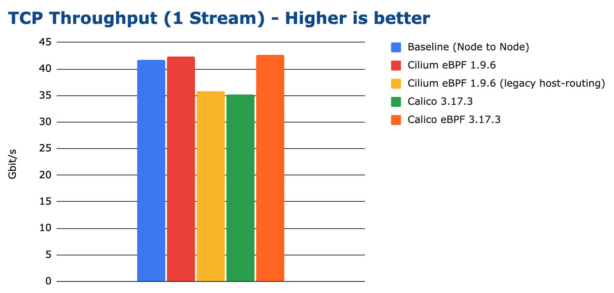

The above graph shows the maximum throughput that can be achieved with a single
TCP connection. The best performing configurations top out just over 40Gbit/s.
It has been measured by running `netperf` using the `TCP_STREAM` test. We are
using a 100Gbit/s network interface to ensure that the network card is not the
bottleneck. Due to running a single `netperf` process transmitting over a
single TCP connection, most of the network processing is done using a single
CPU core. This means that the above number is constrained by the available CPU
resources of a single core and thus nicely highlights how much throughput can
be achieved with each configuration when the CPU is the bottleneck. We'll
expand this test further down in the blog by throwing more CPU cores at the
problem to remove the CPU resources constraint.

Did you notice that the high-performing eBPF implementations can a throughput
even slightly higher than the node-to-node baseline? How is this possible?
It is somewhat unexpected because container networking is generally believed to
add overhead compared to node to node networking. Let's hold this thought for
a moment, we'll explore this aspect as we dig deeper.

# CPU resources required to transfer 100Gbit/s

The results for the `TCP_STREAM` benchmark already hinted which configurations
are the most efficient to achieve high transfer rates but let's look at the
overall system CPU consumption while the benchmark is running:

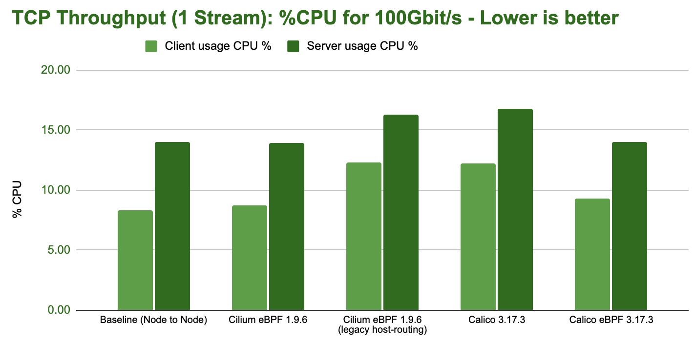

The above CPU usage graph represents the system-wide percent of CPU required to
deliver 100Gbit/s of throughput. Note that this is not the CPU consumption for
the throughput reported in the previous graph, the CPU usage has been
normalized for all results to represent a steady 100Gbit/s transfer rate to make
the numbers directly comparable. The lower the bar in the above graph, the more
efficient a configuration is in transferring 100Gbit/s.

> **Random kernel wisdom:** TCP flow performance is generally limited by the
> receiver, since the sender can use both TSO super-packets. This can be
> observed in the increased CPU spending on the server-side in the above tests.

## What do TCP throughput benchmarks represent?

While the majority of users are unlikely to routinely experience this level of
throughput, certain types of application will care for this type of benchmark:

- AI/ML applications requiring access to large amounts of data
- Data upload/download services (backup services, VM images, container registries, ...)
- Media streaming services, in particular for 4K+

We'll dive into [Measuring Latency: Requests per Second](/blog/2021/05/11/cni-benchmark#rr)
and [Rate of new Connections](/blog/2021/05/11/cni-benchmark#crr) later on in
this post which better represent typical microservices workload.

# Does Container Networking add Overhead?

The initial benchmark indicates that there is some overhead when performing
container networking compared to node networking. Why is this? Let's look at
the two networking models from an architecture perspective:

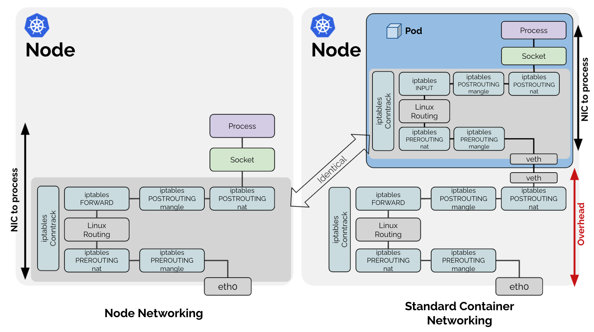

What stands out in the above diagrams is that the entire networking processing
path that is required for node-to-node networking, is also done for container
networking case, just inside of the network namespace of the container (dark
blue box).

Given that all work required for the node network processing is also required
within the container network namespace, any work done outside of the container
network namespace is basically overhead. The above diagram shows the network
path when Linux routing with Virtual Ethernet (veth) devices are used. It may
look slightly different if you use a Linux bridge or OVS, for example, but the
fundamental overhead point is shared between all of them.

# Breaking the Rules: eBPF Host-Routing

You may be wondering about the difference between the configurations "Cilium
eBPF" and "Cilium eBPF (legacy host-routing)" in the benchmarks before and why
the native Cilium eBPF datapath is considerably faster than the legacy host
routing. When referring to the Cilium eBPF native datapath, an optimized
datapath called eBPF host-routing is in use:

eBPF host-routing allows to bypass all of the iptables and upper stack overhead
in the host namespace as well as some of the context-switching overhead when
traversing through the Virtual Ethernet pairs. Network packets are picked up as
early as possible from the network device facing the network and delivered directly
into the network namespace of the Kubernetes Pod. On the egress side, the packet
still traverses the veth pair, is picked up by eBPF and delivered directly
to the external facing network interface. The routing table is consulted
directly from eBPF so this optimization is entirely transparent and compatible
with any other services running on the system providing route distribution.
For information on how to enable this feature, see
[eBPF Host-Routing](https://docs.cilium.io/en/latest/operations/performance/tuning/#ebpf-host-routing)
in the tuning guide.

Calico eBPF is applying some of the same bypasses to iptables but as we'll
learn later on, is not quite identical. However, it proves that the most impact
can by made by bypassing slow kernel subsystems such as iptables.

# Pushing for 100Gbit/s Line-Rate

Earlier in the blog post, we looked at results while mostly involving just a
single CPU core in all of the processing. Let's open up the flood gates and
parallelize TCP streams and run multiple `netperf` processes:

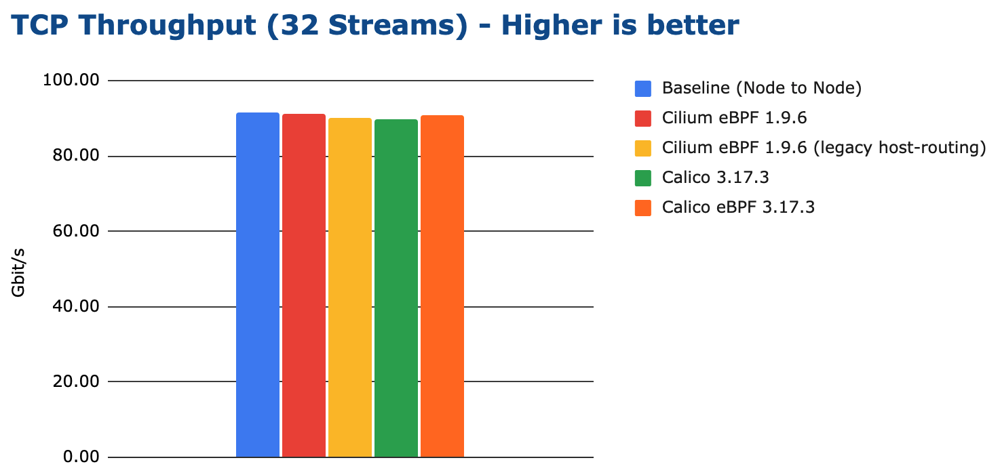

**Note:** We have specifically chosen 32 processes due to the hardware
featuring 32 threads, to ensure that the system can evenly distribute the load.

This graph is kind of boring. It shows that if you throw enough CPU resources
at the problem, all tested configurations can achieve close to 100Gbit/s
line-rate. However, looking at the CPU resources, we can still identify a
difference in efficiency:

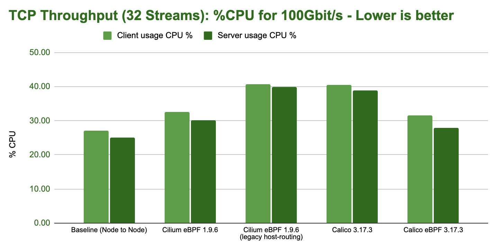

Note that the CPU usage measurement includes the entire CPU consumed, this also
includes the `netperf` processes running so it also includes the CPU typically
required by workloads to perform the network I/O. It however does not include
any business logic that the application would typically perform.

# Measuring Latency: Requests per Second

The requests per second metric is almost the exact opposite of the throughput
metric. It measures the rate of single byte round-trips that can be performed
in sequence over a single persistent TCP connection. This benchmark highlights
how efficiently a single network packet can be processed. The
lower the latency for an individual network packet, the more requests can be
processed per second. Optimizing between throughput and latency is often a
trade-off. To achieve maximum throughput, large buffer sizes are ideal but
these large buffer sizes can lead to an increase in latency. This is called
buffer bloat. Cilium contains a feature called
[Bandwidth Manager](https://docs.cilium.io/en/latest/operations/performance/tuning/#bandwidth-manager)
which automatically configures fair queueing, optionally allows for EDT-based
Pod rate-limiting, and optimizes TCP stack settings for server workloads to
strike the best possible balance between the two.

This benchmark is often overlooked but it is usually a lot more relevant to users
as it models a pretty common usage pattern for microservices: request and
responses exchanged between services using persistent HTTP or gRPC connections.

Let's look at how the different configurations perform when a single
`netperf` process performs a `TCP_RR` test:

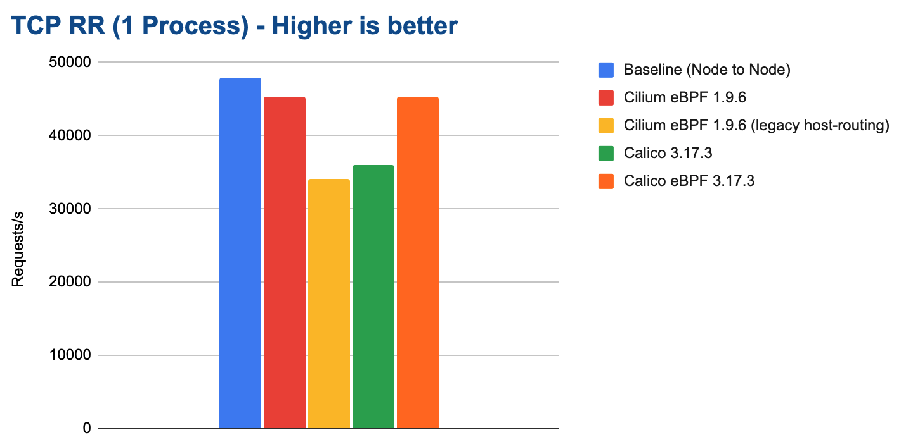

Configurations that perform better in this test also deliver
lower average latencies. However, it does not directly allow to draw
conclusions on P95 or P99 latencies. We will look into them in a future blog
post.

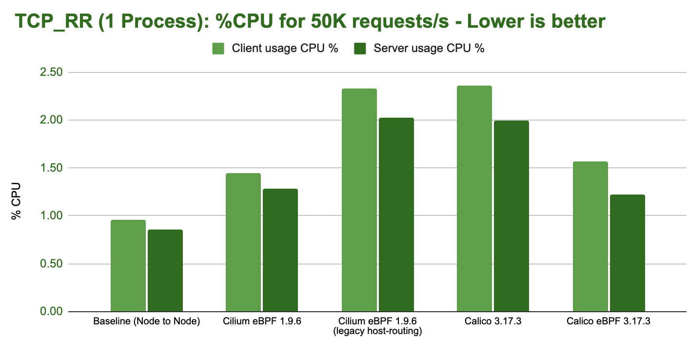

As we expand the test to run 32 parallel `netperf` processes to scale out and
utilize all available CPU cores, we can see that all configurations are able to
scale up accordingly. However, unlike for the throughput tests, throwing more
CPU at the problem does not allow to catch up on the difference in efficiency
because the maximum rate is limited by the latency and not the available CPU.
We would only see identical requests if the network bandwidth became the
bottleneck.

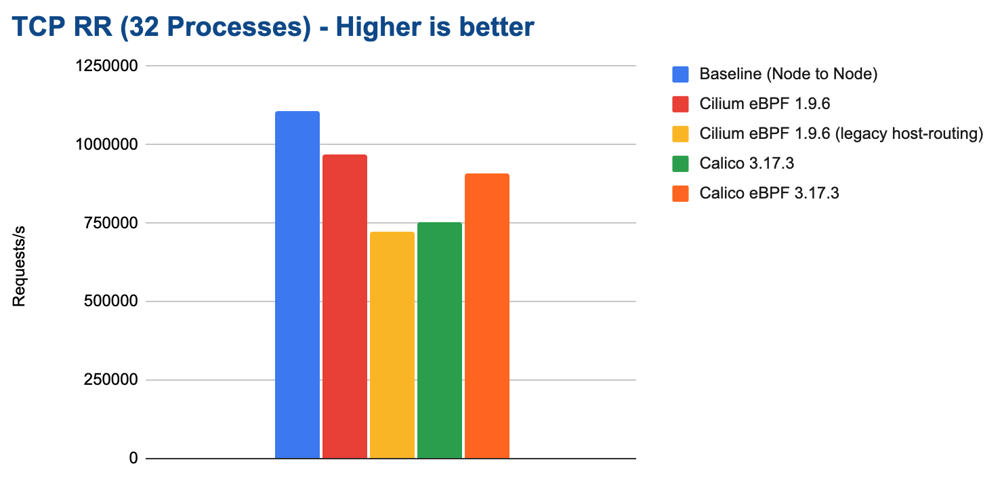

Overall, the results are quite encouraging, Cilium can achieve almost 1M
requests/s on our test system with eBPF host-routing.

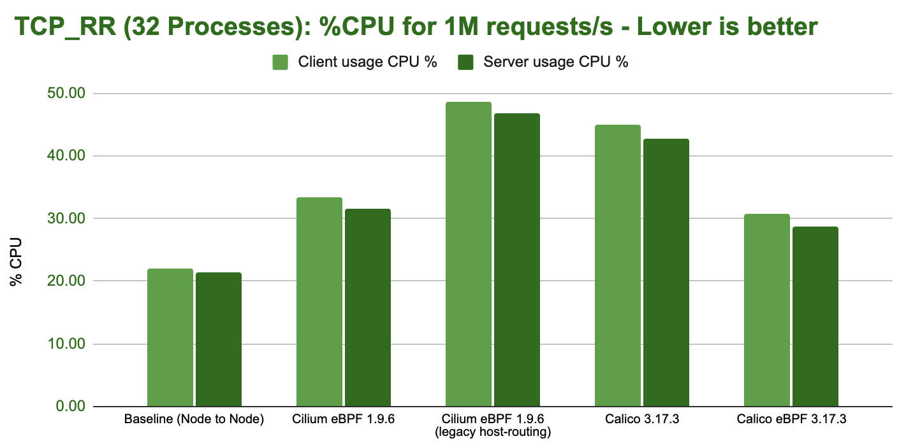

# Comparing CPU Flamegraphs Cilium eBPF vs Calico eBPF

Overall, the performance for Cilium eBPF and Calico eBPF are relatively
similar, are they using the same datapath? Not really. There is no such thing
as a pre-defined eBPF datapath. eBPF is a programming language and runtime
engine that allows to build datapath features among many other things. The Cilium
and Calico eBPF datapaths differ quite significantly. In fact, Cilium offers a
wide range of features which are not supported by Calico eBPF. But even on the
interaction with the Linux networking stack, the two show significant
differences. Let's look at CPU flamegraphs to dig in a bit:

## Cilium eBPF (Receive Path)

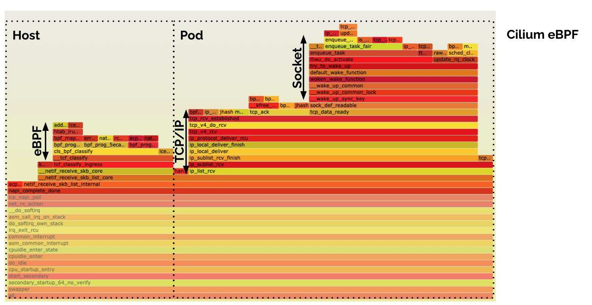

The eBPF host-routing implementation of Cilium features a nice context-switch
free delivery of data from the NIC all the way into the socket of the
application. That's why the entire receive-side path fits nicely into a single
flamegraph above. You can see the processing blocks for eBPF, TCP/IP, and
the Socket.

## Calico eBPF (Receive Path)

The Calico eBPF receive side does not look quite the same. There is an identical
eBPF block which executes the eBPF program. Then there is an additional Virtual
Ethernet (veth) traversal which is not required on the receive side in Cilium's
eBPF datapath.

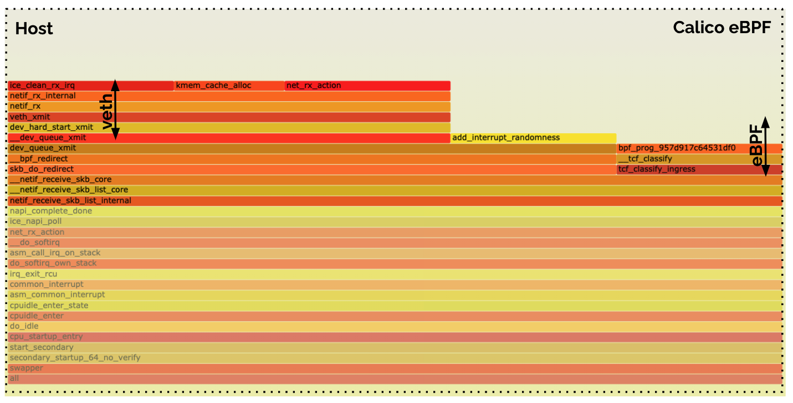

All of the above is still performed in the context of the host. This following
second flamegraph highlights the work done in the pod itself. It shows the work
performed as resumed by `process_backlog`. It is the same work (TCP/IP + socket
delivery) as in the Cilium case, but after an additional context switch due to
the veth traversal.

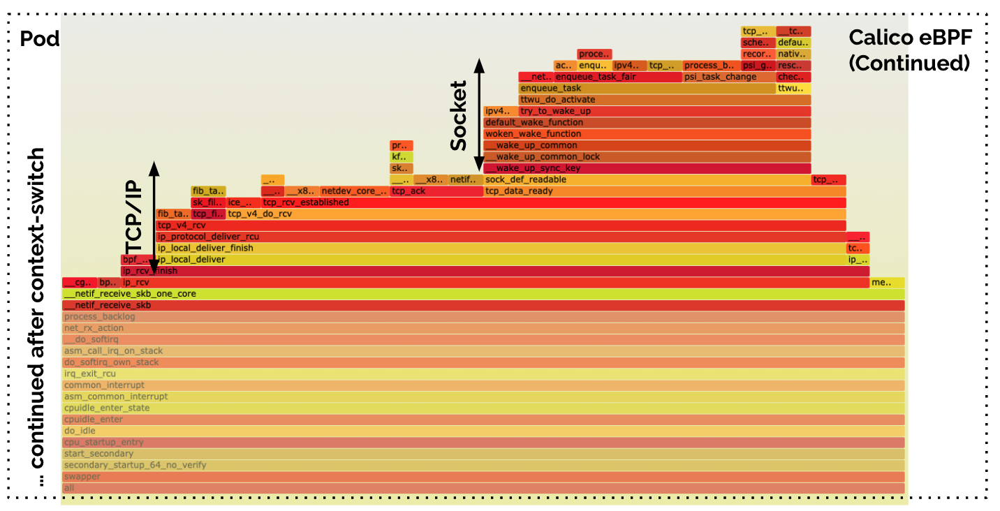

If you want to dig deeper yourself, open the below links in your browser for
the interactive SVG versions of the images that will allow to zoom in:

- [Cilium eBPF Flamegraph SVG - Sender](images/cilium-ebpf-hr-rr-zh3.svg)
- [Cilium eBPF Flamegraph SVG - Receiver](images/cilium-ebpf-hr-rr-zh4.svg)
- [Calico eBPF Flamegraph SVG - Sender](images/calico-ebpf-rr-zh3.svg)
- [Calico eBPF Flamegraph SVG - Receiver](images/calico-ebpf-rr-zh4.svg)

# Rate of new Connections

The connection rate benchmark builds on top of the requests per second
benchmark but initiates a new connection for each request. This benchmark
highlights the difference between using persistent connections and opening new
connections for each request. Handling new TCP connections requires work to be
performed in various parts of the system; this test is therefore by far the most
stressful for the entire system. We will see that it is possible to actually
consume the majority of the available system resources with this benchmark.

This test represents a workload that receives or initiates a lot of TCP
connections. An example where this is the case is a publicly exposed service
that receives connections from many clients. Good examples of this are L4
proxies or services opening many connections to external endpoints such as a
data scraper. This benchmark puts the most stress on the system with the least
work offloaded to hardware, so we can expect to see the biggest differences
between tested configurations.

In a first test, we run a single `netperf` process using the `TCP_CRR` test:

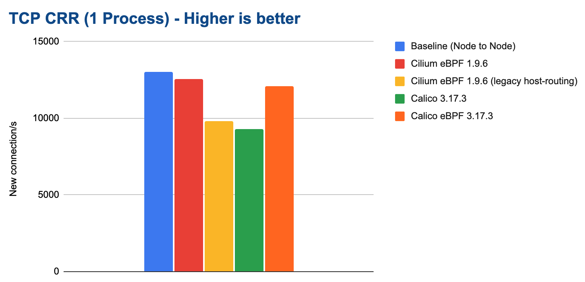

The difference is already quite severe for a single process and it will amplify
as we scale out to more CPU cores. It's also clear that Cilium can again almost
compensate for the additional network namespace overhead and almost match the
baseline.

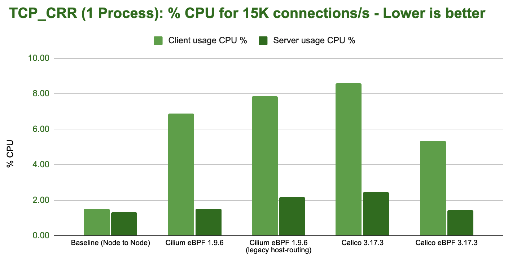

> **Future work scheduled:** The CPU resource usage was a surprise to us and lead
> us to schedule further investigation for the 1.11 development cycle. There
> seems to be a cost paid on the sender side as soon network namespaces get
> involved. This cost is paid by all configuration that involve network
> namespaces so it is likely caused by the kernel datapath portion shared by
> both Cilium and Calico. We'll provide an update as soon as we have learned
> more about this.

As we scale out the test to run on all CPU cores by running 32 parallel
`netperf` processes using `TCP_CRR`, an interesting observation can be made:

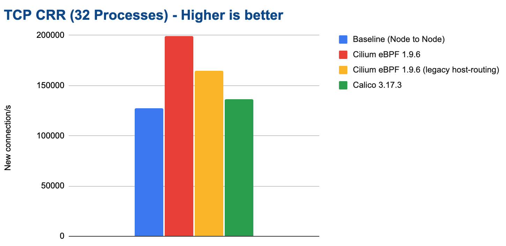

The connection rate for the baseline drops significantly. It is not able to
scale with the additional CPU resources available. This is despite the
connection tracking table sized accordingly and us validating that no drops had
occurred due to the connection tracking table filling up. We have re-run these
tests many times but the results remained consistent. Manually bypassing the
iptables connection tracking table using `-j NOTRACK` iptables rules
immediately fixes this issue for the baseline and improves performance
to 200K connections/s as well. So there is clear evidence that the iptables
connection tracking table can start to struggle once above some threshold.

**Note:** The results for the Calico eBPF datapath have been unstable in this
test. We are not sure why. The network packet flow was not steady. We are
therefore not including the results because they are probably not accurate. We
invite the Calico team to work with us to investigate this and then re-test.

Handling 200K connections/s is impressive given we have a standard, unmodified
application handling these requests and transmitting actual information but let's
look at the cost on the CPU side:

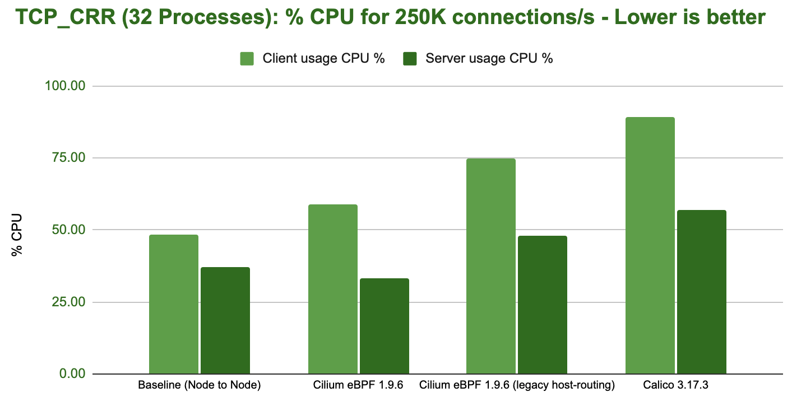

This benchmark outlines the biggest difference between the various
configurations. In order to handle 250K new connections per second, the overall
system has to spend anywhere from 33% to 90% of the available resources.

Based on the consistent difference between the required CPU for the sender and
the receiver, it's also safe to assume that you can typically accept more
connections per second than you can initiate.

# The Cost of Encryption - Wireguard vs IPsec

Everybody will expect Wireguard to outperform IPsec so let's look at Wireguard
first and see how Wireguard performance is tied to the configured MTU:

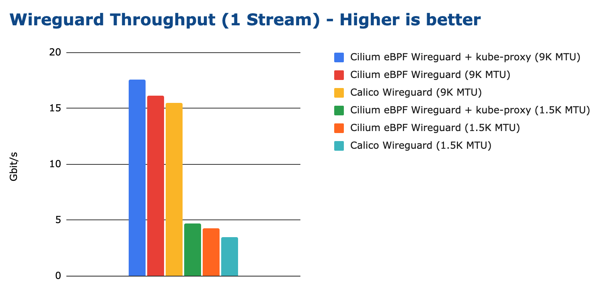

There is some difference between the configurations and interestingly Cilium in
combination with kube-proxy performs better than Cilium without kube-proxy.
However, the differences are relatively minor and most of the difference can be
recovered by optimizing the MTU.

How does the CPU resources side look like:

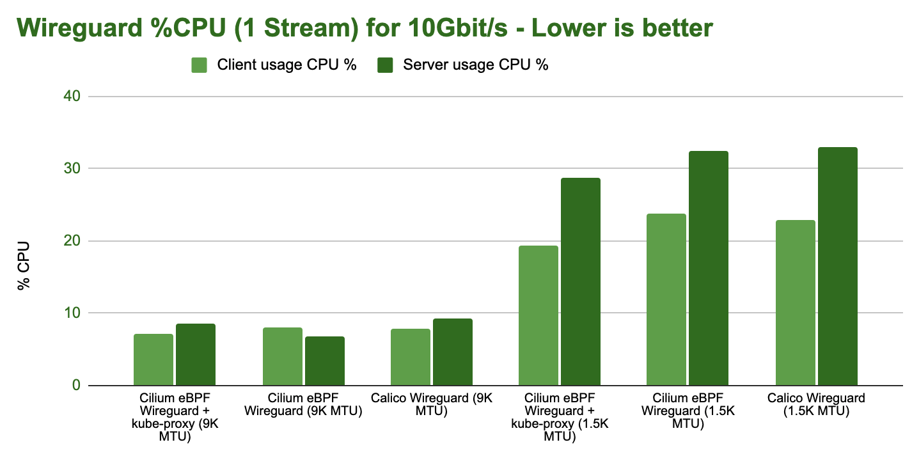

No major differences really. Configure your MTU correctly. We have also
performed requests per second tests in our benchmarks but they show more of the
same. No major differences. If you are interested, you can find them in the [CNI
Performance
Benchmark](https://docs.cilium.io/en/latest/operations/performance/benchmark/)
section of the Cilium documentation.

## Wireguard vs IPsec

Comparing the performance of Wireguard with IPsec is a more interesting test.
Cilium has supported IPsec for a while and starting with Cilium 1.10,
Cilium now also supports Wireguard. So it's interesting to compare the two next
to each other while all other aspects are the same:

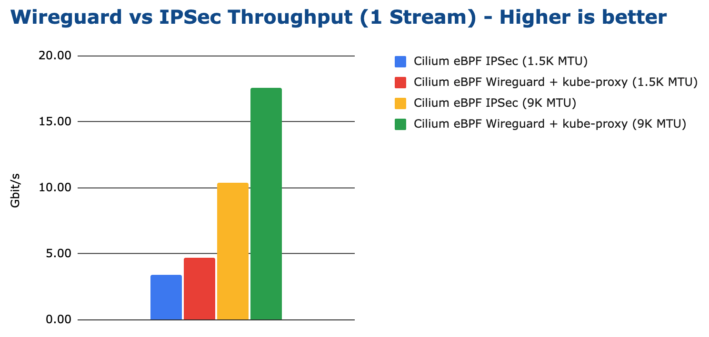

The above results is likely what everybody was expecting. Wireguard is
achieving a higher throughput. Again, depending on the MTU but for both MTU
configurations, Wireguard is able to achieve a higher maximum transfer rate.

However, let's look at the CPU resources required to achieve 10Gbit/s:

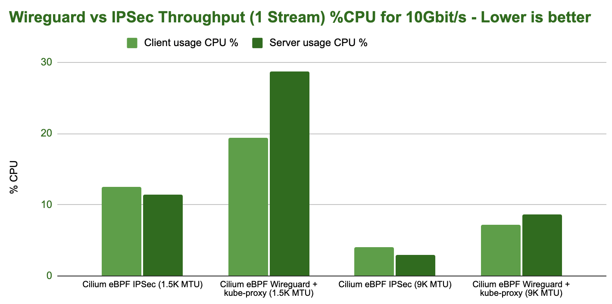

While Wireguard is able to achieve a higher maximum, IPsec is more efficient in
achieving the same throughput. The difference is actually quite severe.

> **Note:** To achieve this efficiency with IPsec, you strictly need
> hardware that supports AES-NI instructions in order to offload IPsec
> encryption.

> **Future work scheduled:** It's not entirely clear to us yet why the higher
> efficiency of IPsec does not translate to a higher throughput as well. Also,
> throwing additional CPU cores at the problem doesn't significantly improve
> the performance. This is likely because RSS can't scale out well across cores
> for encrypted traffic since the L4 information typically used to hash and
> distribute flows across cores is encrypted and not available. Therefore, all
> connections will look the same from a hashing perspective as only two IP
> addresses are utilized in the benchmark.

Does this also affect the latency? Let's have a look. Remember that the latency
benchmark is the one that most accurately describes microservices style
workloads where persistent connections are used to exchange requests and responses.

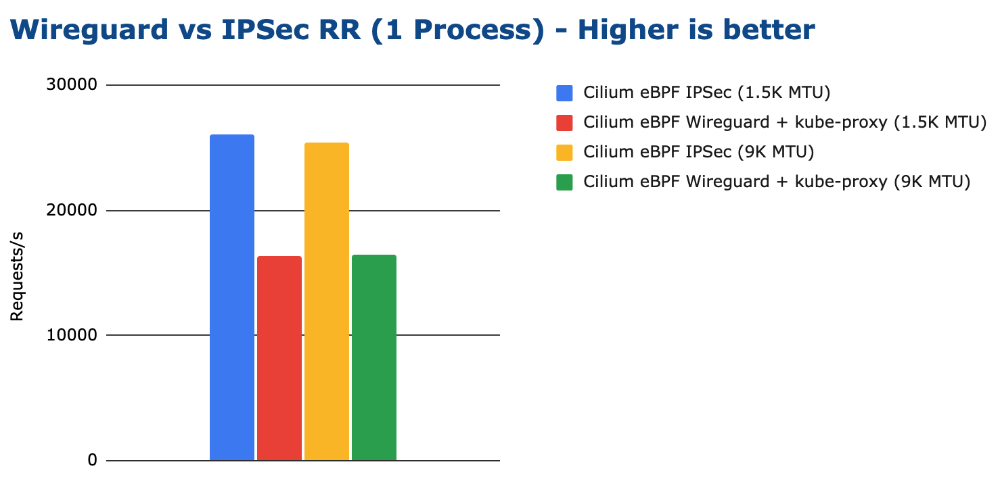

The CPU efficiency is in line with the observed requests per second but
overall, none of the configurations consume a considerable amount of total CPU.
The difference in latency is much more significant than the consumed CPU:

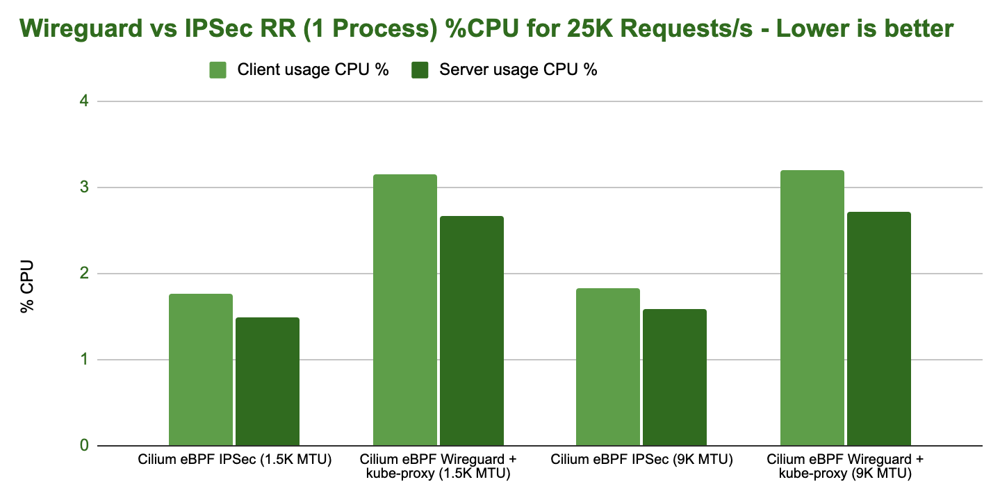

# Performance Impact of a Sidecar

Besides avoiding the sheer amount of proxies that need to be run in a sidecar model, a significant advantage of a sidecar-free model is that we can avoid the requirement to run two proxies in between any connection. This is made possible by using Cilium at the network/node level to encrypt and authenticate or use the upcoming new mTLS model which separates the authentication from the transport. More details in this blog [Next-Generation Mutual Authentication with Cilium Service Mesh](https://isovalent.com/blog/post/2022-05-03-servicemesh-security/)

Reducing the number of proxies in the network path and choosing the type of Envoy filter has a significant impact on performance.  The above benchmark illustrates the latency cost of HTTP processing with a single Envoy proxy running the Cilium Envoy filter (brown) compared to a two-sidecar Envoy model running the Istio Envoy filter (blue). Yellow is the baseline latency with no proxy with no HTTP processing performed.

# Performance Impact of Sidecars on a Service Mesh

Besides avoiding the sheer amount of proxies that need to be run in a sidecar service mesh model, a significant advantage of sidecarless service mesh is that we can avoid requiring running two proxies in between any connection. More details about Cilium's sidecarless service mesh can be found in this blog [Next-Generation Mutual Authentication with Cilium Service Mesh](https://isovalent.com/blog/post/2022-05-03-servicemesh-security/)

Reducing the number of proxies in the network path and choosing the type of Envoy filter has a significant impact on performance.  The above benchmark illustrates the latency cost of HTTP processing with a single Envoy proxy running the Cilium Envoy filter (brown) compared to a two-sidecar Envoy model running the Istio Envoy filter (blue). Yellow is the baseline latency with no proxy and no HTTP processing performed.

# Test Environment

This is the spec of our bare metal, off-the-shelf test environment. Two identical
systems are used. The systems are directly connected to each other.

- **CPU:** AMD Ryzen 9 3950x, AM4 platform, 3.5GHz, 16 cores / 32 threads
- **Mainboard:** x570 Aorus Master, PCIe 4.0 x16 support
- **Memory:** HyperX Fury DDR4-3200 128GB, XMP clocked to 3.2GHz
- **Network Card:** Intel E810-CQDA2, dual port, 100Gbit/s per port, PCIe 4.0 x16
- **Kernel:** Linux 5.10 LTS (built with `CONFIG_PREEMPT_NONE`)

All tests have been performed using a standard MTU of 1500 unless explicitly
called out. While it is of course possible to achieve better absolute
numbers with a higher MTU, the purpose of these benchmarks is to outline
relative differences and not the highest or lowest absolute numbers.

## Test Configurations

Upon popular request, we have included measurements for Calico for comparisons.
We have therefore measured with the following configurations to allow for the
best possible comparison:

- **Baseline (Node to Node):** In this configuration, no Kubernetes or
  containers are used. The benchmark is performed by directly running `netperf`
  on the bare metal machine. Typically this will produce the best possible
  result.

- **Cilium eBPF:** Cilium 1.9.6 running as described in the
  [tuning guide](https://docs.cilium.io/en/latest/operations/performance/tuning/)
  with eBPF host-routing, and kube-proxy replacement enabled. This
  configuration requires a modern kernel (>=5.10). From a comparison and
  requirements perspective, this configuration maps best to "Calico eBPF". We
  have focused on benchmarking in a direct routing configuration as this is
  where performance typically matters most. We will extend the benchmarking for
  tunneling modes as well later on.

- **Cilium eBPF (legacy host-routing):** Cilium 1.9.6 running in legacy host-routing
  with standard kube-proxy supporting older kernels (>=4.9). From a comparison and
  requirements perspective, this configuration maps best to "Calico".

- **Calico eBPF:** Calico 3.17.3 kernel with the eBPF datapath with kube-proxy
  replacement, connection-tracking bypass, and eBPF FIB lookup enabled. This
  configuration requires a modern kernel (>=5.3). From a comparison and
  requirements perspective, this configuration maps best to "Cilium eBPF"

- **Calico:** Calico 3.17.3 running with standard kube-proxy supporting older
  kernels. From a comparison and requirements perspective, this configuration
  maps best to "Cilium eBPF (legacy host-routing)".

## How to reproduce

All scripts required to reproduce the above numbers can be found in the git
repository [cilium/cilium-perf-networking](https://github.com/cilium/cilium-perf-networking).

# What is Next?

We feel like we have already achieved a lot in optimizing performance, but we
still have many ideas to pursue and will continue to improve the performance
of all aspects of Cilium.

- **Benchmarking Observability:** Benchmarking pure networking is nice but the
  cost of observability is where the real difference can be made. Whether it is
  for security or troubleshooting, observability will become key in your
  infrastructure and the cost paid for the visibility will differ greatly. eBPF
  is a great tool for observability and Cilium's
  [Hubble](https://docs.cilium.io/en/latest/gettingstarted/hubble_setup/)
  allows to benefit from it. For this benchmark, we have disabled Hubble to
  make the numbers comparable to Calico. In a subsequent blog post, we'll benchmark
  and look at the CPU requirements for Hubble and how it compared to other
  similar systems.

- **Benchmarking Services & NetworkPolicy:** The published benchmark results do
  not involve any NetworkPolicy or services. We have excluded both to keep the
  scope of this blog post somewhat under control. We will extend the results to
  include NetworkPolicy use cases as well as services for both east-west and
  north-south scenarios. If you can't wait, the [Cilium 1.8 release
  blog](/blog/2020/06/22/cilium-18#kubeproxy-removal) already published some
  benchmark results and shows how the use of XDP and eBPF significantly improves
  performance.

  On this note, we are still not happy with the CIDR rule performance aspect of
  NetworkPolicy. Our current architecture is optimized for a small number
  complex CIDRs with exceptions implemented using longest prefix match (LPM)
  tables. Several users seem to desire and benchmark large allow and deny lists
  of individual IPs. We will make this use case a priority as well and provide
  a hashtable-based implementation.

- **Memory Optimizations:** We continue to optimize the memory footprint of
  Cilium. The majority of Cilium's memory footprint comes from eBPF map
  allocations. These are kernel-level data structures which are required for
  the network processing. For efficiency, eBPF maps are pre-sized so there is a
  minimal amount of required memory based on the configuration. This aspect is
  not as ideal as we would want it right now so it will be a focus of ours in
  future releases.

- **Breaking More Rules - Bypassing More iptables:** In our opinion, you can't
  bypass enough iptables until you eventually get rid of it entirely. There is
  still optimization potential in the container namespace and other parts of
  the system. We are also continuing work to accelerate service mesh datapath
  applications, an initial version of this is already available using
  [socket-level redirection for Envoy](/blog/2018/08/07/istio-10-cilium#socket-level-redirection-to-accelerate-istio-and-envoy).
  Expect more to come in this area.

- **Other Ideas?** Do you have other ideas? Let us know! What would you like us
  to benchmark or improve on? We are eager to hear your thoughts. Drops us a
  line on the [Cilium Slack](https://cilium.io/slack) or reach out to us on
  [Twitter](https://twitter.com/ciliumproject).

# Further Reading

- All of the above numbers have been published in the [CNI Performance
  Benchmark](https://docs.cilium.io/en/latest/operations/performance/benchmark/)
  section of the Cilium documentation and we will continuously update this.
- All the instructions on how to tune Cilium for performance can be found in
  the [Tuning Guide](https://docs.cilium.io/en/latest/operations/performance/tuning/).
- To learn more about Cilium, check out the [What is
  Cilium?](https://docs.cilium.io/en/latest/intro/) documentation.
- To learn more about eBPF check out the [eBPF.io](https://ebpf.io) website.

<BlogAuthor {...authors.thomasGraf}/>
