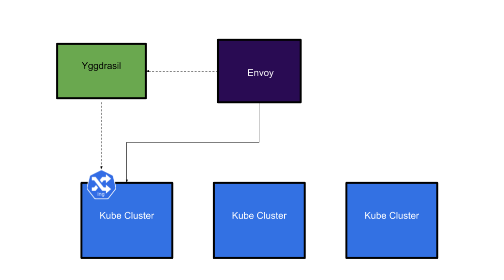
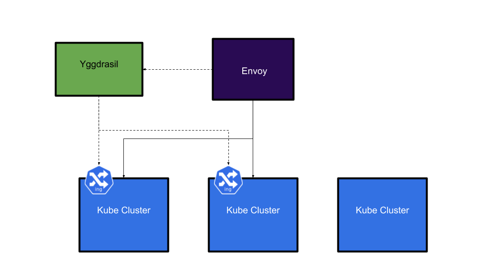
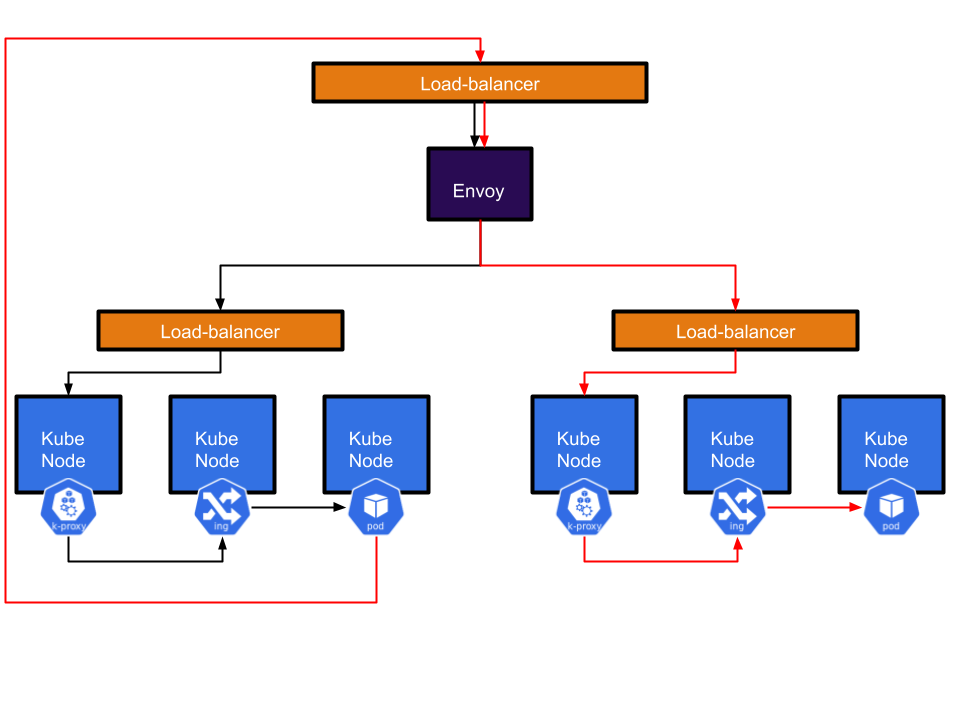
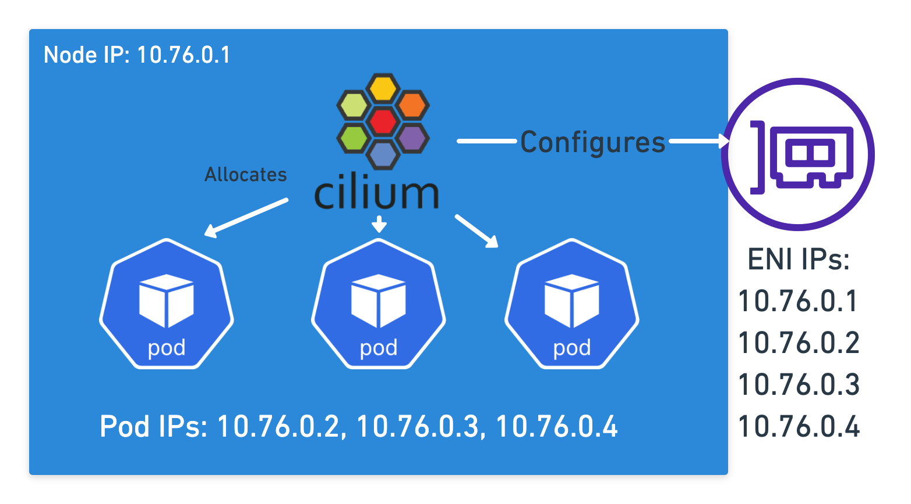
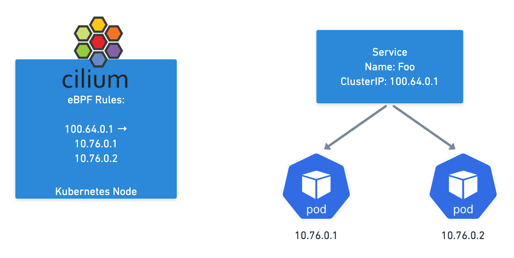
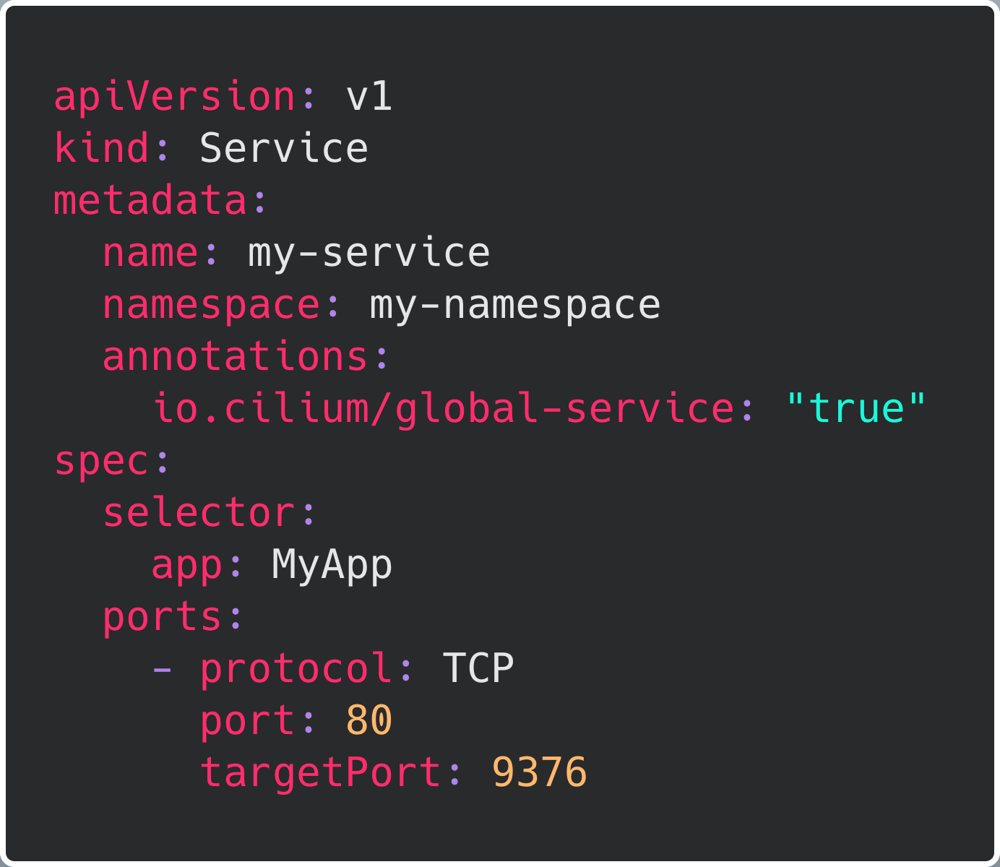
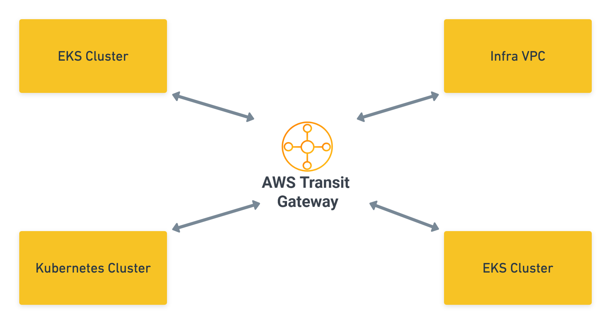
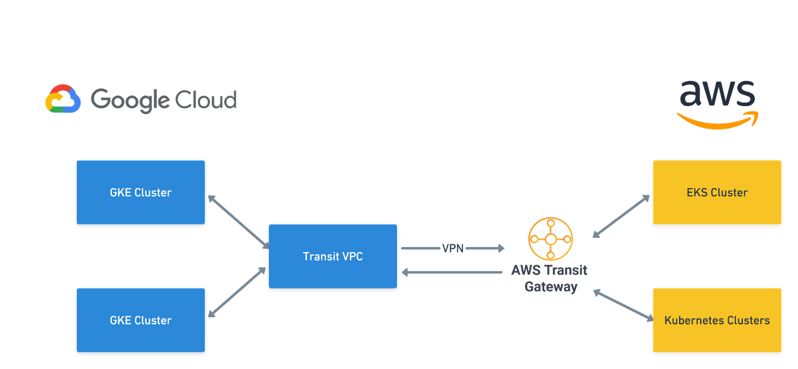

April 12, 2022
Author: Joseph Irving, Platform Lead at RVU (Uswitch)

# Multi Cluster Networking with Cilium and Friends

Setting up networking for one Kubernetes cluster can be a challenge but it becomes even more fun once you add multiple clusters into the mix. In this blog, we’ll go over the solutions that [RVU](https://www.rvu.co.uk/) ([Uswitch](https://www.uswitch.com/)) came up with to allow their applications to talk between clusters and the rationale behind them, from [building our own tools](https://labs.rvu.co.uk/multi-cluster-kubernetes-load-balancing-in-aws-with-yggdrasil-c1583ea7d78f) like [Yggdrasil](https://github.com/uswitch/yggdrasil) (Envoy controller) to implementing other tools such as Cilium. We’ll see what benefits and drawbacks the different approaches can have and also explore why we opted to avoid using a traditional service mesh to achieve our multi-cluster networking goals. 

# Background

Over the course of around two years, we had a relatively rapid shift in how we thought about infrastructure at our company. Historically, every product team ran their own infrastructure and were almost entirely independent of each other. We realised that teams were duplicating effort and spending far too much time maintaining and building infrastructure instead of developing new features for our websites. To reduce this replication effort, we decided to centralise the infrastructure on a common platform built on top of Kubernetes. 

As we did this one of the biggest concerns from our teams was: what happens if a cluster has an outage? As these clusters had so much of the website running on them this could be very disruptive. To alleviate these concerns, we built multiple Kubernetes clusters for failover. However, this then created the problem of how do we route traffic between them?

# Building our own tool

Our first approach centred around the open source proxy called [Envoy](https://www.envoyproxy.io/), its ability to dynamically change its configuration via GRPC was of particular interest to us as we saw a way to leverage our existing infrastructure to configure it. Our idea was to configure Envoy to send traffic to our Kubernetes clusters based on the Ingress objects that were already present in the clusters. We built an Envoy control plane called Yggdrasil. It takes Ingress resources across multiple Kubernetes clusters and turns them into Envoy configuration.

If your ingress is in one cluster, Envoy will be configured to send traffic for that host into that cluster.

However, if the ingress is in multiple clusters, Envoy will be configured to load balance across them.

This allowed us to set up HA services spread across multiple clusters and reduce the risk of outages caused by something going wrong in one cluster.  \
While this system was primarily intended for user traffic, it inadvertently became a very convenient way for applications to talk to each other. As Envoy would always send traffic to the correct cluster, applications could just talk to Envoy if they wanted to reach another internal service regardless of whether it was running in the same cluster or not.

There were a few major drawbacks with this approach. First, a user would talk to one service which then called another service in another cluster by going through Envoy. This resulted in the request having to go out of the cluster and back again adding a fair amount of latency (P95 of around 20ms per trip). This round trip also caused us to lose identity information. As far as our apps were concerned everything was coming from Envoy.

This kind of cross-cluster functionality was clearly useful to our development teams, however the implementation was less than ideal. We concluded that we would need something more like a service mesh for service to service communication to work in a sensible way.

# Searching for a Service Mesh

When evaluating the various different service meshes that existed we started with three main requirements:

1. Multi-cluster services - this was the main one, we wanted a way to talk between clusters, service to service.
2. ‘Real’ Pod IPs - meaning that the pods get an IP address that belongs to the VPC they’re running in, instead of being assigned a virtual IP address. This was ‘a nice to have’ as it can simplify networking complexity and allow for more VPC native tools like flow logs, security groups, etc to work with pods easily.
3. Easy to implement on our existing stack - whatever we chose we’d rather it didn’t require significant reworks to how our existing applications work.

With these in mind we began our testing and comparison on the various meshes around at the time and as we did, a few common problems were found. 

One of the biggest drawbacks was a reliance on sidecars as the main mechanism for implementing the mesh. This caused all sorts of complications including:

* Service mesh is unavailable during the init phase - there are no sidecars in the init phase so the mesh functionality does not work.
* Job pods get stuck in a state where they never complete - the sidecars need some kind of logic to understand that they’re in a job and should shut down once the primary container has finished its job.
* Startup/Shutdown ordering can be an issue - if the sidecar starts up/shuts down after/before your containers you can get networking issues

While all of these problems do have solutions, it still seemed like a lot of work compared to what we wanted to achieve. 

After looking at more ‘traditional’ service meshes, we discovered Cilium which appeared to meet our requirements very well:

* Run as a daemonset - no sidecars required
* Support ‘real’ IPs for Pods using AWS ENIs
* No application changes needed to leverage its capabilities - everything is done at the host level and is transparent to the applications using it.

This all sounded great, so the next step was to try it out!

# Cilium Time

So let's compare Cilium to our original requirements, first real pod IPs:

Cilium does this in AWS by associating ENIs with your instance that it can then assign additional IPs to, each IP corresponding to one of the pods on the node. This means every pod has an IP that is a valid IP in the VPC you’re running in, allowing all the normal AWS networking features to work with them. No virtual network needed!

Cilium maps pod IPs to services in the same way a more traditional setup would work, but instead of just relying on IPTables rules, Cilium can replace kube-proxy leveraging eBPF which at scale outperforms IPTables and ensures Service Endpoint changes are atomic using eBPF maps.

The (Cluster) Mesh works by allowing Cilium to populate Service Endpoints in each Cluster using eBPF Maps. If you have the same service in two different clusters, Cilium will combine all those pod IPs as possible destinations. Thus, when you talk to the service address, you will get sent to any cluster where that service has endpoints.

This makes the mesh completely transparent to normal applications, they just need to talk to the service in their cluster as they normally would and they’ll be talking across Kubernetes clusters!

Establishing load-balancing between clusters is achieved by defining a Kubernetes service with identical name and namespace in each cluster and adding the annotation io.cilium/global-service: "true" to declare it global. Cilium will automatically perform load-balancing to pods in both clusters.

Our new cross cluster journey for applications is just one hop. From one pod to another pod via their pod IP. Not only does this remove a load of latency but it also maintains identity so we can now use things like Network Policy to control what services can talk to each other.

The actual networking setup for this was also quite simple thanks to the use of AWS Transit Gateway which we use to peer all our clusters together. Since all our pod IPs were ‘real’, as long as routes and Security groups were set up, it all just worked seamlessly.

We even extended this to go across clouds by setting up a VPN between Google Cloud and AWS. Our GKE and EKS clusters talk to each other via the Cilium Clustermesh without any hassle.

# What’s Next?

Cilium proved to be a great option for us, giving us the functionality we wanted without all the complication that the more traditional service meshes typically imposed on a user. However, it wasn’t completely without its drawbacks. The lack of a dedicated proxy in Cilium meant that apps had to implement things like retries and load-balancing when talking to other services (something our old setup or going through Envoy did for them). Another thing to be aware of is that Cilium differs from more traditional IPTables based implementations, so it is a good idea to familiarise yourself with how Cilium operates and how it uses eBPF maps. The Cilium community was always very helpful if we did ever find any bugs though, so rest assured someone will help you!

It’s also worth noting that Cilium have now started the beta of their Cilium based service mesh which promises to add some more service-meshy features like retries and canary deployments, but with the same transparent sidecar-less approach that vanilla Cilium provides. We’ll be watching this one closely! 
