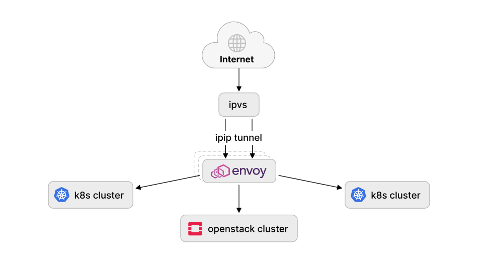
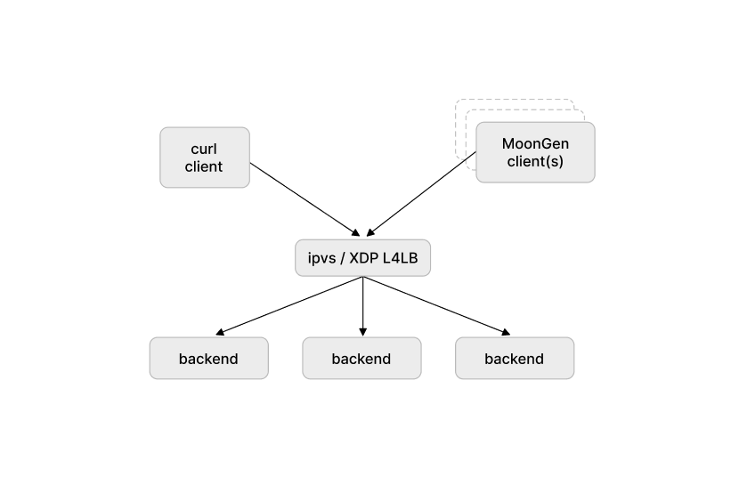
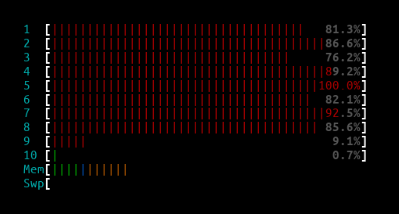
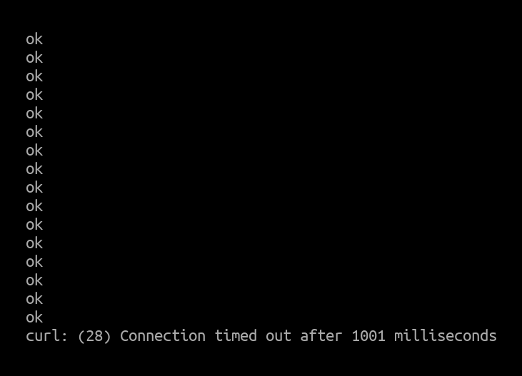
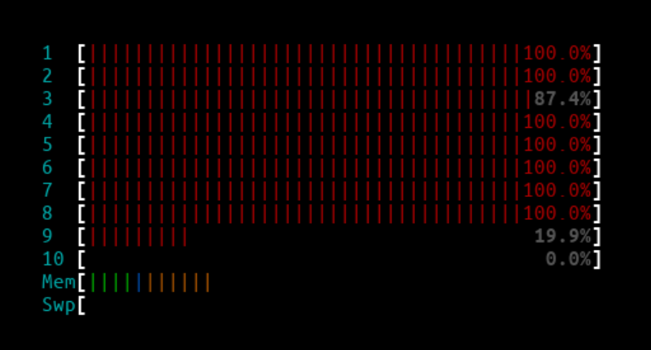
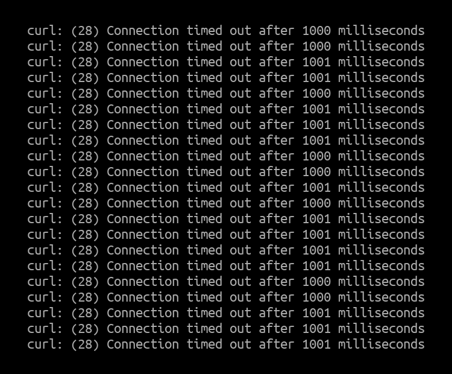
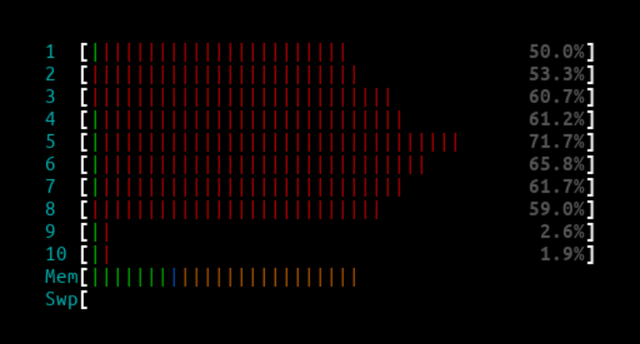
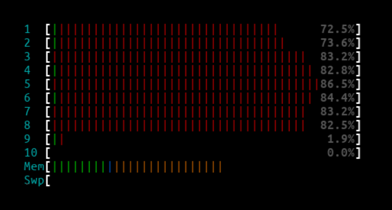
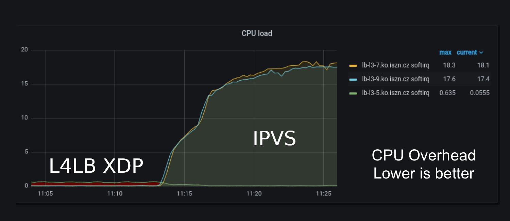

_July 13th, 2022_  
_Author: Ondrej Blazek, Infrastructure Engineer @ Seznam.cz_

Seznam.cz is a Czech technological company developing a custom search engine, advertising platform, online maps, content management system, and also private cloud services, custom hardware, and datacenters.
 
 
# Architecture
 
Seznam's infrastructure historically used F5 hardware load balancers but we switched to software load balancers a few years ago. Up until now we've been using a [multiple tier](https://vincent.bernat.ch/en/blog/2018-multi-tier-loadbalancer) setup - [ECMP routing](https://vincent.bernat.ch/en/blog/2018-multi-tier-loadbalancer#first-tier-ecmp-routing) as the first tier + [IPVS](http://www.linuxvirtualserver.org/software/ipvs.html) as the second tier ([L4 load balancer (L4LB)](https://vincent.bernat.ch/en/blog/2018-multi-tier-loadbalancer#second-tier-l4-load-balancing)) + [Envoy proxy](https://www.envoyproxy.io/) as the third tier ([L7 load balancer](https://vincent.bernat.ch/en/blog/2018-multi-tier-loadbalancer#last-tier-l7-load-balancing)).  Unfortunately as traffic increased and, thanks to COVID, we started running short on hardware supplies, we had to look for alternatives to use our hardware more effectively.
 
We have been watching Cilium closely and noticed the [announcement of maglev in Cilium](https://cilium.io/blog/2020/11/10/cilium-19#maglev) together with [**Standalone L4LB XDP**](https://cilium.io/blog/2021/05/20/cilium-110#standalonelb) announced in 1.10. XDP hook is known for its efficient use of CPU and has an extremely high performance. This was very interesting for our team because we have been hitting traffic spikes up to 20M active connections which was massively increasing CPU usage of our IPVS nodes.
 
 
Our load balancer setup directs external traffic into the Kubernetes and OpenStack clusters and IPVS is used in a classic "load balancer on a stick" scenario. In a simplified world this looks like this:
 

 
Since, we have been using the maglev scheduler (which is part of a netfilter inside the Linux kernel since v4.18) the **Standalone L4LB XDP** was a perfect match to try as an alternative because it supports all the main features we required (IPIP, DSR, maglev).
 
We are using 25GbE NICs on our IPVS nodes so there was no problem running L4LB at the XDP driver layer as the majority of the modern NICs support it.
 
 
```
# ethtool -i eth0
driver: i40e
version: 2.8.20-k
firmware-version: 6.02 0x80003621 1.1747.0
expansion-rom-version:
bus-info: 0000:c1:00.0
supports-statistics: yes
supports-test: yes
supports-eeprom-access: yes
supports-register-dump: yes
supports-priv-flags: yes
```
 
```
# lspci | grep Ether
c1:00.0 Ethernet controller: Intel Corporation Ethernet Controller XXV710 for 25GbE SFP28 (rev 02)
```
 
# Launching Standalone L4LB
Cilium itself is released as a Docker image which we tried running on the IPVS node itself. As we wanted to persist the state when the Cilium container is restarted/upgraded, we created a systemd service to mount the bpf filesystem:
 
```
# cat /etc/systemd/system/sys-fs-bpf.mount
[Unit]
Description=BPF mounts
DefaultDependencies=no
Before=local-fs.target umount.target
After=swap.target
 
[Mount]
What=bpffs
Where=/sys/fs/bpf
Type=bpf
 
[Install]
WantedBy=multi-user.target
 
```
 
and then we launched Cilium in load balancer only mode:
 
```
systemctl start sys-fs-bpf.mount; docker run \
--cap-add NET_ADMIN \
--cap-add SYS_MODULE \
--cap-add CAP_SYS_ADMIN \
--network host \
--privileged \
-v /sys/fs/bpf:/sys/fs/bpf \
-v /lib/modules \
--name l4lb \
<our_private_docker_repo>/cilium cilium-agent \
--bpf-lb-algorithm=maglev \
--bpf-lb-mode=dsr \
--bpf-lb-acceleration=native \
--bpf-lb-dsr-dispatch=ipip \
--devices=eth0 \
--datapath-mode=lb-only \
--enable-l7-proxy=false \
--tunnel=disabled \
--install-iptables-rules=false \
--enable-bandwidth-manager=false \
--enable-local-redirect-policy=false \
--enable-hubble=false \
--enable-l7-proxy=false \
--preallocate-bpf-maps=false \
--disable-envoy-version-check=true \
-auto-direct-node-routes=false \
--enable-ipv4=true \
--enable-ipv6=true
```

We serve around 3k services and use 30+ L7 nodes so we quickly reached the defaults for lbmap size. However, it is possible to extend it so we added the `--bpf-lb-map-max 512000` option.

# Setting Up Services
Cilium provides an API to set up the lbmaps. We used the following command to configure all the services:
 
```
cilium service update --id $idx --frontend "$svc" --backends "$backends" --k8s-node-port
```
 
The `frontend` stands for each VIP service and `backends` for the L7 nodes (e.g. `cilium service update --id 1 --frontend "10.248.11.13:7047" --backends "10.246.3.34:7047,10.246.39.33:7047,10.246.39.34:7047" --k8s-node-port`).
 
For BGP announcement, [we use BIRD](https://docs.cilium.io/en/stable/gettingstarted/bird/) so this part is fairly straightforward:
```
# systemctl start bird
# systemctl start bird6
```

# Comparison Under Load
* [SynFlood](https://www.cloudflare.com/learning/ddos/syn-flood-ddos-attack/)
* [MoonGen](https://github.com/emmericp/MoonGen)
* 1 CPU for generating traffic
* 64B packets
 
At first, we decided to compare IPVS with L4LB under synthetic test/load generated by a single client running a MoonGen with 1 CPU and small 64B packets with TCP SYN set. Packets (tcp segments) sent out by the MoonGen generator were configured to randomize source IP address and TCP source port so that the traffic is distributed across all receive rx queues as our NIC cards are configured to use 4 tuple (src IP, dst IP, src TCP port, dst TCP port) hashing:

```
# ethtool -n eth0 rx-flow-hash tcp4
TCP over IPV4 flows use these fields for computing Hash flow key:
IP SA
IP DA
L4 bytes 0 & 1 [TCP/UDP src port]
L4 bytes 2 & 3 [TCP/UDP dst port]
```
During the test run we used another client running a simple GET request (using curl in a while loop) to see how the server was able to handle the requests.
 
The test setup looked like this:


 
## Results
 
In both scenarios (scenario #1 IPVS and scenario #2 L4LB) the MoonGen client was configured to generate 1Mpps (million packets per second) and 3Mpps.
Each output screenshot below is taken from the corresponding server - either the server IPVS/L4LB under test or the `curl` client. For L4LB XDP, both 1Mpps and 3Mpps were too easy and did not have any performance impact. We instead started with 10Mpps and only saw an impact at 14.8 Mpps which was probably due to constraints of the NIC rather than L4LB.
 
 
### 1Mpps - IPVS
 
IPVS htop output:

 
 
Curl client output:
 

 
The CPUs were not fully maxed out, but were close to their limit and dropped a few packet drops from time to time.
 
### 3Mpps - IPVS
 
IPVS htop output:
 

 
Curl client output:
 

 
Since all of the CPU cores handling the interrupts were maxed out, almost all the packets from the second client were dropped by the IPVS node.

### 10Mpps - L4LB XDP
 
L4LB htop output:
 

 
Curl client output:
 

 
### 14.8Mpps - L4LB XDP
 
L4LB htop output:
 

 
Curl client output:
 


At 14.8Mpps there were a few packet drops here and there but because we were hitting NIC limits this was totally expected.

# Production Traffic
The biggest surprise came when we deployed the L4LB XDP to one of our production nodes (which was previously running IPVS). As we have full access to our nodes and are able to start/stop BIRD at any point in time, we were able to cleanly pass traffic between L4LB XDP nodes and IPVS nodes. At approx 11:00 AM, we stopped BIRD on the IPVS nodes so that the L4LB XDP node was handling all the traffic and at approx 11:14 AM, we switched to the 2 nodes running IPVS. 
 

_Packets per second (Higher is better)_ 
 
The output above shows that during time ~11:04 - 11:13 the production traffic went from 750kpps up to 1Mpps and this was handled by a single host `lb-l3-5.ko.iszn.cz` using L4LB XDP. At ~11:16, we switched to 2 hosts `lb-l3-7.ko.iszn.cz` and `lb-l3-9.ko.iszn.cz` running IPVS (the summed traffic during that time was also around 1Mpps).
 
The wow effect really came when we started to look at CPU usage. At one point, we were not sure if we had a bug somewhere because the CPU load was so low when L4LB XDP was handling the traffic. But after looking closely, it really was consuming only half of a single CPU compared to 2x18 CPUs when IPVS was handling the traffic. We were saving 36 CPUs when switched to L4LB XDP.


 
_Note: The pictures were taken from our production grafana. CPU Load (Lower is better)_ 
 
# Endnotes
 
The screenshots speak for themselves, but the key take away for us was, **L4LB XDP at the driver layer with a majority of HTTP traffic (~90% of our traffic is HTTP requests) saves us an unbelievable amount of CPUs needed to handle our production traffic**.
 
The only thing we found missing in Cilium, before we can fully switch to L4LB XDP, are weighted backends which we are currently working on - [maglev: support setting a weight of a backend in a service spec via new cmdline argument](https://github.com/cilium/cilium/pull/18306). After this is done there is nothing stopping us from saying goodbye to IPVS. 
 
With this we would like to thank the Cilium community for building such a great project and for their support!
